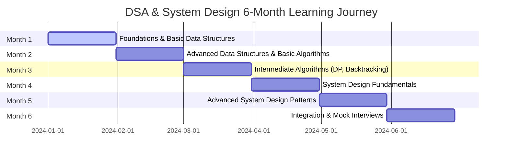
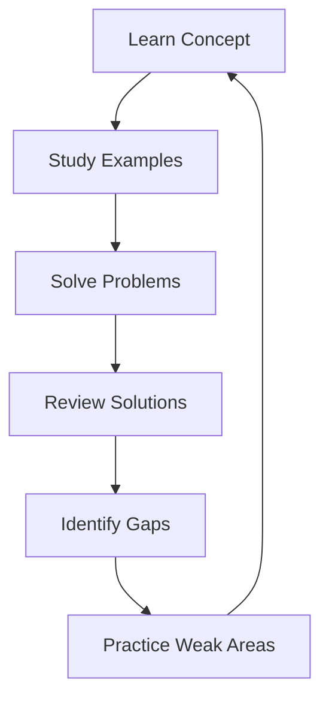

# DSA and System Design Learning Map - 6-Month Comprehensive Guide

## 🎯 Learning Objective

This comprehensive 6-month learning map is designed to take you from beginner to interview-ready for MAANG and product-based companies. With 1 hour of dedicated study daily, you'll master data structures, algorithms, and system design fundamentals required for technical interviews.

## 📊 Learning Philosophy

### The "1-Hour Daily" Approach
```
Daily 1-Hour Breakdown:
┌─────────────────────────────────────┐
│ 10 min: Concept Learning           │
│ 20 min: Example Walkthrough        │
│ 25 min: Practice Problems          │
│  5 min: Review & Notes            │
└─────────────────────────────────────┘
```

### Why This Structure Works
- **Consistency over intensity**: 1 hour daily > 7 hours once a week
- **Spaced repetition**: Concepts reinforced through daily practice
- **Building mental models**: Before diving into code, understand the "why"
- **Progressive complexity**: Each topic builds on previous knowledge

## 🗓️ 6-Month Roadmap



## 📁 Document Structure

This learning map is organized into 13 topic-based files for focused learning:

### Phase 1: Foundations (Month 1)
1. **01_SPACE_TIME_COMPLEXITY.md** - Big O notation, complexity analysis
2. **02_DATA_STRUCTURES_I.md** - Arrays, strings, linked lists, stacks, queues

### Phase 2: Core Concepts (Month 2)
3. **03_DATA_STRUCTURES_II.md** - Trees, heaps, hash tables, graphs
4. **04_ALGORITHMS_I.md** - Sorting, searching, two pointers, sliding window

### Phase 3: Advanced Algorithms (Month 3)
5. **05_ALGORITHMS_II.md** - Recursion, backtracking, dynamic programming, greedy

### Phase 4: System Design Basics (Month 4)
6. **06_SYSTEM_DESIGN_FUNDAMENTALS.md** - Scalability, availability, CAP theorem
7. **07_SYSTEM_DESIGN_PATTERNS.md** - Load balancing, caching, database design

### Phase 5: Advanced System Design (Month 5)
8. **08_ADVANCED_SYSTEM_DESIGN.md** - Distributed systems, messaging, real-time systems

### Phase 6: Practice & Integration (Month 6)
9. **09_PRACTICE_SCHEDULE.md** - Weekly breakdowns and daily schedules
10. **10_LEETCODE_MAPPING.md** - Questions by topic and difficulty
11. **11_PROGRESS_TRACKER.md** - Progress tracking templates

### Reference Materials
12. **12_QUICK_REFERENCE.md** - Cheat sheets and quick lookups
13. **JVM_TUNING_GUIDE.md** - Complete JVM performance optimization guide
14. **JAVA_17_GUIDE.md** - Java 17 specific features and benefits

## 🎓 Prerequisites

### Required Knowledge
- Basic programming proficiency in Java (Java 17 or higher recommended)
- Understanding of variables, functions, loops, and conditionals
- Ability to write simple Java programs
- Basic mathematical concepts (algebra, arithmetic)
- Familiarity with object-oriented programming concepts

### Recommended Tools
- **LeetCode** (free tier) - Practice platform with Java 17 support
- **GitHub** - Code storage and version control
- **IDE/Code Editor** - IntelliJ IDEA 2023+ (Java 17 support), VS Code with Java Extension Pack
- **JDK 17** - Java Development Kit for Java 17 features
- **Markdown Viewer** - For reading these documents
- **Note-taking App** - Obsidian, Notion, or similar

### Java 17 Features Used in This Course
- **Records**: For immutable data classes (reduces boilerplate)
- **Sealed Classes**: For restricted class hierarchies
- **Pattern Matching**: Enhanced instanceof and switch expressions
- **Text Blocks**: For multi-line strings and SQL queries
- **Var**: Local variable type inference
- **Stream API Enhancements**: toArray() and.toList() methods
- **Record Patterns**: For pattern matching with records

### Optional but Helpful
- **System Design Primer** - Free online book
- **VisuAlgo** - Algorithm visualization tool
- **Excalidraw** - For creating your own diagrams

## 📈 Success Metrics

### Monthly Milestones
- **Month 1**: Understand Big O notation, implement basic data structures
- **Month 2**: Solve 50+ easy/medium LeetCode problems
- **Month 3**: Implement DP solutions for common patterns
- **Month 4**: Design basic system architectures
- **Month 5**: Design complex distributed systems
- **Month 6**: Complete 5+ mock interviews successfully

### Weekly Targets
- **Weeks 1-4**: 15 problems solved, 80% accuracy
- **Weeks 5-8**: 20 problems solved, 75% accuracy
- **Weeks 9-12**: 25 problems solved, 70% accuracy
- **Weeks 13-16**: 30 problems solved, 65% accuracy
- **Weeks 17-20**: 35 problems solved, 60% accuracy
- **Weeks 21-24**: 40 problems solved, 55% accuracy

### Daily Habits
- ✅ Complete 1-hour study session
- ✅ Solve at least 1 practice problem
- ✅ Review concepts from previous days
- ✅ Take notes on new learnings
- ✅ Track progress in tracker

## 🔄 Learning Loop



### How to Use This Loop
1. **Learn Concept**: Read the topic explanation, study diagrams
2. **Study Examples**: Understand the provided code examples
3. **Solve Problems**: Attempt practice problems independently
4. **Review Solutions**: Compare your approach with optimal solutions
5. **Identify Gaps**: Note areas where you struggled
6. **Practice Weak Areas**: Revisit concepts and try similar problems

## 🎯 Interview Readiness Checklist

By the end of 6 months, you should be able to:

### Data Structures & Algorithms
- [ ] Analyze time and space complexity of any algorithm
- [ ] Implement arrays, linked lists, stacks, and queues from scratch
- [ ] Solve tree traversal problems (DFS, BFS, inorder, etc.)
- [ ] Implement hash tables and handle collisions
- [ ] Traverse graphs and find shortest paths
- [ ] Apply dynamic programming to optimization problems
- [ ] Use two-pointer and sliding window techniques
- [ ] Implement common sorting and searching algorithms

### System Design
- [ ] Design scalable web applications
- [ ] Choose appropriate database systems
- [ ] Design caching strategies
- [ ] Implement load balancing
- [ ] Handle system failures and availability
- [ ] Design message queue systems
- [ ] Solve CAP theorem trade-offs
- [ ] Design real-time systems

### Problem Solving
- [ ] Solve 200+ LeetCode problems (mix of easy/medium/hard)
- [ ] Explain your thought process clearly
- [ ] Optimize solutions for time/space complexity
- [ ] Handle edge cases and constraints
- [ ] Write clean, readable code
- [ ] Debug your own code efficiently

## 📚 External Resources

### Free Resources
- **LeetCode**: https://leetcode.com/ (Free tier sufficient)
- **System Design Primer**: https://systemdesign.one/ (Free online book)
- **VisuAlgo**: https://visualgo.net/ (Algorithm visualizations)
- **GeeksforGeeks**: https://www.geeksforgeeks.org/ (Tutorials and problems)
- **HackerRank**: https://www.hackerrank.com/ (Practice problems)

### Recommended Books (Optional)
- "Cracking the Coding Interview" by Gayle Laakmann McDowell
- "Introduction to Algorithms" by CLRS (for deep dives)
- "Designing Data-Intensive Applications" by Martin Kleppmann

### Video Resources
- **MIT OpenCourseWare**: 6.006 Introduction to Algorithms
- **Stanford CS161**: Design and Analysis of Algorithms
- **WilliamFiset**: YouTube channel for algorithms and data structures

## 🛠️ Getting Started

### Week 1: Setup and Foundation
1. **Day 1**: Set up your learning environment, read this overview
2. **Day 2**: Complete prerequisite check, set up LeetCode account
3. **Day 3-7**: Start with space and time complexity (File 01)

### Daily Routine Template
```markdown
## Study Session - [Date]

### Topic: [Topic Name]
- File: [File Number]
- Section: [Specific Section]

### Learning (10 min)
- [ ] Read concept explanation
- [ ] Study diagrams
- [ ] Take notes

### Examples (20 min)
- [ ] Review code examples
- [ ] Trace through examples manually
- [ ] Understand the "why"

### Practice (25 min)
- [ ] Solve problem 1: [Problem Name]
- [ ] Solve problem 2: [Problem Name]
- [ ] Time yourself

### Review (5 min)
- [ ] Check solutions
- [ ] Note optimizations
- [ ] Plan tomorrow's focus
```

## 💡 Tips for Success

### Maximizing Your 1 Hour
- **Eliminate distractions**: Phone on silent, close unnecessary tabs
- **Use a timer**: Stick to the 10-20-25-5 breakdown
- **Active learning**: Don't just read, implement and practice
- **Take notes**: Writing reinforces learning
- **Stay consistent**: Missing days breaks momentum

### When You Get Stuck
- **Re-read the concept**: Sometimes you missed a key detail
- **Try a simpler problem**: Build confidence before tackling harder ones
- **Look at the solution**: Learn from it, then try a similar problem
- **Take a break**: Sometimes stepping away helps
- **Ask for help**: Use communities like LeetCode Discuss

### Maintaining Motivation
- **Track progress**: Use the progress tracker to see improvement
- **Celebrate small wins**: Completing a topic is an achievement
- **Join a community**: Find study partners or online groups
- **Remember your goal**: Why are you doing this?
- **Mix it up**: Alternate between DSA and system design

## ⚠️ Common Pitfalls to Avoid

### Don't Skip Fundamentals
- **Problem**: Jumping to advanced topics without basics
- **Solution**: Follow the sequence, each topic builds on previous ones

### Don't Just Read Without Practicing
- **Problem**: Understanding concepts but unable to implement
- **Solution**: Always code the examples and solve problems

### Don't Spend Too Long on One Problem
- **Problem**: Stuck for hours on a single problem
- **Solution**: Set 30-minute limit, then look at solution

### Don't Ignore Time Complexity
- **Problem**: Writing working code without considering efficiency
- **Solution**: Always analyze Big O before and after optimizing

### Don't Forget System Design
- **Problem**: Focusing only on DSA, neglecting system design
- **Solution**: Dedicate equal time to both as per the schedule

## 🎓 Interview Preparation Timeline

### 3 Months Before Interview
- Complete all DSA topics
- Solve 150+ LeetCode problems
- Study system design fundamentals

### 2 Months Before Interview
- Complete system design patterns
- Solve 50+ system design problems
- Practice explaining solutions aloud

### 1 Month Before Interview
- Take mock interviews
- Focus on weak areas
- Review all notes and key concepts

### 1 Week Before Interview
- Light practice only
- Review cheat sheets
- Prepare behavioral questions
- Get good sleep

## 📞 Support and Community

### When You Need Help
- **LeetCode Discuss**: Community for specific problems
- **Reddit**: r/leetcode, r/cscareerquestions
- **Discord**: Various DSA and coding interview servers
- **Stack Overflow**: For specific technical questions

### Study Groups
- Find study partners with similar goals
- Schedule regular practice sessions
- Share solutions and approaches
- Hold each other accountable

## 🏆 Success Stories

Many developers have successfully transitioned to MAANG companies using similar structured approaches. The key is consistency and dedication. With 1 hour daily for 6 months, you'll accumulate 180+ hours of focused study - equivalent to a full semester college course on algorithms and system design.

## 📝 Next Steps

1. **Start with File 01**: Space and Time Complexity
2. **Set up your tracking**: Use the progress tracker template
3. **Create your schedule**: Block 1 hour daily in your calendar
4. **Find your motivation**: Write down why you're doing this
5. **Begin today**: There's no better time than now

---

**Remember**: Every expert was once a beginner. The journey of 1,000 miles begins with a single step. Your step starts now with File 01.

**Let's get started!** → [01_SPACE_TIME_COMPLEXITY.md](./01_SPACE_TIME_COMPLEXITY.md)
