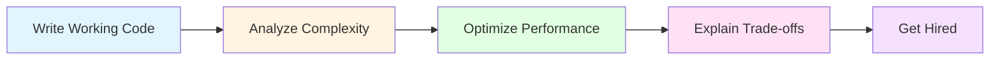
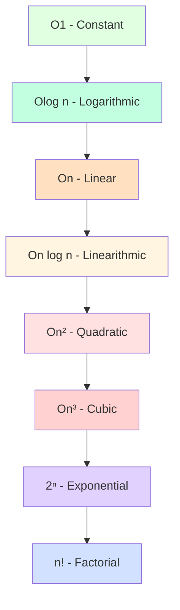
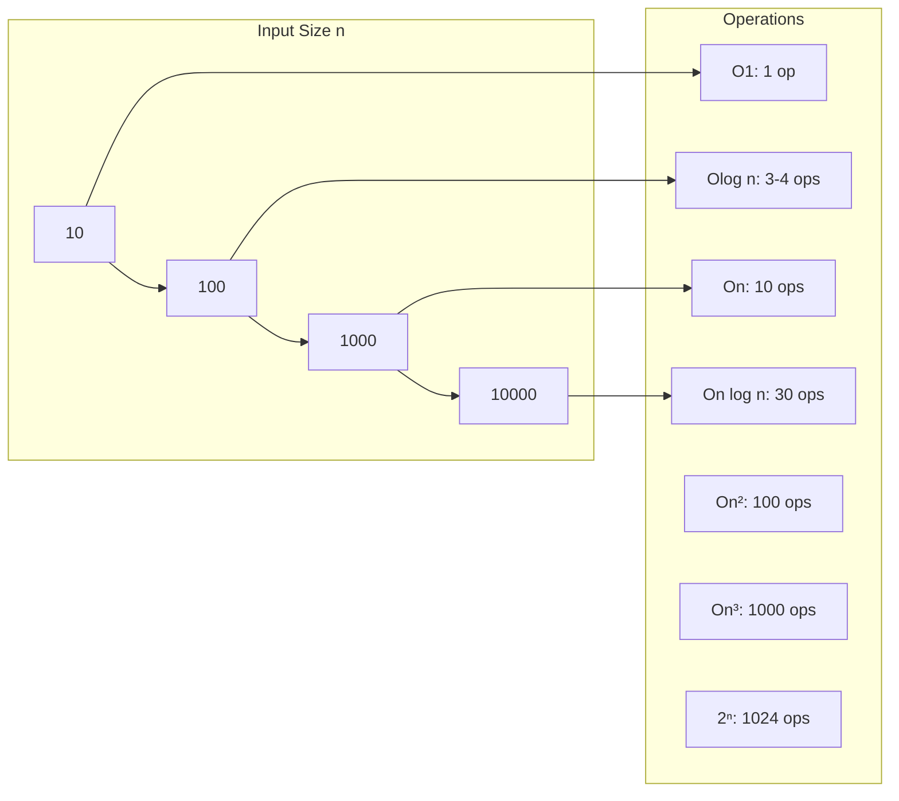
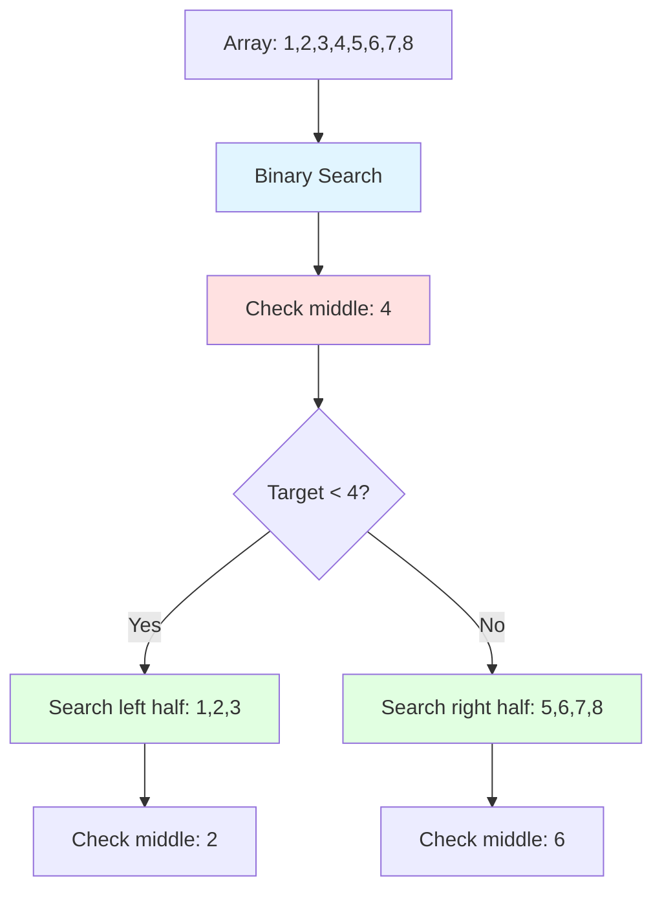
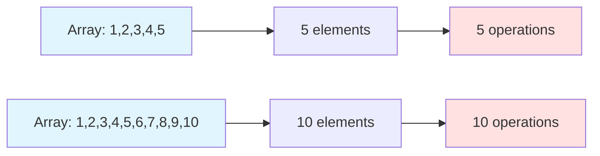
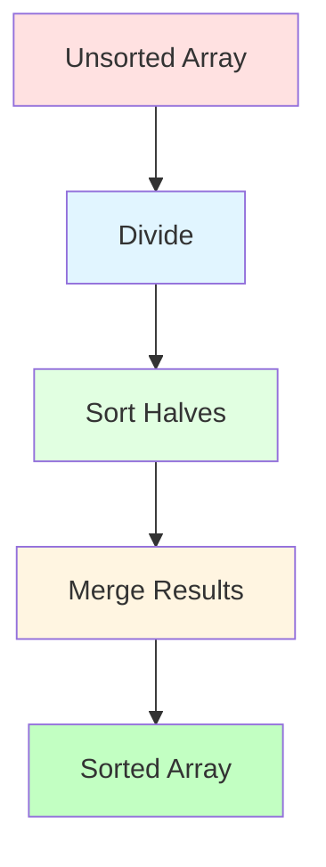
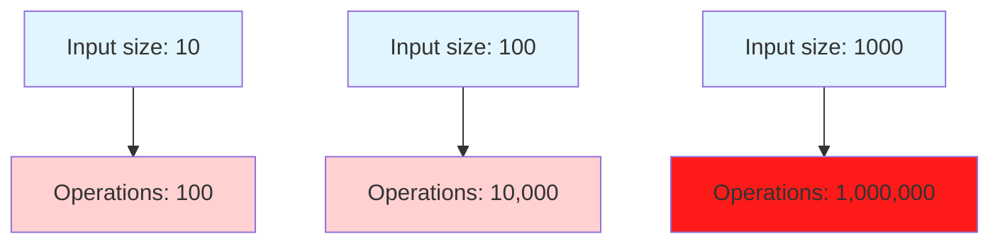
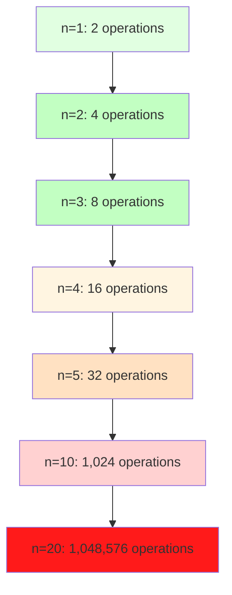
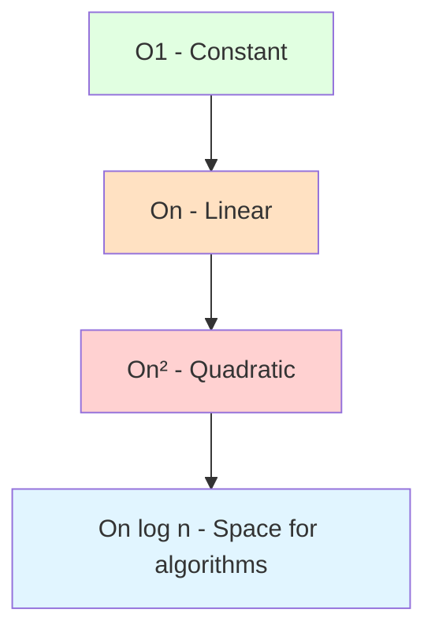
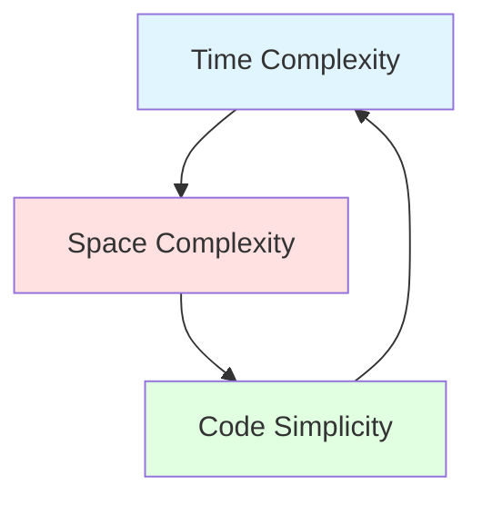

# Space and Time Complexity - Complete Guide

## 🎯 Learning Objectives

By the end of this file, you will:
- Understand what Big O notation is and why it matters
- Be able to analyze time complexity of algorithms
- Be able to analyze space complexity of algorithms
- Recognize common complexity patterns
- Make informed decisions about algorithm trade-offs

## 📊 What is Big O Notation?

Big O notation describes the **performance** or **complexity** of an algorithm. It specifically describes:
- **Worst-case scenario**: The maximum time/space an algorithm will take
- **Growth rate**: How performance scales as input size increases
- **Upper bound**: The algorithm will never perform worse than this

### Why Big O Matters in Interviews



**Interviewers ask about complexity because:**
1. They want to know if you understand performance implications
2. They need to know if your solution will scale
3. They want to see if you can optimize your approach
4. They assess your ability to make technical trade-offs

## 🧮 Understanding Time Complexity

### Common Time Complexities (Ranked from Best to Worst)



### Visual Growth Rates



### O(1) - Constant Time
**Definition**: Algorithm takes the same amount of time regardless of input size.

**Examples:**
- Accessing array element by index
- Hash table lookup (average case)
- Push/Pop from stack

**Code Example (Java 17):**
```java
public int getFirstElement(int[] arr) {
    return arr[0];  // Always one operation, regardless of array size
}
```

**When to Use:**
- Direct access operations
- Mathematical calculations
- Fixed-size operations

### O(log n) - Logarithmic Time
**Definition**: Time grows logarithmically with input size. Very efficient for large datasets.

**Examples:**
- Binary search in sorted array
- Balanced tree operations
- Many divide-and-conquer algorithms

**Visual Explanation:**


**Code Example (Java 17):**
```java
public int binarySearch(int[] arr, int target) {
    int left = 0;
    int right = arr.length - 1;
    
    while (left <= right) {
        int mid = left + (right - left) / 2;  // Prevents overflow
        if (arr[mid] == target) {
            return mid;
        } else if (arr[mid] < target) {
            left = mid + 1;
        } else {
            right = mid - 1;
        }
    }
    return -1;
}
```

**Why It's Efficient:**
- Each step eliminates half the remaining elements
- For 1,000,000 elements: ~20 steps (log₂(1,000,000) ≈ 20)
- For 1,000,000,000 elements: ~30 steps

### O(n) - Linear Time
**Definition**: Time grows linearly with input size. Double the input = double the time.

**Examples:**
- Linear search in unsorted array
- Traversing a linked list
- Simple loops

**Visual Explanation:**


**Code Example (Java 17):**
```java
public boolean linearSearch(int[] arr, int target) {
    for (int element : arr) {  // n iterations
        if (element == target) {
            return true;
        }
    }
    return false;
}
```

**When to Use:**
- When you must examine every element
- When data is unsorted
- When you need to process all items

### O(n log n) - Linearithmic Time
**Definition**: Combination of linear and logarithmic growth. Common in efficient sorting algorithms.

**Examples:**
- Merge sort
- Quick sort (average case)
- Heap sort

**Visual Explanation:**


**Code Example (Java 17):**
```java
public int[] mergeSort(int[] arr) {
    if (arr.length <= 1) {
        return arr;
    }
    
    int mid = arr.length / 2;
    int[] left = mergeSort(Arrays.copyOfRange(arr, 0, mid));  // log n levels
    int[] right = mergeSort(Arrays.copyOfRange(arr, mid, arr.length));  // log n levels
    
    return merge(left, right);  // n work at each level
}

private int[] merge(int[] left, int[] right) {
    int[] result = new int[left.length + right.length];
    int i = 0, j = 0, k = 0;
    
    while (i < left.length && j < right.length) {
        if (left[i] <= right[j]) {
            result[k++] = left[i++];
        } else {
            result[k++] = right[j++];
        }
    }
    
    while (i < left.length) {
        result[k++] = left[i++];
    }
    
    while (j < right.length) {
        result[k++] = right[j++];
    }
    
    return result;
}
```

**Why It's Good:**
- Much better than O(n²) for large datasets
- Preserves stability (important in some applications)
- Guaranteed O(n log n) performance

### O(n²) - Quadratic Time
**Definition**: Time grows quadratically. Double input = 4x time.

**Examples:**
- Nested loops
- Bubble sort, selection sort, insertion sort
- Brute force algorithms

**Visual Explanation:**


**Code Example (Java 17):**
```java
public void bubbleSort(int[] arr) {
    int n = arr.length;
    for (int i = 0; i < n; i++) {  // n iterations
        for (int j = 0; j < n - i - 1; j++) {  // n iterations
            if (arr[j] > arr[j + 1]) {
                // Swap elements
                int temp = arr[j];
                arr[j] = arr[j + 1];
                arr[j + 1] = temp;
            }
        }
    }
}
```

**When to Avoid:**
- Large datasets (performance becomes terrible)
- When better alternatives exist (like O(n log n) sorting)

### O(2ⁿ) - Exponential Time
**Definition**: Time doubles with each additional input. Very inefficient.

**Examples:**
- Brute force password cracking
- Recursive Fibonacci (naive implementation)
- Generating all subsets of a set

**Visual Explanation:**


**Code Example (Java 17):**
```java
public int fibonacciNaive(int n) {
    if (n <= 1) {
        return n;
    }
    return fibonacciNaive(n - 1) + fibonacciNaive(n - 2);
    // Recalculates same subproblems repeatedly
}
```

**How to Optimize:**
- Use memoization (store computed results)
- Use dynamic programming
- Find mathematical patterns

## 💾 Understanding Space Complexity

### What is Space Complexity?

Space complexity measures the **memory** an algorithm needs to run. It includes:
- **Auxiliary space**: Extra space used by the algorithm (excluding input)
- **Total space**: Input space + auxiliary space

### Common Space Complexities



### O(1) - Constant Space
**Definition**: Algorithm uses the same amount of memory regardless of input size.

**Examples:**
- Variables and simple calculations
- In-place algorithms (modify input directly)
- Sorting algorithms like heapsort

**Code Example (Java 17):**
```java
public int findMax(int[] arr) {
    int maxVal = arr[0];  // Constant space
    for (int num : arr) {
        if (num > maxVal) {
            maxVal = num;
        }
    }
    return maxVal;
}
```

### O(n) - Linear Space
**Definition**: Memory usage grows linearly with input size.

**Examples:**
- Creating a copy of an array
- Recursion stack depth (in some cases)
- Hash tables storing all elements

**Code Example (Java 17):**
```java
public int[] reverseArray(int[] arr) {
    int[] reversedArr = new int[arr.length];  // O(n) space
    for (int i = 0; i < arr.length; i++) {
        reversedArr[arr.length - 1 - i] = arr[i];
    }
    return reversedArr;
}
```

### O(n²) - Quadratic Space
**Definition**: Memory usage grows quadratically with input size.

**Examples:**
- 2D arrays/matrices
- Creating all pairs of elements
- Dynamic programming tables

**Code Example (Java 17):**
```java
public int[][] createMatrix(int n) {
    int[][] matrix = new int[n][n];  // O(n²) space
    for (int i = 0; i < n; i++) {
        for (int j = 0; j < n; j++) {
            matrix[i][j] = i * j;
        }
    }
    return matrix;
}
```

## 🔄 Time vs Space Trade-offs

### The Trade-off Triangle



**Common Trade-offs:**

| Time | Space | Use Case |
|------|-------|----------|
| O(n) | O(1) | Linear search, single pass |
| O(log n) | O(1) | Binary search, tree operations |
| O(n) | O(n) | Creating copy for modification |
| O(n log n) | O(n) | Merge sort, requires extra space |
| O(1) | O(n) | Hash table lookup (requires storing all data) |

### Example: Fibonacci Sequence

**Naive Approach:**
```java
public int fibonacciNaive(int n) {
    if (n <= 1) {
        return n;
    }
    return fibonacciNaive(n - 1) + fibonacciNaive(n - 2);
}
// Time: O(2ⁿ), Space: O(n) due to recursion stack
```

**Memoized Approach:**
```java
public int fibonacciMemo(int n, Map<Integer, Integer> memo) {
    if (memo.containsKey(n)) {
        return memo.get(n);
    }
    if (n <= 1) {
        return n;
    }
    int result = fibonacciMemo(n - 1, memo) + fibonacciMemo(n - 2, memo);
    memo.put(n, result);
    return result;
}
// Time: O(n), Space: O(n) for memoization table
```

**Iterative Approach:**
```java
public int fibonacciIterative(int n) {
    if (n <= 1) {
        return n;
    }
    int a = 0, b = 1;
    for (int i = 2; i <= n; i++) {
        int temp = a + b;
        a = b;
        b = temp;
    }
    return b;
}
// Time: O(n), Space: O(1)
```

## 🎯 Practical Analysis Examples

### Example 1: Finding Duplicates in Array

**Approach 1: Nested Loops**
```java
public boolean hasDuplicateNested(int[] arr) {
    int n = arr.length;
    for (int i = 0; i < n; i++) {  // O(n)
        for (int j = i + 1; j < n; j++) {  // O(n)
            if (arr[i] == arr[j]) {
                return true;
            }
        }
    }
    return false;
}
// Time: O(n²), Space: O(1)
```

**Approach 2: Sorting**
```java
public boolean hasDuplicateSort(int[] arr) {
    Arrays.sort(arr);  // O(n log n)
    for (int i = 0; i < arr.length - 1; i++) {  // O(n)
        if (arr[i] == arr[i + 1]) {
            return true;
        }
    }
    return false;
}
// Time: O(n log n), Space: O(1) or O(n) depending on sort
```

**Approach 3: Hash Set**
```java
public boolean hasDuplicateHash(int[] arr) {
    Set<Integer> seen = new HashSet<>();  // O(n) space
    for (int num : arr) {  // O(n)
        if (seen.contains(num)) {
            return true;
        }
        seen.add(num);
    }
    return false;
}
// Time: O(n), Space: O(n)
```

**Trade-off Analysis:**
- **Nested loops**: Slow but uses minimal space
- **Sorting**: Faster but may modify input
- **Hash set**: Fastest but uses more space

### Example 2: Two Sum Problem

**Approach 1: Brute Force**
```java
public int[] twoSumBrute(int[] arr, int target) {
    int n = arr.length;
    for (int i = 0; i < n; i++) {  // O(n)
        for (int j = i + 1; j < n; j++) {  // O(n)
            if (arr[i] + arr[j] == target) {
                return new int[]{i, j};
            }
        }
    }
    return new int[]{};
}
// Time: O(n²), Space: O(1)
```

**Approach 2: Hash Map**
```java
public int[] twoSumHash(int[] arr, int target) {
    Map<Integer, Integer> seen = new HashMap<>();  // O(n) space
    for (int i = 0; i < arr.length; i++) {  // O(n)
        int complement = target - arr[i];
        if (seen.containsKey(complement)) {
            return new int[]{seen.get(complement), i};
        }
        seen.put(arr[i], i);
    }
    return new int[]{};
}
// Time: O(n), Space: O(n)
```

**Approach 3: Two Pointers (if sorted)**
```java
public int[] twoSumTwoPointers(int[] arr, int target) {
    int left = 0, right = arr.length - 1;
    while (left < right) {  // O(n)
        int currentSum = arr[left] + arr[right];
        if (currentSum == target) {
            return new int[]{left, right};
        } else if (currentSum < target) {
            left++;
        } else {
            right--;
        }
    }
    return new int[]{};
}
// Time: O(n), Space: O(1)
```

## 📊 Complexity Analysis Techniques

### Technique 1: Count Operations

Count the number of basic operations as a function of input size n.

**Example:**
```java
public int exampleFunction(int[] arr) {
    int count = 0;
    for (int i = 0; i < arr.length; i++) {  // n iterations
        count++;  // 1 operation
        for (int j = 0; j < arr.length; j++) {  // n iterations
            count++;  // 1 operation
        }
    }
    return count;
}
// Total operations: n × n = n²
// Time complexity: O(n²)
```

### Technique 2: Count Loops

Analyze nested loops and their relationship.

**Rules:**
- Single loop = O(n)
- Two nested loops = O(n²)
- Three nested loops = O(n³)
- Consecutive loops = O(n + m) = O(n)

### Technique 3: Divide and Conquer

For algorithms that divide the problem:
- Binary search type: O(log n)
- Merge sort type: O(n log n)

### Technique 4: Recursive Relations

Use recurrence relations for recursive algorithms:
- T(n) = T(n/2) + O(1) → O(log n)
- T(n) = 2T(n/2) + O(n) → O(n log n)
- T(n) = T(n-1) + O(1) → O(n)

## 🎓 Common Mistakes to Avoid

### Mistake 1: Ignoring Constants
**Wrong:** "This algorithm is O(2n), so it's slower than O(n)"
**Right:** "O(2n) = O(n)" - constants don't matter in Big O

### Mistake 2: Focusing on Best Case
**Wrong:** "Binary search is O(1) when the target is in the middle"
**Right:** "Binary search is O(log n)" - we analyze worst case

### Mistake 3: Confusing Space and Time
**Wrong:** "Recursion is always O(n)"
**Right:** "Recursion time depends on the algorithm, space is O(depth)"

### Mistake 4: Not Considering Auxiliary Space
**Wrong:** "This algorithm uses O(1) space" (ignoring input storage)
**Right:** "This algorithm uses O(n) total space, O(1) auxiliary space"

## 🧪 Practice Problems

### Easy (Day 1-3)
1. **Array Index**: What's the time complexity of accessing arr[5]? (O(1))
2. **Linear Search**: What's the time complexity of searching an unsorted array? (O(n))
3. **Nested Loops**: What's the time complexity of two nested loops over n elements? (O(n²))

### Medium (Day 4-6)
1. **Bubble Sort Analysis**: Analyze time and space complexity of bubble sort
2. **Merge Sort Analysis**: Why is merge sort O(n log n)?
3. **Binary Search**: What's the space complexity of iterative vs recursive binary search?

### Hard (Day 7-8)
1. **Complex Nested Loops**: Analyze this code:
```java
for (int i = 0; i < n; i++) {
    for (int j = 0; j < i; j++) {
        for (int k = 0; k < j; k++) {
            System.out.println(i + " " + j + " " + k);
        }
    }
}
```
2. **Recursive Complexity**: Find time complexity of this:
```java
public int recursiveFunction(int n) {
    if (n <= 1) {
        return 1;
    }
    return recursiveFunction(n - 1) + recursiveFunction(n - 2);
}
```

## 📖 LeetCode Questions by Complexity

### O(1) - Constant Time
- **Easy**: Single Number, Missing Number
- **Medium**: First Missing Positive

### O(log n) - Logarithmic Time
- **Easy**: Search in Rotated Sorted Array
- **Medium**: Find Minimum in Rotated Sorted Array

### O(n) - Linear Time
- **Easy**: Contains Duplicate, Move Zeroes
- **Medium**: Two Sum, 3Sum

### O(n log n) - Linearithmic Time
- **Easy**: Valid Anagram
- **Medium**: Sort Colors, Merge Intervals

### O(n²) - Quadratic Time
- **Easy**: Two Sum (brute force)
- **Medium**: 3Sum (brute force)

## 🎯 Daily Exercises (1-Hour Schedule)

### Day 1: Understanding Big O (10 + 20 + 25 + 5)
**Learning (10 min):**
- Read this entire introduction
- Study the complexity growth diagrams
- Understand why Big O matters

**Examples (20 min):**
- Trace through each code example manually
- Calculate operations for small inputs (n=5, n=10)
- Visualize how algorithms scale

**Practice (25 min):**
- Solve "Single Number" on LeetCode (Easy)
- Solve "Contains Duplicate" on LeetCode (Easy)
- Analyze time complexity of your solutions

**Review (5 min):**
- Compare your solutions with optimal approaches
- Note which time complexities you recognized correctly

### Day 2: Time Complexity Analysis (10 + 20 + 25 + 5)
**Learning (10 min):**
- Re-read time complexity section
- Focus on the trade-off triangle
- Study the practical examples

**Examples (20 min):**
- Manually calculate operations for the "Two Sum" examples
- Compare the three different approaches
- Understand when to use each approach

**Practice (25 min):**
- Solve "Move Zeroes" on LeetCode (Easy)
- Solve "Valid Anagram" on LeetCode (Easy)
- Write time complexity analysis for each

**Review (5 min):**
- Check if your analysis matches LeetCode solutions
- Note which techniques you need to practice more

### Day 3: Space Complexity Analysis (10 + 20 + 25 + 5)
**Learning (10 min):**
- Study space complexity section
- Understand auxiliary vs total space
- Learn space-time trade-offs

**Examples (20 min):**
- Analyze the Fibonacci examples
- Understand memoization benefits
- Compare iterative vs recursive approaches

**Practice (25 min):**
- Solve "Missing Number" on LeetCode (Easy)
- Solve "First Missing Positive" on LeetCode (Medium)
- Analyze space complexity of your solutions

**Review (5 min):**
- Review space vs time trade-offs in your solutions
- Note when you chose time over space or vice versa

## 📋 Weekly Summary

### Week 1 Goals
- [ ] Understand Big O notation and its importance
- [ ] Analyze time complexity of simple algorithms
- [ ] Analyze space complexity of simple algorithms
- [ ] Recognize common complexity patterns
- [ ] Solve 6+ LeetCode problems with complexity analysis

### Week 1 Checklist
- [ ] Completed all daily exercises
- [ ] Can explain Big O to someone else
- [ ] Can identify complexity of simple code
- [ ] Understand when to use different complexity patterns
- [ ] Ready to move to data structures

## 🚀 Next Steps

After mastering space and time complexity:
1. **Move to File 02**: Data Structures I (Arrays, Strings, Linked Lists)
2. **Apply complexity analysis** to each data structure operation
3. **Choose appropriate data structures** based on complexity requirements
4. **Practice optimization** - improve algorithm complexity

## 💡 Key Takeaways

1. **Big O describes growth rate**, not absolute time
2. **Worst-case analysis** is the standard for interviews
3. **Space vs time trade-offs** are common and important
4. **Constants don't matter** in Big O (O(2n) = O(n))
5. **Best algorithm depends on constraints** - always consider context

---

**You're now ready to analyze algorithms!** → [02_DATA_STRUCTURES_I.md](./02_DATA_STRUCTURES_I.md)
