# Data Structures I - Arrays, Strings, Linked Lists, Stacks, Queues

## 🎯 Learning Objectives

By the end of this file, you will:
- Understand the fundamental data structures used in programming
- Know when to use each data structure
- Understand the time complexity of common operations
- Be able to implement these data structures from scratch
- Recognize which data structure to use for specific problems

## 📊 Data Structure Overview

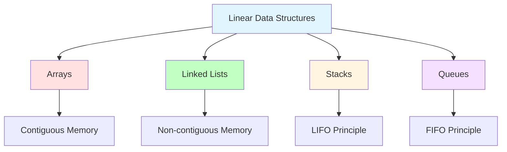

## 📚 Arrays

### What is an Array?

An array is a **contiguous** block of memory that stores elements of the same type. Each element can be accessed directly using its index.

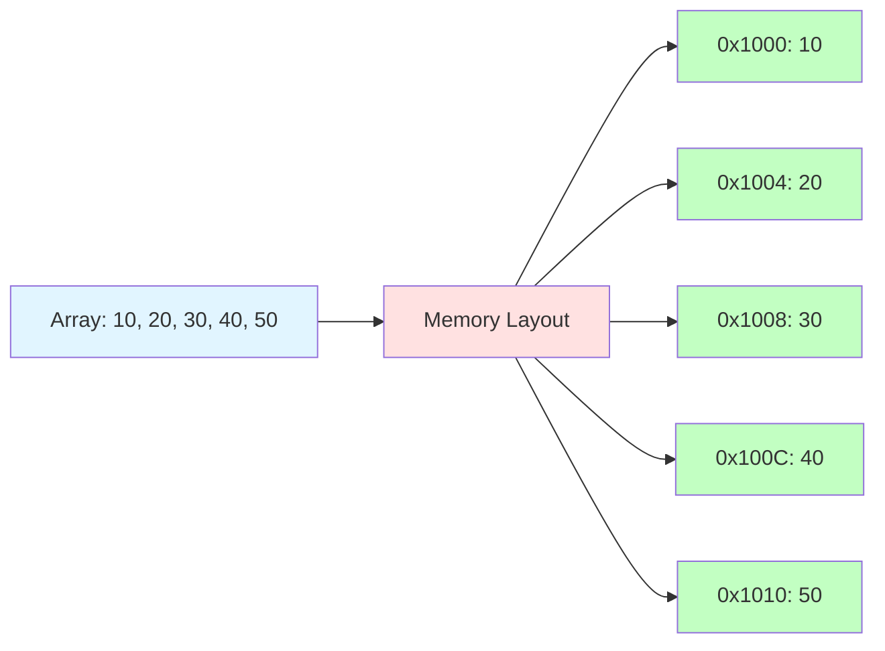

### Array Operations and Complexity

| Operation | Time Complexity | Space Complexity |
|-----------|-----------------|-------------------|
| Access by index | O(1) | O(1) |
| Search (unsorted) | O(n) | O(1) |
| Search (sorted) | O(log n) | O(1) |
| Insert at end | O(1) | O(1) amortized |
| Insert at beginning | O(n) | O(1) |
| Delete at end | O(1) | O(1) |
| Delete at beginning | O(n) | O(1) |

### Why Arrays Are Efficient

**Random Access**: O(1) access time because we can calculate memory address directly
```java
// If array starts at address 0x1000
// Element at index i is at address: 0x1000 + (i × element_size)
int address = baseAddress + (index * elementSize);
```

**Cache Locality**: Contiguous memory improves cache performance
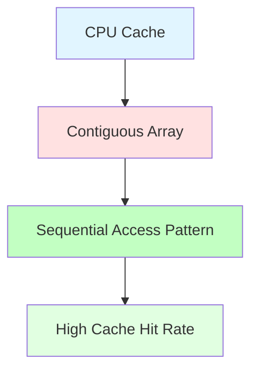

### Array Implementation in Java 17

```java
public class DynamicArray<T> {
    private Object[] array;
    private int size;
    private int capacity;
    
    public DynamicArray(int capacity) {
        this.capacity = capacity;
        this.size = 0;
        this.array = new Object[capacity];
    }
    
    public void insert(T element) {
        if (size >= capacity) {
            throw new RuntimeException("Array is full");
        }
        array[size++] = element;
    }
    
    @SuppressWarnings("unchecked")
    public T get(int index) {
        if (index < 0 || index >= size) {
            throw new IndexOutOfBoundsException("Index out of bounds");
        }
        return (T) array[index];
    }
    
    public void delete(int index) {
        if (index < 0 || index >= size) {
            throw new IndexOutOfBoundsException("Index out of bounds");
        }
        for (int i = index; i < size - 1; i++) {
            array[i] = array[i + 1];
        }
        size--;
    }
    
    public int size() {
        return size;
    }
}
```

### When to Use Arrays

✅ **Use Arrays When:**
- You need random access by index
- You know the size in advance
- Memory is contiguous and plentiful
- You need cache locality

❌ **Avoid Arrays When:**
- You need frequent insertions/deletions at beginning
- Size changes frequently
- Memory is fragmented

### Common Array Problems

**Two Pointers Technique:**
```java
public int[] twoPointers(int[] arr, int target) {
    int left = 0, right = arr.length - 1;
    while (left < right) {
        int currentSum = arr[left] + arr[right];
        if (currentSum == target) {
            return new int[]{left, right};
        } else if (currentSum < target) {
            left++;
        } else {
            right--;
        }
    }
    return new int[]{};
}
```

**Sliding Window:**
```java
public int slidingWindow(int[] arr, int k) {
    int maxSum = 0;
    int windowSum = 0;
    
    // Initialize first window
    for (int i = 0; i < k; i++) {
        windowSum += arr[i];
    }
    maxSum = windowSum;
    
    // Slide the window
    for (int i = k; i < arr.length; i++) {
        windowSum += arr[i] - arr[i - k];
        maxSum = Math.max(maxSum, windowSum);
    }
    
    return maxSum;
}
```

## 🔤 Strings

### What is a String?

A string is essentially an **array of characters** with additional operations for text manipulation.

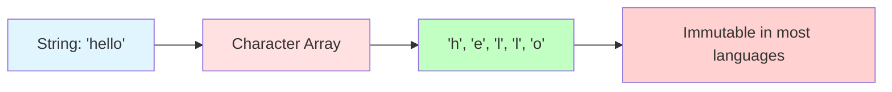

### String Operations and Complexity

| Operation | Time Complexity | Space Complexity |
|-----------|-----------------|-------------------|
| Access by index | O(1) | O(1) |
| Concatenation | O(n + m) | O(n + m) |
| Substring search | O(n × m) | O(1) |
| Character replacement | O(n) | O(n) |
| Case conversion | O(n) | O(n) |

### String Manipulation Techniques

**Two Pointers for Palindromes:**
```python
def is_palindrome(s):
    left, right = 0, len(s) - 1
    while left < right:
        if s[left] != s[right]:
            return False
        left += 1
        right -= 1
    return True
```

**Sliding Window for Substrings:**
```python
def length_of_longest_substring(s, k):
    char_count = {}
    max_length = 0
    left = 0
    
    for right in range(len(s)):
        char_count[s[right]] = char_count.get(s[right], 0) + 1
        
        while char_count[s[right]] > k:
            char_count[s[left]] -= 1
            left += 1
        
        max_length = max(max_length, right - left + 1)
    
    return max_length
```

### Common String Problems

**Anagram Check:**
```python
def is_anagram(s1, s2):
    if len(s1) != len(s2):
        return False
    return sorted(s1) == sorted(s2)
```

**Longest Common Prefix:**
```python
def longest_common_prefix(strs):
    if not strs:
        return ""
    
    prefix = strs[0]
    for s in strs[1:]:
        while not s.startswith(prefix):
            prefix = prefix[:-1]
            if not prefix:
                return ""
    
    return prefix
```

## 🔗 Linked Lists

### What is a Linked List?

A linked list is a **linear** data structure where elements are stored in **non-contiguous** memory locations. Each element (node) contains data and a reference (pointer) to the next node.

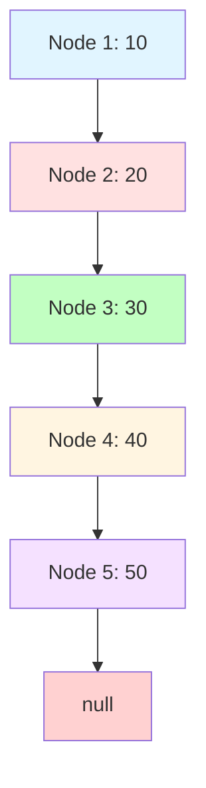

### Linked List vs Arrays

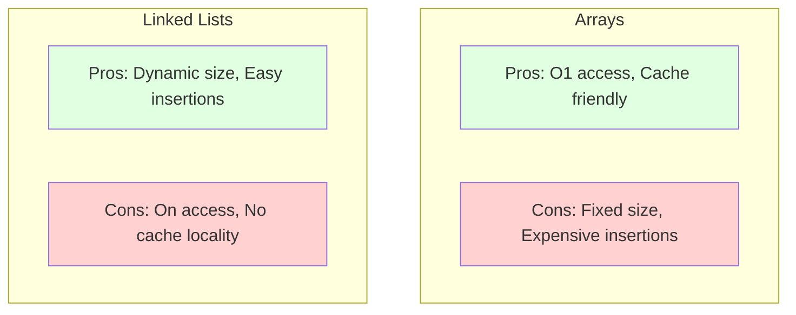

### Linked List Operations and Complexity

| Operation | Time Complexity | Space Complexity |
|-----------|-----------------|-------------------|
| Access by index | O(n) | O(1) |
| Search | O(n) | O(1) |
| Insert at beginning | O(1) | O(1) |
| Insert at end | O(n) | O(1) |
| Delete at beginning | O(1) | O(1) |
| Delete at end | O(n) | O(1) |

### Linked List Implementation (Java 17)

```java
public class Node<T> {
    T data;
    Node<T> next;
    
    public Node(T data) {
        this.data = data;
        this.next = null;
    }
}

public class LinkedList<T> {
    private Node<T> head;
    private int size;
    
    public LinkedList() {
        this.head = null;
        this.size = 0;
    }
    
    public void insertAtBeginning(T data) {
        Node<T> newNode = new Node<>(data);
        newNode.next = head;
        head = newNode;
        size++;
    }
    
    public void insertAtEnd(T data) {
        Node<T> newNode = new Node<>(data);
        if (head == null) {
            head = newNode;
        } else {
            Node<T> current = head;
            while (current.next != null) {
                current = current.next;
            }
            current.next = newNode;
        }
        size++;
    }
    
    public T deleteAtBeginning() {
        if (head == null) {
            return null;
        }
        T data = head.data;
        head = head.next;
        size--;
        return data;
    }
    
    public boolean search(T data) {
        Node<T> current = head;
        while (current != null) {
            if (current.data.equals(data)) {
                return true;
            }
            current = current.next;
        }
        return false;
    }
    
    public int size() {
        return size;
    }
}
```

### Types of Linked Lists

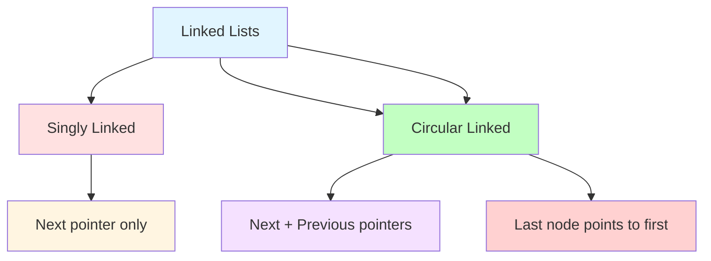

**Singly Linked List:** Each node points only to the next node
**Doubly Linked List:** Each node points to both next and previous nodes
**Circular Linked List:** Last node points back to the first node

### Common Linked List Problems

**Reverse a Linked List:**
```python
def reverse_linked_list(head):
    prev = None
    current = head
    
    while current:
        next_node = current.next
        current.next = prev
        prev = current
        current = next_node
    
    return prev
```

**Detect Cycle in Linked List:**
```python
def has_cycle(head):
    slow = head
    fast = head
    
    while fast and fast.next:
        slow = slow.next
        fast = fast.next.next
        
        if slow == fast:
            return True
    
    return False
```

**Find Middle of Linked List:**
```python
def find_middle(head):
    slow = head
    fast = head
    
    while fast and fast.next:
        slow = slow.next
        fast = fast.next.next
    
    return slow
```

## 📚 Stacks

### What is a Stack?

A stack is a **LIFO** (Last In, First Out) data structure. Think of it like a stack of plates - you can only add or remove from the top.

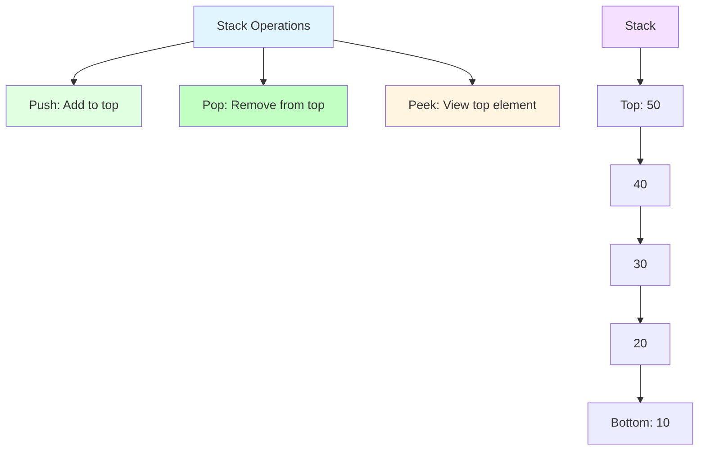

### Stack Operations and Complexity

| Operation | Time Complexity | Space Complexity |
|-----------|-----------------|-------------------|
| Push | O(1) | O(1) |
| Pop | O(1) | O(1) |
| Peek | O(1) | O(1) |
| Search | O(n) | O(1) |

### Stack Implementation (Java 17)

```java
import java.util.ArrayDeque;
import java.util.Deque;

public class Stack<T> {
    private final Deque<T> items;
    
    public Stack() {
        this.items = new ArrayDeque<>();
    }
    
    public void push(T item) {
        items.push(item);
    }
    
    public T pop() {
        return items.isEmpty() ? null : items.pop();
    }
    
    public T peek() {
        return items.isEmpty() ? null : items.peek();
    }
    
    public boolean isEmpty() {
        return items.isEmpty();
    }
    
    public int size() {
        return items.size();
    }
}
```

### Stack Applications

**Function Call Stack:**
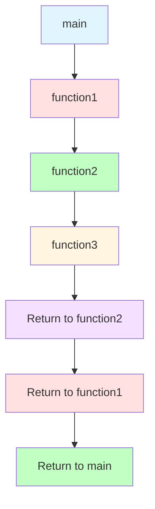

**Undo/Redo Operations:**
```python
class TextEditor:
    def __init__(self):
        self.undo_stack = Stack()
        self.redo_stack = Stack()
        self.text = ""
    
    def type_text(self, text):
        self.undo_stack.push(self.text)
        self.text += text
        self.redo_stack = Stack()  # Clear redo stack
    
    def undo(self):
        if not self.undo_stack.is_empty():
            self.redo_stack.push(self.text)
            self.text = self.undo_stack.pop()
    
    def redo(self):
        if not self.redo_stack.is_empty():
            self.undo_stack.push(self.text)
            self.text = self.redo_stack.pop()
```

**Expression Evaluation:**
```python
def evaluate_expression(expression):
    stack = Stack()
    
    for char in expression:
        if char == '(':
            stack.push(char)
        elif char == ')':
            while stack.peek() != '(':
                stack.pop()
            stack.pop()  # Remove '('
    
    return stack.is_empty()  # Balanced if stack is empty
```

### Common Stack Problems

**Valid Parentheses:**
```python
def is_valid_parentheses(s):
    stack = Stack()
    mapping = {')': '(', '}': '{', ']': '['}
    
    for char in s:
        if char in mapping.values():
            stack.push(char)
        elif char in mapping:
            if stack.is_empty() or stack.pop() != mapping[char]:
                return False
    
    return stack.is_empty()
```

**Min Stack:**
```python
class MinStack:
    def __init__(self):
        self.stack = Stack()
        self.min_stack = Stack()
    
    def push(self, val):
        self.stack.push(val)
        if self.min_stack.is_empty() or val <= self.min_stack.peek():
            self.min_stack.push(val)
    
    def pop(self):
        val = self.stack.pop()
        if val == self.min_stack.peek():
            self.min_stack.pop()
    
    def get_min(self):
        return self.min_stack.peek()
```

## 🚚 Queues

### What is a Queue?

A queue is a **FIFO** (First In, First Out) data structure. Think of it like a line at a store - first person in line gets served first.

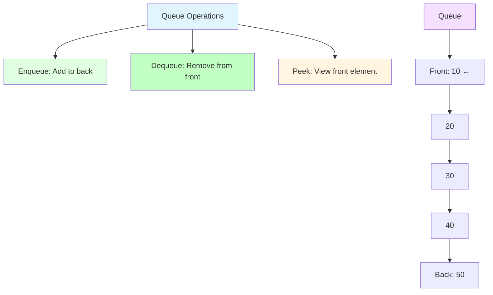

### Queue Operations and Complexity

| Operation | Time Complexity | Space Complexity |
|-----------|-----------------|-------------------|
| Enqueue | O(1) | O(1) |
| Dequeue | O(1) | O(1) |
| Peek | O(1) | O(1) |
| Search | O(n) | O(1) |

### Queue Implementation (Java 17)

```java
import java.util.ArrayDeque;
import java.util.Deque;

public class Queue<T> {
    private final Deque<T> items;
    
    public Queue() {
        this.items = new ArrayDeque<>();
    }
    
    public void enqueue(T item) {
        items.addLast(item);
    }
    
    public T dequeue() {
        return items.isEmpty() ? null : items.removeFirst();
    }
    
    public T peek() {
        return items.isEmpty() ? null : items.peekFirst();
    }
    
    public boolean isEmpty() {
        return items.isEmpty();
    }
    
    public int size() {
        return items.size();
    }
}
```

### Queue Applications

**Breadth-First Search (BFS):**
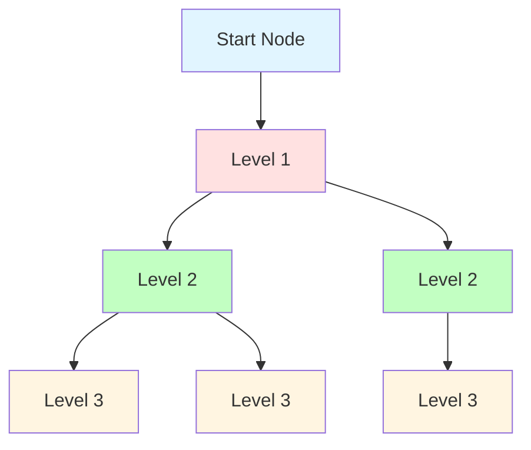

**Task Scheduling:**
```python
def task_scheduler(tasks, n):
    queue = Queue()
    time = 0
    
    for task in tasks:
        queue.enqueue(task)
    
    while not queue.is_empty():
        task = queue.dequeue()
        time += 1
        print(f"Processing task {task} at time {time}")
```

**Buffer/Producer-Consumer:**
```python
class Buffer:
    def __init__(self, size):
        self.queue = Queue()
        self.size = size
    
    def produce(self, item):
        if self.queue.size() < self.size:
            self.queue.enqueue(item)
            return True
        return False
    
    def consume(self):
        if not self.queue.is_empty():
            return self.queue.dequeue()
        return None
```

### Types of Queues

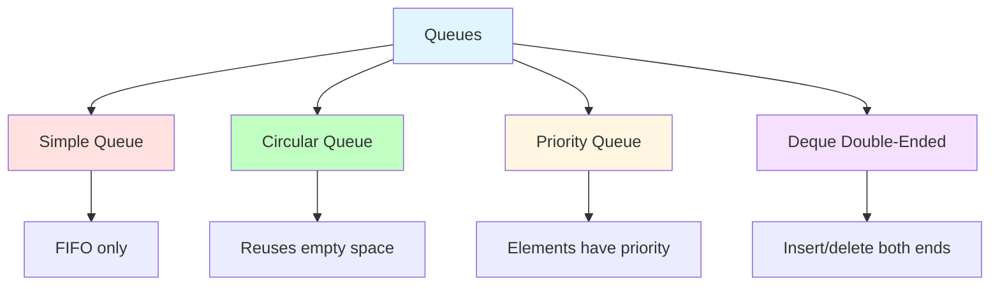

**Circular Queue:** Efficient use of array space
**Priority Queue:** Elements are processed based on priority
**Deque (Double-Ended Queue): Can add/remove from both ends

### Common Queue Problems

**Implement Queue using Stacks:**
```python
class QueueWithStacks:
    def __init__(self):
        self.in_stack = Stack()
        self.out_stack = Stack()
    
    def enqueue(self, x):
        self.in_stack.push(x)
    
    def dequeue(self):
        if self.out_stack.is_empty():
            while not self.in_stack.is_empty():
                self.out_stack.push(self.in_stack.pop())
        
        if self.out_stack.is_empty():
            return None
        
        return self.out_stack.pop()
```

**Implement Stack using Queues:**
```python
class StackWithQueues:
    def __init__(self):
        self.queue1 = Queue()
        self.queue2 = Queue()
    
    def push(self, x):
        self.queue2.enqueue(x)
        while not self.queue1.is_empty():
            self.queue2.enqueue(self.queue1.dequeue())
        
        # Swap queues
        self.queue1, self.queue2 = self.queue2, self.queue1
    
    def pop(self):
        if self.queue1.is_empty():
            return None
        return self.queue1.dequeue()
```

## 🔄 Data Structure Selection Guide

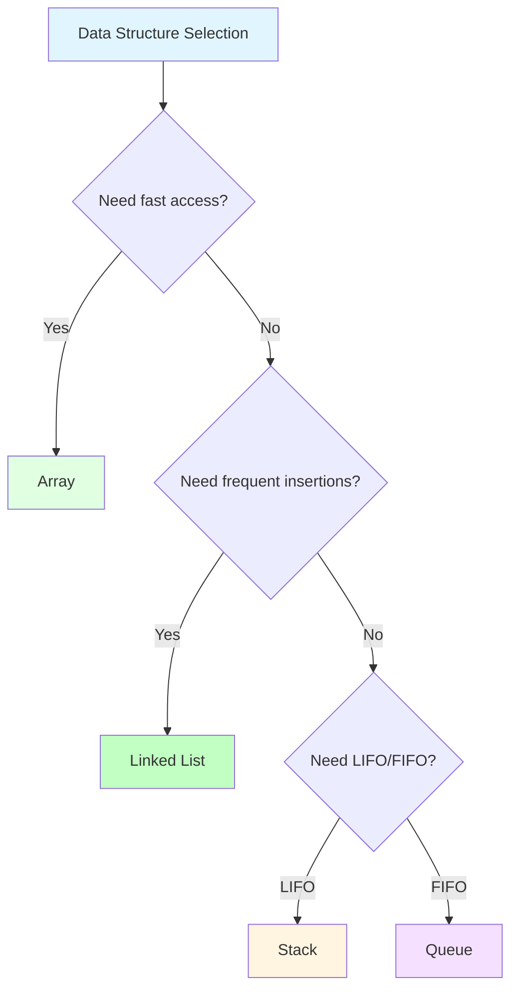

### Decision Tree

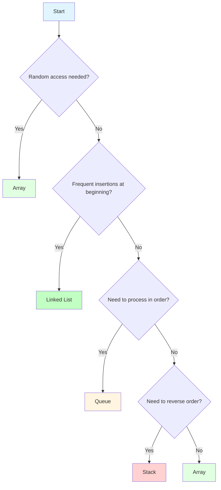

## 🧪 Practice Problems

### Easy (Day 1-5)
1. **Contains Duplicate**: Use hash set or sorting
2. **Missing Number**: Use sum formula or XOR
3. **Move Zeroes**: Use two pointers
4. **Valid Parentheses**: Use stack
5. **Implement Stack**: Implement using array or linked list

### Medium (Day 6-10)
1. **Two Sum**: Use hash map or two pointers
2. **3Sum**: Use sorting + two pointers
4. **Reverse Linked List**: Use three pointers
5. **LRU Cache**: Use hash map + doubly linked list

### Hard (Day 11-14)
1. **Merge Intervals**: Use sorting + two pointers
2. **Insert Interval**: Use intervals + binary search
3. **Design Circular Queue**: Handle edge cases
4. **Design Min Stack**: Use auxiliary stack

## 🎯 Daily Exercises (1-Hour Schedule)

### Day 1: Arrays (10 + 20 + 25 + 5)
**Learning (10 min):**
- Read array section
- Study memory layout diagram
- Understand random access

**Examples (20 min):**
- Implement array class from scratch
- Test insertion and deletion operations
- Calculate time complexity of each operation

**Practice (25 min):**
- Solve "Contains Duplicate" on LeetCode (Easy)
- Solve "Missing Number" on LeetCode (Easy)
- Solve "Move Zeroes" on LeetCode (Easy)

**Review (5 min):**
- Compare your solutions with optimal approaches
- Note which operations you understood correctly

### Day 2: Strings (10 + 20 + 25 + 5)
**Learning (10 min):**
- Read string section
- Understand string immutability
- Study common string operations

**Examples (20 min):**
- Implement string manipulation functions
- Practice two-pointer string techniques
- Understand time complexity of string operations

**Practice (25 min):**
- Solve "Valid Anagram" on LeetCode (Easy)
- Solve "Longest Common Prefix" on LeetCode (Easy)
- Solve "Valid Palindrome" on LeetCode (Easy)

**Review (5 min):**
- Check if your solutions are optimal
- Note string-specific techniques you learned

### Day 3: Linked Lists (10 + 20 + 25 + 5)
**Learning (10 min):**
- Read linked list section
- Study node structure and pointers
- Understand memory layout

**Examples (20 min):**
- Implement singly linked list from scratch
- Practice insertion and deletion operations
- Trace through pointer operations manually

**Practice (25 min):**
- Solve "Reverse Linked List" on LeetCode (Easy)
- Solve "Middle of Linked List" on LeetCode (Easy)
- Solve "Cycle Detection" on LeetCode (Easy)

**Review (5 min):**
- Review pointer manipulation
- Note which operations were intuitive or difficult

### Day 4: Stacks (10 + 20 + 25 + 5)
**Learning (10 min):**
- Read stack section
- Understand LIFO principle
- Study stack applications

**Examples (20 min):**
- Implement stack from scratch
- Practice push, pop, peek operations
- Understand function call stack

**Practice (25 min):**
- Solve "Valid Parentheses" on LeetCode (Easy)
- Solve "Min Stack" on LeetCode (Medium)
- Solve "Evaluate Expression" (practice)

**Review (5 min):**
- Review stack use cases
- Note which problems were naturally suited for stacks

### Day 5: Queues (10 + 20 + 25 + 5)
**Learning (10 min):**
- Read queue section
- Understand FIFO principle
- Study queue applications

**Examples (20 min):**
- Implement queue from scratch
- Practice enqueue, dequeue operations
- Understand BFS concept

**Practice (25 min):**
- Solve "Implement Queue using Stacks" (LeetCode 232)
- Solve "Design Circular Queue" (LeetCode 622)
- Solve "Moving Average from Data Stream" (LeetCode 346)

**Review (5 min):**
- Review queue vs stack differences
- Note which scenarios need FIFO vs LIFO

### Day 6-7: Mixed Practice (10 + 20 + 25 + 5)
**Learning (10 min):**
- Review all data structures
- Study the selection guide
- Understand trade-offs

**Examples (20 min):**
- Compare array vs linked list operations
- Practice converting between data structures
- Understand when to use each structure

**Practice (25 min):**
- Solve problems that combine multiple data structures
- Practice LeetCode medium problems
- Focus on time/space optimization

**Review (5 min):**
- Review your data structure selection
- Note areas that need more practice

## 📋 Weekly Summary

### Week 2 Goals
- [ ] Implement arrays, strings, linked lists, stacks, queues from scratch
- [ ] Understand time complexity of common operations
- [ ] Solve 15+ LeetCode problems using these data structures
- [ ] Recognize which data structure to use for specific problems
- [ ] Understand space vs time trade-offs

### Week 2 Checklist
- [ ] Completed all daily exercises
- [ ] Can implement each data structure without looking at code
- [ ] Can analyze time complexity of operations
- [ ] Can choose appropriate data structure for problems
- [ ] Ready to move to advanced data structures

## 🚀 Next Steps

After mastering basic data structures:
1. **Move to File 03**: Data Structures II (Trees, Heaps, Hash Tables, Graphs)
2. **Apply these structures** to solve more complex problems
3. **Practice hybrid problems** that use multiple data structures
4. **Learn optimization techniques** for these structures

## 💡 Key Takeaways

1. **Arrays** are fast for access but slow for insertions/deletions
2. **Linked lists** are flexible for insertions but slow for access
3. **Stacks** are perfect for LIFO operations and recursion
4. **Queues** are essential for BFS and order processing
5. **Choose data structure based on** access patterns and operation frequency

---

**You're now ready for advanced data structures!** → [03_DATA_STRUCTURES_II.md](./03_DATA_STRUCTURES_II.md)
