# Data Structures II - Trees, Heaps, Hash Tables, Graphs

## 🎯 Learning Objectives

By the end of this file, you will:
- Understand hierarchical data structures (trees)
- Master priority-based data structures (heaps)
- Learn hash-based data structures (hash tables)
- Understand network-based data structures (graphs)
- Know which advanced data structure to use for complex problems

## 🌳 Trees

### What is a Tree?

A tree is a **hierarchical** data structure with a root node and child nodes. It's like a family tree or organizational chart.

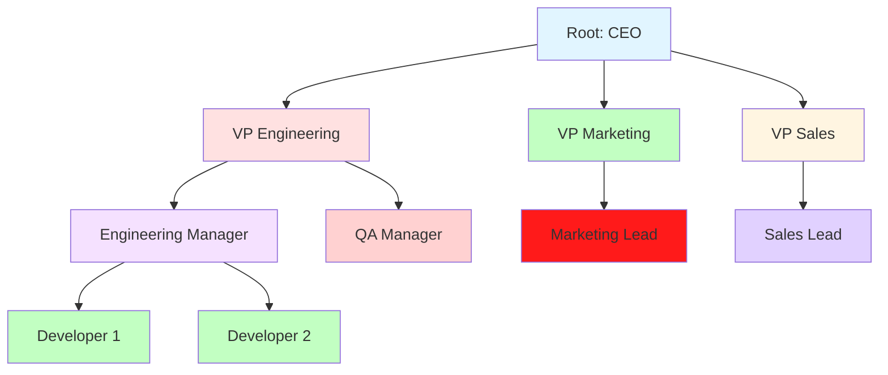

### Tree Terminology

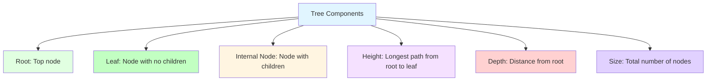

### Binary Tree

A binary tree is a tree where each node has **at most two children**.

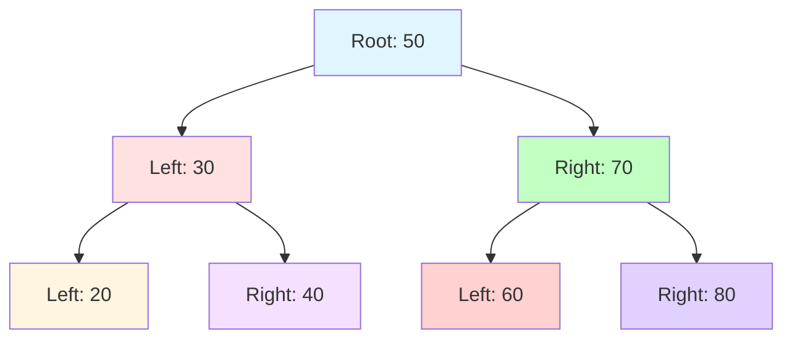

### Binary Search Tree (BST)

A BST is a binary tree where:
- **Left child** < parent node
- **Right child** > parent node

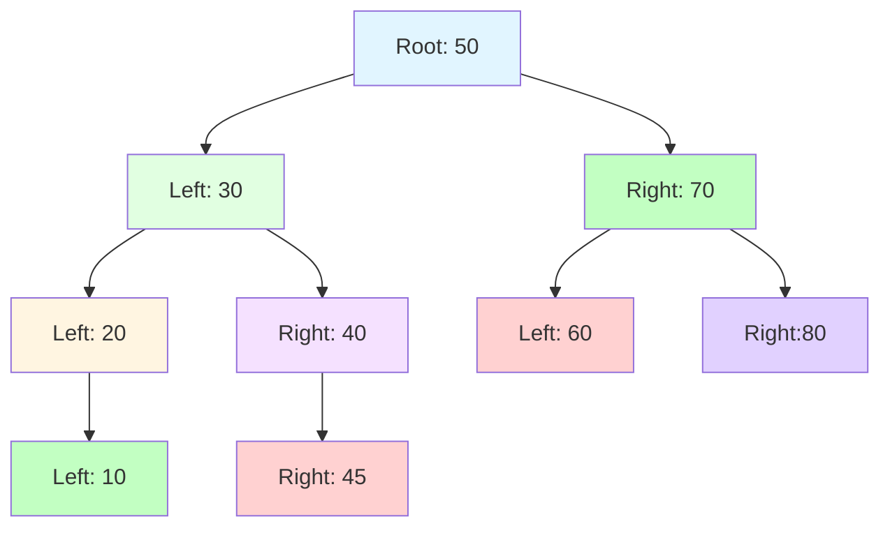

### BST Operations and Complexity

| Operation | Average Case | Worst Case | Space Complexity |
|-----------|-------------|------------|-------------------|
| Search | O(log n) | O(n) | O(1) |
| Insert | O(log n) | O(n) | O(1) |
| Delete | O(log n) | O(n) | O(1) |
| Traverse | O(n) | O(n) | O(n) |

### BST Implementation

```python
class TreeNode:
    def __init__(self, val=0, left=None, right=None):
        self.val = val
        self.left = left
        self.right = right

class BST:
    def __init__(self):
        self.root = None
    
    def insert(self, val):
        if not self.root:
            self.root = TreeNode(val)
        else:
            self._insert_recursive(self.root, val)
    
    def _insert_recursive(self, node, val):
        if val < node.val:
            if node.left is None:
                node.left = TreeNode(val)
            else:
                self._insert_recursive(node.left, val)
        else:
            if node.right is None:
                node.right = TreeNode(val)
            else:
                self._insert_recursive(node.right, val)
    
    def search(self, val):
        return self._search_recursive(self.root, val)
    
    def _search_recursive(self, node, val):
        if node is None:
            return False
        if val == node.val:
            return True
        elif val < node.val:
            return self._search_recursive(node.left, val)
        else:
            return self._search_recursive(node.right, val)
```

### Tree Traversals

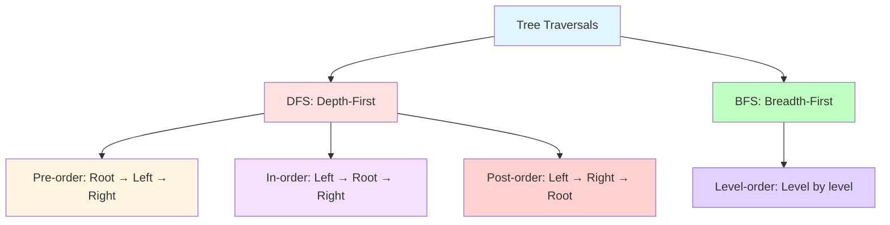

**Pre-order Traversal (Root → Left → Right):**
```python
def preorder_traversal(root):
    if root:
        print(root.val)  # Visit root
        preorder_traversal(root.left)  # Visit left subtree
        preorder_traversal(root.right)  # Visit right subtree
```

**In-order Traversal (Left → Root → Right):**
```python
def inorder_traversal(root):
    if root:
        inorder_traversal(root.left)  # Visit left subtree
        print(root.val)  # Visit root
        inorder_traversal(root.right)  # Visit right subtree
```

**Post-order Traversal (Left → Right → Root):**
```python
def postorder_traversal(root):
    if root:
        postorder_traversal(root.left)  # Visit left subtree
        postorder_traversal(root.right)  # Visit right subtree
        print(root.val)  # Visit root
```

**Level-order Traversal (BFS):**
```python
from collections import deque

def level_order_traversal(root):
    if not root:
        return []
    
    result = []
    queue = deque([root])
    
    while queue:
        node = queue.popleft()
        result.append(node.val)
        
        if node.left:
            queue.append(node.left)
        if node.right:
            queue.append(node.right)
    
    return result
```

### Common Tree Problems

**Validate BST:**
```python
def is_valid_bst(root):
    def validate(node, min_val, max_val):
        if not node:
            return True
        
        if node.val <= min_val or node.val >= max_val:
            return False
        
        return (validate(node.left, min_val, node.val) and
                validate(node.right, node.val, max_val))
    
    return validate(root, float('-inf'), float('inf'))
```

**Maximum Depth of Binary Tree:**
```python
def max_depth(root):
    if not root:
        return 0
    
    left_depth = max_depth(root.left)
    right_depth = max_depth(root.right)
    
    return max(left_depth, right_depth) + 1
```

**Lowest Common Ancestor:**
```python
def lowest_common_ancestor(root, p, q):
    if not root or root == p or root == q:
        return root
    
    left = lowest_common_ancestor(root.left, p, q)
    right = lowest_common_ancestor(root.right, p, q)
    
    if left and right:
        return root
    return left if left else right
```

## 🏔 Heaps

### What is a Heap?

A heap is a **complete binary tree** that satisfies the **heap property**:
- **Min-heap**: Parent ≤ children (smallest at root)
- **Max-heap**: Parent ≥ children (largest at root)

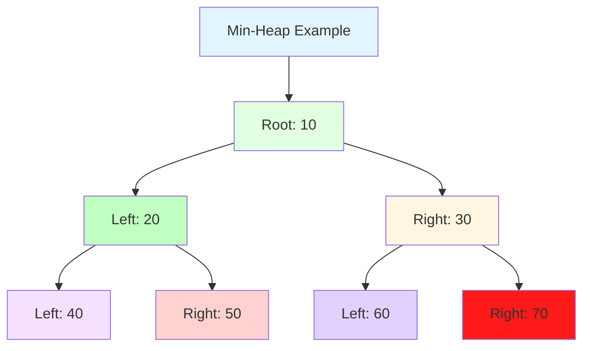

### Heap Operations and Complexity

| Operation | Time Complexity | Space Complexity |
|-----------|-----------------|-------------------|
| Insert | O(log n) | O(1) |
| Extract Min/Max | O(log n) | O(1) |
| Peek | O(1) | O(1) |
| Delete | O(log n) | O(1) |
| Build Heap | O(n) | O(1) |

### Heap Implementation (Min-Heap)

```python
import heapq

class MinHeap:
    def __init__(self):
        self.heap = []
    
    def insert(self, val):
        heapq.heappush(self.heap, val)
    
    def extract_min(self):
        if not self.heap:
            return None
        return heapq.heappop(self.heap)
    
    def peek(self):
        if not self.heap:
            return None
        return self.heap[0]
    
    def size(self):
        return len(self.heap)
```

### Heap Applications

**Priority Queue:**
```python
import heapq

class PriorityQueue:
    def __init__(self):
        self.heap = []
    
    def enqueue(self, item, priority):
        heapq.heappush(self.heap, (priority, item))
    
    def dequeue(self):
        if not self.heap:
            return None
        return heapq.heappop(self.heap)[1]
    
    def peek(self):
        if not self.heap:
            return None
        return self.heap[0][1]
```

**K Largest Elements:**
```python
def k_largest_elements(arr, k):
    # Use min-heap of size k
    min_heap = []
    
    for num in arr:
        if len(min_heap) < k:
            heapq.heappush(min_heap, num)
        else:
            heapq.heappushpop(min_heap, num)
    
    return sorted(min_heap, reverse=True)
```

**Merge K Sorted Lists:**
```python
def merge_k_sorted_lists(lists):
    import heapq
    
    min_heap = []
    
    # Push first element from each list
    for i, lst in enumerate(lists):
        if lst:
            heapq.heappush(min_heap, (lst[0], i, 0))
    
    result = []
    
    while min_heap:
        val, list_idx, element_idx = heapq.heappop(min_heap)
        result.append(val)
        
        if element_idx + 1 < len(lists[list_idx]):
            next_val = lists[list_idx][element_idx + 1]
            heapq.heappush(min_heap, (next_val, list_idx, element_idx + 1))
    
    return result
```

## 🔑 Hash Tables

### What is a Hash Table?

A hash table uses a **hash function** to map keys to array indices, enabling O(1) average case operations.

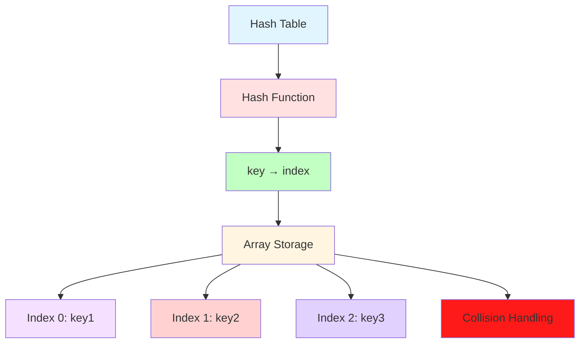

### Hash Table Operations and Complexity

| Operation | Average Case | Worst Case | Space Complexity |
|-----------|-------------|------------|-------------------|
| Insert | O(1) | O(n) | O(n) |
| Search | O(1) | O(n) | O(1) |
| Delete | O(1) | O(n) | O(n) |

### Collision Resolution

**Chaining (Separate Chaining):**
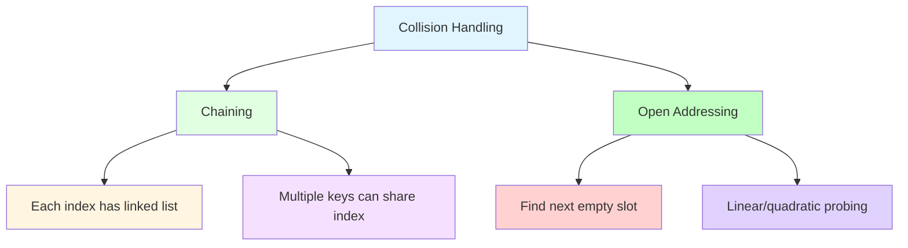

### Hash Table Implementation

```python
class HashTable:
    def __init__(self, capacity=16):
        self.capacity = capacity
        self.size = 0
        self.buckets = [[] for _ in range(capacity)]
    
    def _hash(self, key):
        return hash(key) % self.capacity
    
    def put(self, key, value):
        index = self._hash(key)
        bucket = self.buckets[index]
        
        # Check if key already exists
        for i, (existing_key, _) in enumerate(bucket):
            if existing_key == key:
                bucket[i] = (key, value)
                return
        
        bucket.append((key, value))
        self.size += 1
        
        # Resize if load factor > 0.75
        if self.size / self.capacity > 0.75:
            self._resize()
    
    def get(self, key):
        index = self._hash(key)
        bucket = self.buckets[index]
        
        for existing_key, value in bucket:
            if existing_key == key:
                return value
        
        return None
    
    def remove(self, key):
        index = self._hash(key)
        bucket = self.buckets[index]
        
        for i, (existing_key, _) in enumerate(bucket):
            if existing_key == key:
                bucket.pop(i)
                self.size -= 1
                return True
        
        return False
    
    def _resize(self):
        old_buckets = self.buckets
        self.capacity *= 2
        self.buckets = [[] for _ in range(self.capacity)]
        self.size = 0
        
        for bucket in old_buckets:
            for key, value in bucket:
                self.put(key, value)
```

### Common Hash Table Problems

**Two Sum (Hash Map Approach):**
```python
def two_sum_hash(nums, target):
    seen = {}
    
    for i, num in enumerate(nums):
        complement = target - num
        if complement in seen:
            return [seen[complement], i]
        seen[num] = i
    
    return []
```

**Group Anagrams:**
```python
from collections import defaultdict

def group_anagrams(strs):
    anagrams = defaultdict(list)
    
    for s in strs:
        key = ''.join(sorted(s))
        anagrams[key].append(s)
    
    return list(anagrams.values())
```

**LRU Cache (Hash Map + Doubly Linked List):**
```python
class Node:
    def __init__(self, key, value):
        self.key = key
        self.value = value
        self.prev = None
        self.next = None

class LRUCache:
    def __init__(self, capacity):
        self.capacity = capacity
        self.cache = {}
        self.head = Node(None, None)
        self.tail = Node(None, None)
        self.head.next = self.tail
        self.tail.prev = self.head
    
    def get(self, key):
        if key in self.cache:
            node = self.cache[key]
            # Move to front (most recently used)
            self._remove_node(node)
            self._add_to_front(node)
            return node.value
        return -1
    
    def put(self, key, value):
        if key in self.cache:
            node = self.cache[key]
            node.value = value
            self._remove_node(node)
            self._add_to_front(node)
        else:
            node = Node(key, value)
            self.cache[key] = node
            self._add_to_front(node)
            
            if len(self.cache) > self.capacity:
                # Remove least recently used
                lru = self.tail.prev
                self._remove_node(lru)
                del self.cache[lru.key]
```

## 🕸️ Graphs

### What is a Graph?

A graph is a **non-linear** data structure consisting of **vertices** (nodes) and **edges** (connections). It represents relationships between objects.

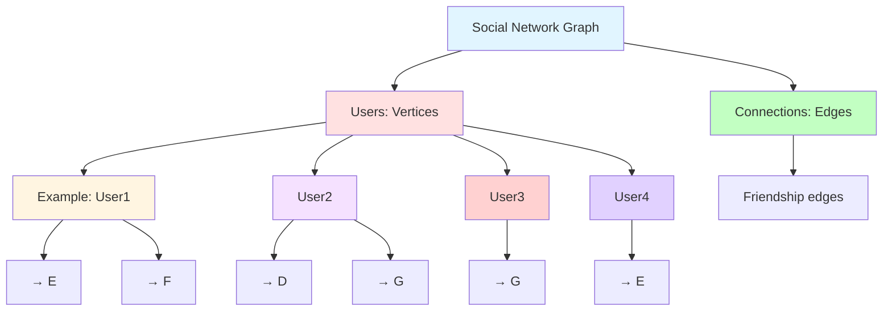

### Graph Terminology

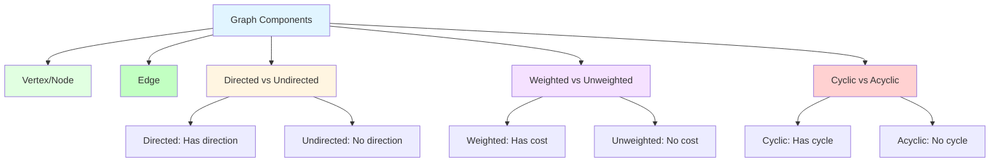

### Graph Representation

**Adjacency Matrix:**
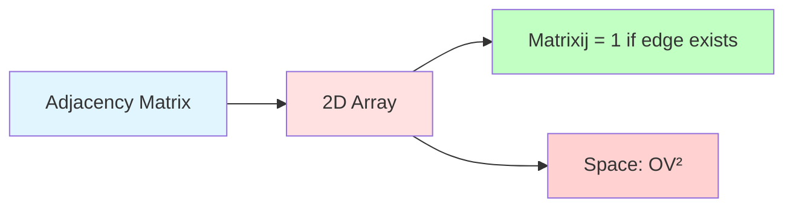

**Adjacency List:**
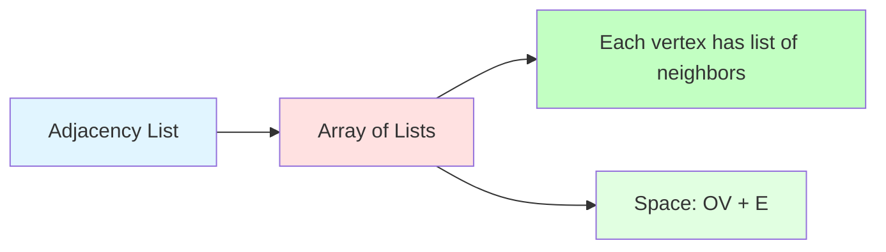

### Graph Implementation (Adjacency List)

```python
class Graph:
    def __init__(self, directed=False):
        self.graph = {}
        self.directed = directed
    
    def add_vertex(self, vertex):
        if vertex not in self.graph:
            self.graph[vertex] = []
    
    def add_edge(self, vertex1, vertex2):
        if vertex1 not in self.graph:
            self.add_vertex(vertex1)
        if vertex2 not in self.graph:
            self.add_vertex(vertex2)
        
        self.graph[vertex1].append(vertex2)
        
        if not self.directed:
            self.graph[vertex2].append(vertex1)
    
    def remove_edge(self, vertex1, vertex2):
        if vertex1 in self.graph and vertex2 in self.graph[vertex1]:
            self.graph[vertex1].remove(vertex2)
        
        if not self.directed:
            self.graph[vertex2].remove(vertex1)
    
    def bfs(self, start):
        visited = set()
        queue = [start]
        result = []
        
        while queue:
            vertex = queue.pop(0)
            if vertex not in visited:
                visited.add(vertex)
                result.append(vertex)
                queue.extend(self.graph.get(vertex, []))
        
        return result
    
    def dfs(self, start, visited=None):
        if visited is None:
            visited = set()
        
        visited.add(start)
        result = [start]
        
        for neighbor in self.graph.get(start, []):
            if neighbor not in visited:
                result.extend(self.dfs(neighbor, visited))
        
        return result
```

### Graph Traversals

**BFS (Breadth-First Search):**
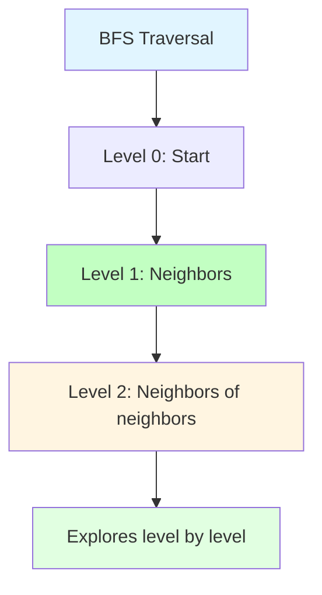

**DFS (Depth-First Search):**
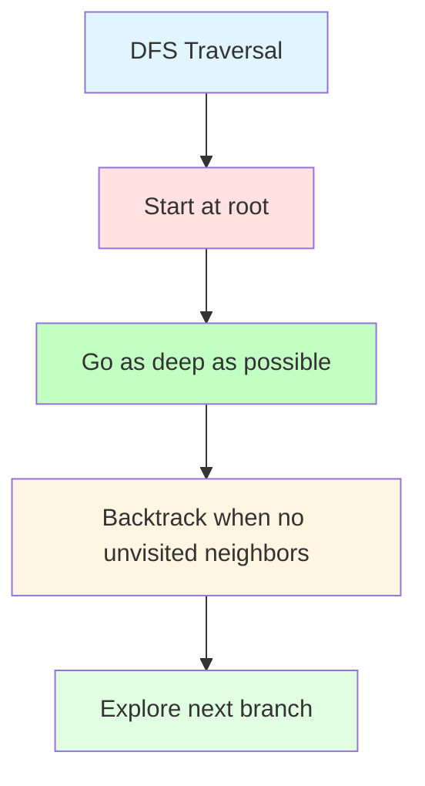

### Common Graph Problems

**Course Schedule (Topological Sort):**
```python
from collections import deque

def course_schedule(num_courses, prerequisites):
    # Build adjacency list
    graph = {i: [] for i in range(num_courses)}
    in_degree = [0] * num_courses
    
    for course, prereq in prerequisites:
        graph[prereq].append(course)
        in_degree[course] += 1
    
    # Find nodes with no prerequisites
    queue = deque([i for i in range(num_courses) if in_degree[i] == 0])
    result = []
    
    while queue:
        course = queue.popleft()
        result.append(course)
        
        for neighbor in graph[course]:
            in_degree[neighbor] -= 1
            if in_degree[neighbor] == 0:
                queue.append(neighbor)
    
    return result if len(result) == num_courses else []
```

**Number of Islands (DFS):**
```python
def num_islands(grid):
    if not grid:
        return 0
    
    rows, cols = len(grid), len(grid[0])
    visited = set()
    islands = 0
    
    def dfs(r, c):
        if (r < 0 or r >= rows or c < 0 or c >= cols or
            grid[r][c] != '1' or (r, c) in visited):
            return
        
        visited.add((r, c))
        dfs(r + 1, c)
        dfs(r - 1, c)
        dfs(r, c + 1)
        dfs(r, c - 1)
    
    for r in range(rows):
        for c in range(cols):
            if grid[r][c] == '1' and (r, c) not in visited:
                dfs(r, c)
                islands += 1
    
    return islands
```

**Shortest Path (Dijkstra's Algorithm):**
```python
import heapq

def dijkstra(graph, start):
    distances = {node: float('inf') for node in graph}
    distances[start] = 0
    pq = [(0, start)]
    visited = set()
    
    while pq:
        dist, node = heapq.heappop(pq)
        
        if node in visited:
            continue
        visited.add(node)
        
        for neighbor, weight in graph[node]:
            if dist + weight < distances[neighbor]:
                distances[neighbor] = dist + weight
                heapq.heappush(pq, (distances[neighbor], neighbor))
    
    return distances
```

## 🔄 Data Structure Comparison

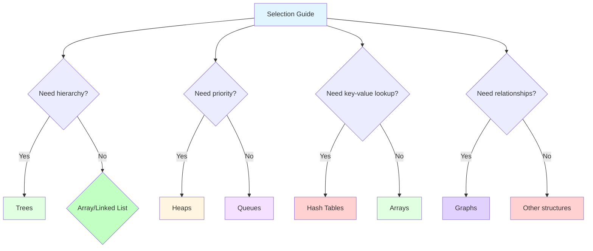

## 🧪 Practice Problems

### Trees (Day 1-3)
1. **Maximum Depth of Binary Tree**: DFS or BFS
2. **Validate Binary Search Tree**: In-order traversal
3. **Lowest Common Ancestor**: Tree traversal

### Heaps (Day 4-5)
1. **Kth Largest Element**: Min-heap
2. **Merge K Sorted Lists**: Min-heap with pointers
3. **Top K Frequent Elements**: Hash map + heap

### Hash Tables (Day 6-8)
1. **Two Sum**: Hash map approach
2. **Group Anagrams**: Hash map with sorted keys
3. **LRU Cache**: Hash map + doubly linked list

### Graphs (Day 9-12)
1. **Course Schedule**: Topological sort
2. **Number of Islands**: DFS/BFS
3. **Clone Graph**: BFS with node tracking

## 🎯 Daily Exercises (1-Hour Schedule)

### Day 1: Trees (10 + 20 + 25 + 5)
**Learning (10 min):**
- Read tree section
- Study tree terminology diagrams
- Understand BST property

**Examples (20 min):**
- Implement TreeNode class
- Implement BST insert/search operations
- Practice tree traversals manually

**Practice (25 min):**
- Solve "Maximum Depth of Binary Tree" on LeetCode (Easy)
- Solve "Validate Binary Search Tree" on LeetCode (Medium)
- Implement tree traversals from scratch

**Review (5 min):**
- Review tree traversal patterns
- Note which traversal you understood best

### Day 2: Heaps (10 + 20 + 25 + 5)
**Learning (10 min):**
- Read heap section
- Study heap property diagrams
- Understand heap vs BST

**Examples (20 min):**
- Implement min-heap using array
- Practice heap operations (insert, extract-min)
- Understand heapify operation

**Practice (25 min):**
- Solve "Kth Largest Element in an Array" on LeetCode (Medium)
- Solve "Top K Frequent Elements" on LeetCode (Medium)
- Implement priority queue from scratch

**Review (5 min):**
- Review heap use cases
- Note when to use heap vs BST

### Day 3: Hash Tables (10 + 20 + 25 + 5)
**Learning (10 min):**
- Read hash table section
- Study collision resolution diagrams
- Understand hash function

**Examples (20 min):**
- Implement hash table with chaining
- Practice handling collisions
- Understand load factor

**Practice (25 min):**
- Solve "Two Sum" using hash map (Easy)
- Solve "Group Anagrams" (Medium)
- Implement LRU cache from scratch

**Review (5 min):**
- Review hash table advantages
- Note collision handling strategies

### Day 4: Graphs (10 + 20 + 25 + 5)
**Learning (10 min):**
- Read graph section
- Study graph terminology
- Understand adjacency list vs matrix

**Examples (20 min):**
- Implement graph using adjacency list
- Practice BFS and DFS implementations
- Understand graph representation trade-offs

**Practice (25 min):**
- Solve "Number of Islands" on LeetCode (Medium)
- Solve "Course Schedule" on LeetCode (Medium)
- Implement graph from scratch

**Review (5 min):**
- Review BFS vs DFS use cases
- Note which traversal felt more intuitive

### Day 5-7: Mixed Practice (10 + 20 + 25 + 5)
**Learning (10 min):**
- Review all advanced data structures
- Study the selection guide
- Understand trade-offs

**Examples (20 min):**
- Practice converting between representations
- Understand hybrid data structure usage
- Study real-world applications

**Practice (25 min):**
- Solve LeetCode medium problems
- Focus on choosing optimal data structure
- Practice implementing solutions from scratch

**Review (5 min):**
- Review your data structure choices
- Note areas that need more practice

## 📋 Weekly Summary

### Week 3 Goals
- [ ] Implement trees, heaps, hash tables, graphs from scratch
- [ ] Understand time complexity of operations
- [ ] Solve 20+ LeetCode problems using these structures
- [ ] Choose appropriate data structure for complex problems
- [ ] Understand collision resolution and graph algorithms

### Week 3 Checklist
- [ ] Completed all daily exercises
- [ ] Can implement each data structure without reference
- [ ] Can analyze complexity of operations
- [ ] Can choose optimal data structure for problems
- [ ] Ready to move to algorithms

## 🚀 Next Steps

After mastering advanced data structures:
1. **Move to File 04**: Algorithms I (Sorting, Searching, Two Pointers)
2. **Apply these structures** to solve algorithmic problems
3. **Practice hybrid problems** that use multiple structures
4. **Learn optimization techniques** for combined structures

## 💡 Key Takeaways

1. **Trees** provide hierarchical organization and efficient search
2. **Heaps** enable priority-based operations and O(1) min/max access
3. **Hash tables** provide O(1) average case operations with key-value mapping
4. **Graphs** model complex relationships and networks
5. **Choosing the right data structure** is crucial for optimal performance

---

**You're now ready for algorithms!** → [04_ALGORITHMS_I.md](./04_ALGORITHMS_I.md)
