# Algorithms I - Sorting, Searching, Two Pointers, Sliding Window

## 🎯 Learning Objectives

By the end of this file, you will:
- Master fundamental sorting algorithms
- Understand searching techniques
- Learn two-pointer and sliding window patterns
- Apply these algorithms to solve complex problems
- Understand when to use each algorithm

## 📊 Algorithm Overview

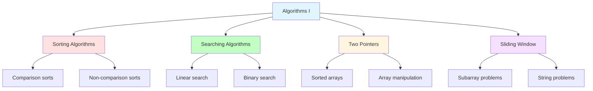

## 🔄 Sorting Algorithms

### What is Sorting?

Sorting arranges elements in a specific order (ascending/descending). It's fundamental for efficient searching and data organization.

```mermaid
graph TD
    A[Sorting Categories] --> B[Comparison-based]
    A --> C[Non-comparison-based]
    
    B --> D[O(n log n): Merge, Quick, Heap]
    B --> E[O(n²): Bubble, Selection, Insertion]
    
    C --> F[O(n): Counting, Radix, Bucket]
    
    style A fill:#e1f5ff
    style B fill:#ffe1e1
    style C fill:#c2ffc2
    style D fill:#e1ffe1
    style E fill:#ffd1d1
    style F fill:#fff5e1
```

### Sorting Algorithm Comparison

| Algorithm | Time (Best) | Time (Average) | Time (Worst) | Space | Stable |
|-----------|-------------|----------------|--------------|-------|--------|
| Bubble Sort | O(n) | O(n²) | O(n²) | O(1) | Yes |
| Selection Sort | O(n²) | O(n²) | O(n²) | O(1) | No |
| Insertion Sort | O(n) | O(n²) | O(n²) | O(1) | Yes |
| Merge Sort | O(n log n) | O(n log n) | O(n log n) | O(n) | Yes |
| Quick Sort | O(n log n) | O(n log n) | O(n²) | O(log n) | No |
| Heap Sort | O(n log n) | O(n log n) | O(n log n) | O(1) | No |

### Bubble Sort

**Concept**: Repeatedly swap adjacent elements if they're in wrong order.

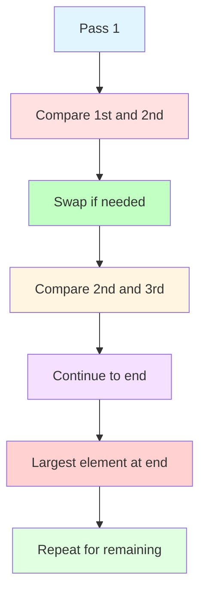

**Implementation (Java 17):**
```java
public void bubbleSort(int[] arr) {
    int n = arr.length;
    for (int i = 0; i < n; i++) {
        boolean swapped = false;
        for (int j = 0; j < n - i - 1; j++) {
            if (arr[j] > arr[j + 1]) {
                // Swap elements
                int temp = arr[j];
                arr[j] = arr[j + 1];
                arr[j + 1] = temp;
                swapped = true;
            }
        }
        if (!swapped) {  // Optimization: already sorted
            break;
        }
    }
}
```

**When to Use:**
- Educational purposes (simple to understand)
- Nearly sorted arrays (with optimization)
- Small datasets

### Selection Sort

**Concept**: Find minimum element and place it at the beginning.

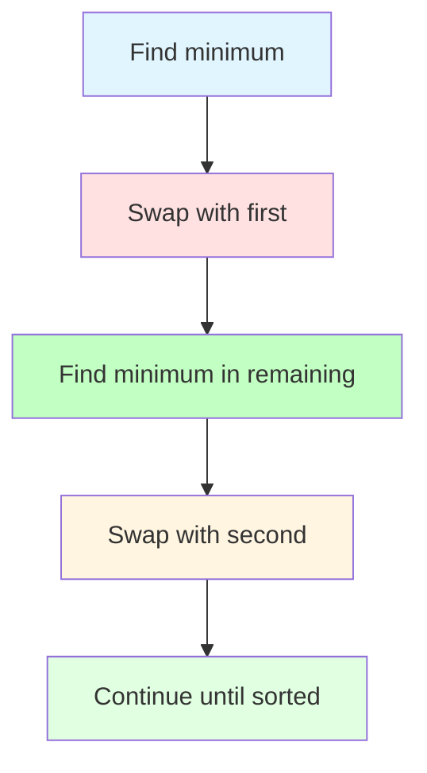

**Implementation (Java 17):**
```java
public void selectionSort(int[] arr) {
    int n = arr.length;
    for (int i = 0; i < n; i++) {
        int minIdx = i;
        for (int j = i + 1; j < n; j++) {
            if (arr[j] < arr[minIdx]) {
                minIdx = j;
            }
        }
        // Swap elements
        int temp = arr[i];
        arr[i] = arr[minIdx];
        arr[minIdx] = temp;
    }
}
```

**When to Use:**
- When memory writes are expensive (minimizes swaps)
- Small datasets
- When swap cost is high

### Insertion Sort

**Concept**: Build sorted array one element at a time.

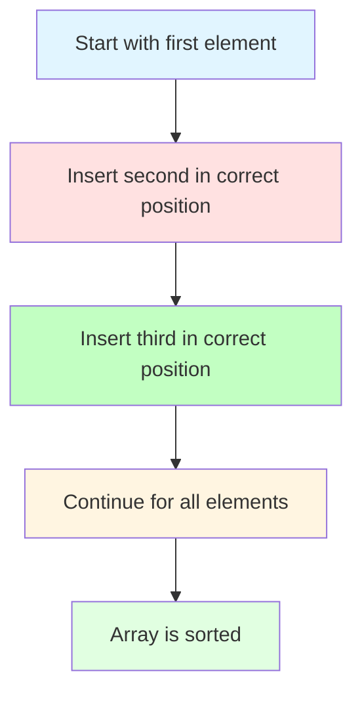

**Implementation (Java 17):**
```java
public void insertionSort(int[] arr) {
    for (int i = 1; i < arr.length; i++) {
        int key = arr[i];
        int j = i - 1;
        while (j >= 0 && arr[j] > key) {
            arr[j + 1] = arr[j];
            j--;
        }
        arr[j + 1] = key;
    }
}
```

**When to Use:**
- Small datasets
- Nearly sorted arrays
- Online algorithms (data arrives in streams)

### Merge Sort

**Concept**: Divide array in half, sort each half, then merge.

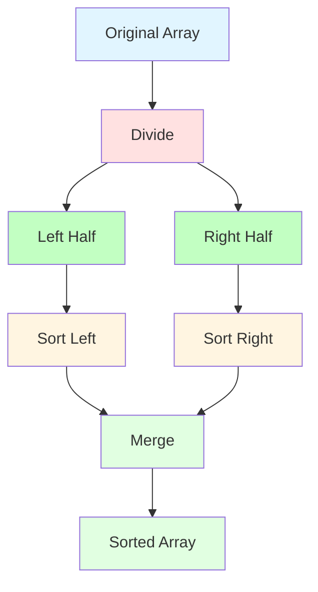

**Implementation (Java 17):**
```java
public int[] mergeSort(int[] arr) {
    if (arr.length <= 1) {
        return arr;
    }
    
    int mid = arr.length / 2;
    int[] left = mergeSort(Arrays.copyOfRange(arr, 0, mid));
    int[] right = mergeSort(Arrays.copyOfRange(arr, mid, arr.length));
    
    return merge(left, right);
}

private int[] merge(int[] left, int[] right) {
    int[] result = new int[left.length + right.length];
    int i = 0, j = 0, k = 0;
    
    while (i < left.length && j < right.length) {
        if (left[i] <= right[j]) {
            result[k++] = left[i++];
        } else {
            result[k++] = right[j++];
        }
    }
    
    while (i < left.length) {
        result[k++] = left[i++];
    }
    
    while (j < right.length) {
        result[k++] = right[j++];
    }
    
    return result;
}
```

**When to Use:**
- Large datasets
- When stability is required
- External sorting (too large for memory)

### Quick Sort

**Concept**: Choose pivot, partition around it, recursively sort partitions.

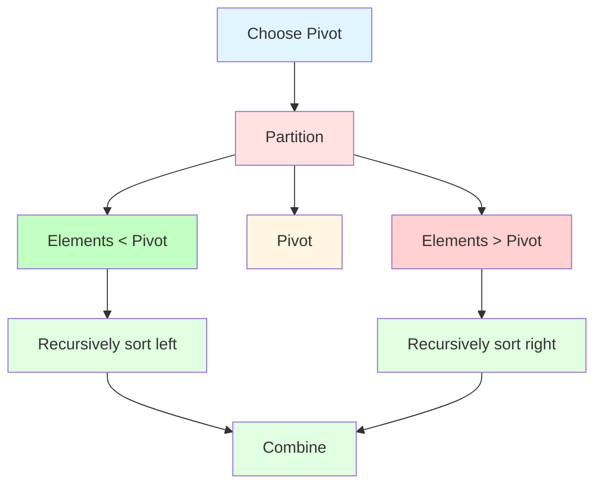

**Implementation (Java 17):**
```java
public int[] quickSort(int[] arr) {
    if (arr.length <= 1) {
        return arr;
    }
    
    int pivot = arr[arr.length / 2];
    List<Integer> left = new ArrayList<>();
    List<Integer> middle = new ArrayList<>();
    List<Integer> right = new ArrayList<>();
    
    for (int num : arr) {
        if (num < pivot) {
            left.add(num);
        } else if (num == pivot) {
            middle.add(num);
        } else {
            right.add(num);
        }
    }
    
    int[] leftArray = quickSort(left.stream().mapToInt(Integer::intValue).toArray());
    int[] rightArray = quickSort(right.stream().mapToInt(Integer::intValue).toArray());
    
    int[] result = new int[leftArray.length + middle.size() + rightArray.length];
    System.arraycopy(leftArray, 0, result, 0, leftArray.length);
    for (int i = 0; i < middle.size(); i++) {
        result[leftArray.length + i] = middle.get(i);
    }
    System.arraycopy(rightArray, 0, result, leftArray.length + middle.size(), rightArray.length);
    
    return result;
}
```

**When to Use:**
- Large datasets (in-place version)
- When average performance matters more than worst case
- General-purpose sorting

## 🔍 Searching Algorithms

### Linear Search

**Concept**: Check each element sequentially.

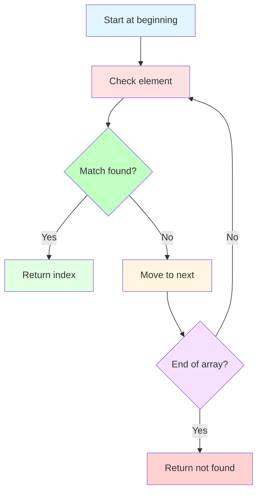

**Implementation (Java 17):**
```java
public int linearSearch(int[] arr, int target) {
    for (int i = 0; i < arr.length; i++) {
        if (arr[i] == target) {
            return i;
        }
    }
    return -1;
}
```

**Time Complexity:** O(n)
**When to Use:**
- Unsorted arrays
- Small datasets
- When data cannot be sorted

### Binary Search

**Concept**: Repeatedly divide search interval in half.

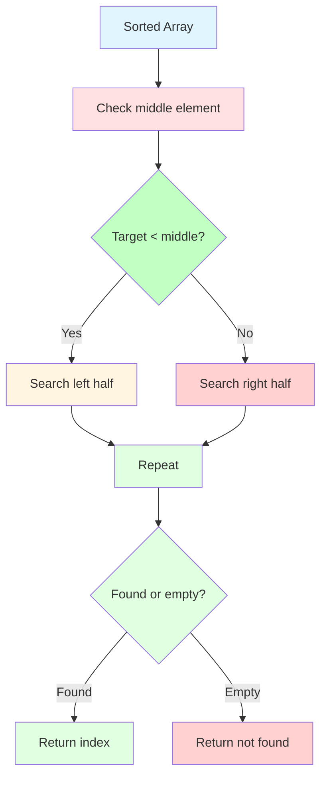

**Implementation (Java 17):**
```java
public int binarySearch(int[] arr, int target) {
    int left = 0, right = arr.length - 1;
    
    while (left <= right) {
        int mid = left + (right - left) / 2;  // Prevents overflow
        if (arr[mid] == target) {
            return mid;
        } else if (arr[mid] < target) {
            left = mid + 1;
        } else {
            right = mid - 1;
        }
    }
    
    return -1;
}
```

**Time Complexity:** O(log n)
**When to Use:**
- Sorted arrays
- Large datasets
- Frequent searches

### Binary Search Variations

**First Occurrence in Sorted Array:**
```python
def binary_search_first(arr, target):
    left, right = 0, len(arr) - 1
    result = -1
    
    while left <= right:
        mid = (left + right) // 2
        if arr[mid] == target:
            result = mid
            right = mid - 1  # Continue searching left
        elif arr[mid] < target:
            left = mid + 1
        else:
            right = mid - 1
    
    return result
```

**Last Occurrence in Sorted Array:**
```python
def binary_search_last(arr, target):
    left, right = 0, len(arr) - 1
    result = -1
    
    while left <= right:
        mid = (left + right) // 2
        if arr[mid] == target:
            result = mid
            left = mid + 1  # Continue searching right
        elif arr[mid] < target:
            left = mid + 1
        else:
            right = mid - 1
    
    return result
```

## 👆 Two Pointers Technique

### What is Two Pointers?

Two pointers technique uses two indices to traverse the array simultaneously, often from opposite ends or at different speeds.

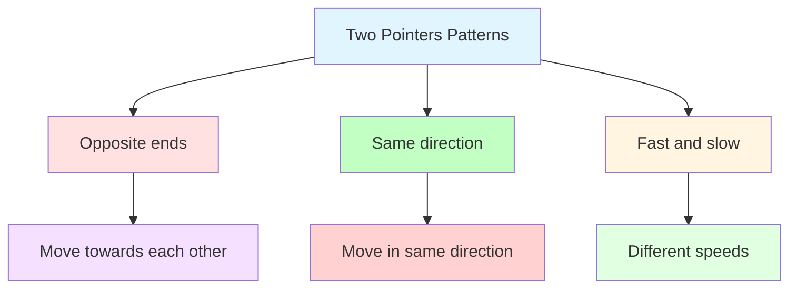

### Two Sum II (Sorted Array)

**Problem**: Find two numbers that add up to target in sorted array.

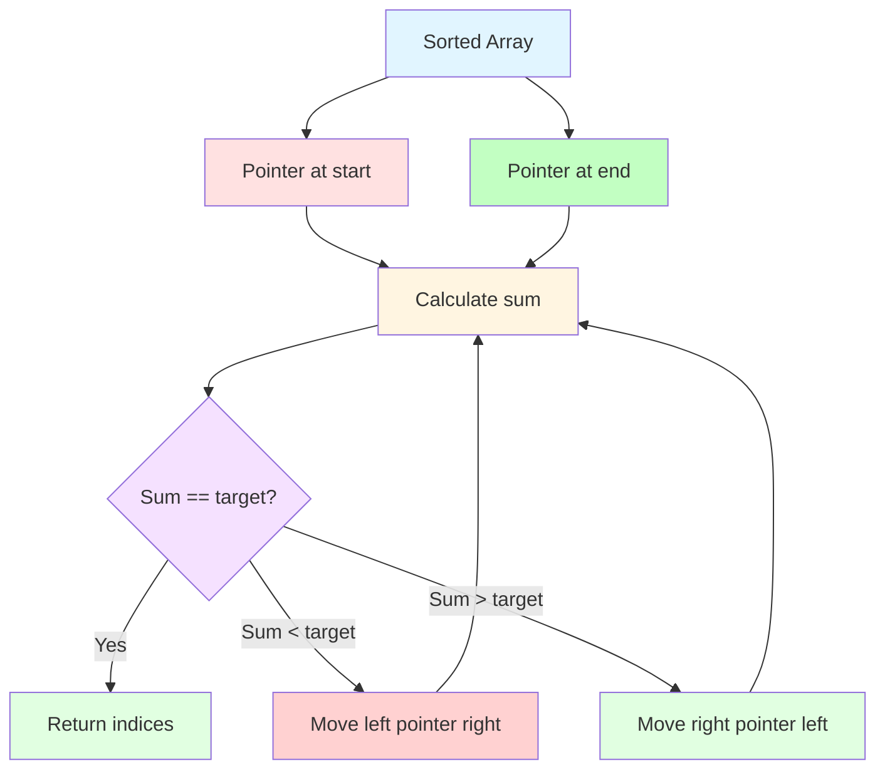

**Implementation:**
```python
def two_sum_sorted(arr, target):
    left, right = 0, len(arr) - 1
    
    while left < right:
        current_sum = arr[left] + arr[right]
        if current_sum == target:
            return [left + 1, right + 1]  # 1-indexed
        elif current_sum < target:
            left += 1
        else:
            right -= 1
    
    return []
```

### Three Sum

**Problem**: Find all triplets that sum to zero.

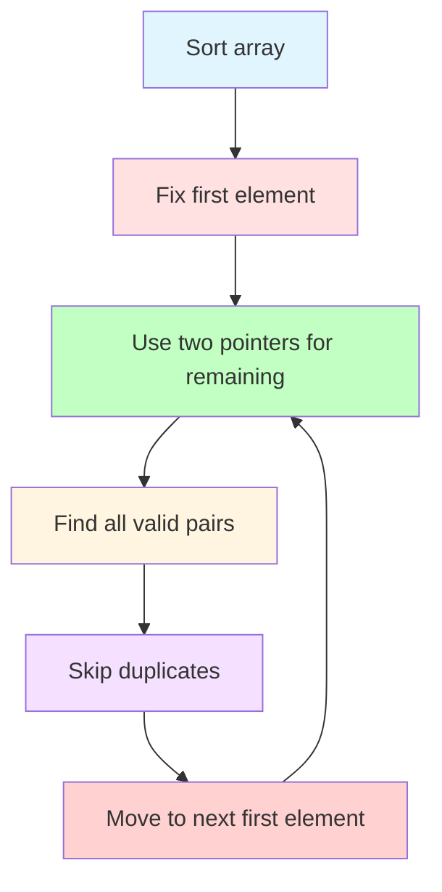

**Implementation:**
```python
def three_sum(nums):
    nums.sort()
    result = []
    
    for i in range(len(nums) - 2):
        if i > 0 and nums[i] == nums[i - 1]:
            continue  # Skip duplicates
        
        left, right = i + 1, len(nums) - 1
        
        while left < right:
            current_sum = nums[i] + nums[left] + nums[right]
            
            if current_sum == 0:
                result.append([nums[i], nums[left], nums[right]])
                left += 1
                right -= 1
                
                # Skip duplicates
                while left < right and nums[left] == nums[left - 1]:
                    left += 1
                while left < right and nums[right] == nums[right + 1]:
                    right -= 1
                    
            elif current_sum < 0:
                left += 1
            else:
                right -= 1
    
    return result
```

### Container With Most Water

**Problem**: Find two lines that together with x-axis form a container that holds the most water.

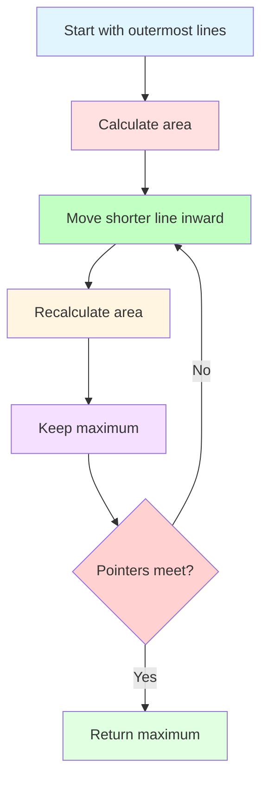

**Implementation:**
```python
def max_area(height):
    left, right = 0, len(height) - 1
    max_water = 0
    
    while left < right:
        width = right - left
        current_height = min(height[left], height[right])
        current_area = width * current_height
        max_water = max(max_water, current_area)
        
        if height[left] < height[right]:
            left += 1
        else:
            right -= 1
    
    return max_water
```

## 🪟 Sliding Window Technique

### What is Sliding Window?

Sliding window maintains a subset of elements (window) that moves through the array, optimizing subarray problems.

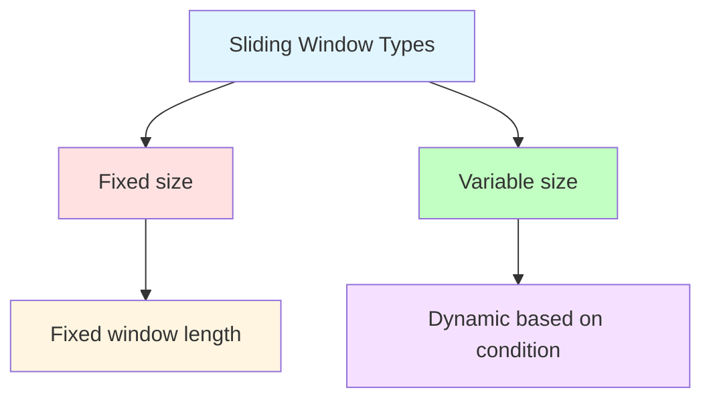

### Maximum Sum Subarray (Fixed Size)

**Problem**: Find maximum sum of subarray of size k.

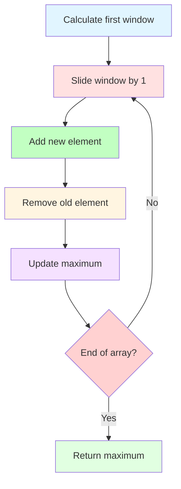

**Implementation:**
```python
def max_sum_subarray(arr, k):
    if len(arr) < k:
        return 0
    
    window_sum = sum(arr[:k])
    max_sum = window_sum
    
    for i in range(k, len(arr)):
        window_sum += arr[i] - arr[i - k]
        max_sum = max(max_sum, window_sum)
    
    return max_sum
```

### Longest Substring Without Repeating Characters

**Problem**: Find longest substring without repeating characters.

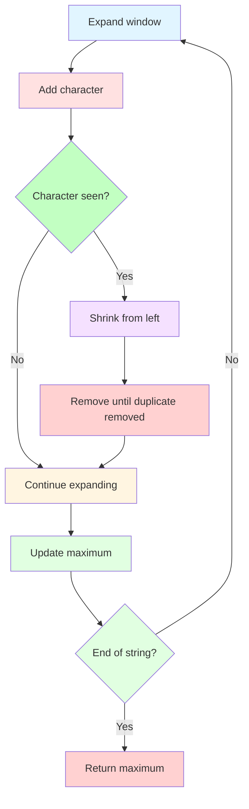

**Implementation:**
```python
def length_of_longest_substring(s):
    char_set = set()
    left = 0
    max_length = 0
    
    for right in range(len(s)):
        while s[right] in char_set:
            char_set.remove(s[left])
            left += 1
        
        char_set.add(s[right])
        max_length = max(max_length, right - left + 1)
    
    return max_length
```

### Minimum Window Substring

**Problem**: Find minimum window in string that contains all characters of another string.

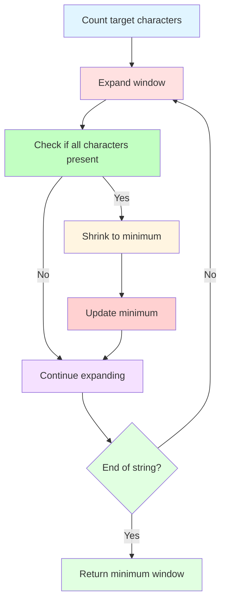

**Implementation:**
```python
from collections import Counter

def min_window_substring(s, t):
    if not s or not t:
        return ""
    
    target_count = Counter(t)
    required = len(target_count)
    
    left, right = 0, 0
    formed = 0
    window_counts = {}
    
    result = float('inf'), None, None  # length, left, right
    
    while right < len(s):
        character = s[right]
        window_counts[character] = window_counts.get(character, 0) + 1
        
        if character in target_count and window_counts[character] == target_count[character]:
            formed += 1
        
        while left <= right and formed == required:
            character = s[left]
            
            if right - left + 1 < result[0]:
                result = (right - left + 1, left, right)
            
            window_counts[character] -= 1
            if character in target_count and window_counts[character] < target_count[character]:
                formed -= 1
            
            left += 1
        
        right += 1
    
    return "" if result[0] == float('inf') else s[result[1]:result[2] + 1]
```

## 🔄 Algorithm Selection Guide

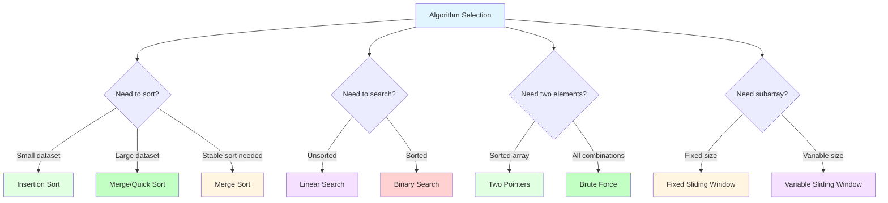

## 🧪 Practice Problems

### Sorting (Day 1-2)
1. **Sort Colors**: Dutch national flag problem
2. **Merge Intervals**: Sort + merge
3. **Valid Anagram**: Sort strings

### Searching (Day 3-4)
1. **Search in Rotated Sorted Array**: Modified binary search
2. **Find Minimum in Rotated Sorted Array**: Binary search
3. **Search Insert Position**: Binary search

### Two Pointers (Day 5-6)
1. **Two Sum II**: Sorted array two pointers
2. **3Sum**: Three pointers
3. **Container With Most Water**: Area optimization

### Sliding Window (Day 7-8)
1. **Maximum Sum Subarray**: Fixed window
2. **Longest Substring Without Repeating**: Variable window
3. **Minimum Window Substring**: Complex window

## 🎯 Daily Exercises (1-Hour Schedule)

### Day 1: Sorting Algorithms (10 + 20 + 25 + 5)
**Learning (10 min):**
- Read sorting section
- Study sorting comparison table
- Understand trade-offs

**Examples (20 min):**
- Implement bubble, selection, insertion sort
- Implement merge sort and quick sort
- Compare their performance on small arrays

**Practice (25 min):**
- Solve "Sort Colors" on LeetCode (Medium)
- Solve "Merge Intervals" on LeetCode (Medium)
- Implement all sorting algorithms from scratch

**Review (5 min):**
- Review which sorting algorithm you understood best
- Note when to use each algorithm

### Day 2: Searching Algorithms (10 + 20 + 25 + 5)
**Learning (10 min):**
- Read searching section
- Understand binary search logic
- Study binary search variations

**Examples (20 min):**
- Implement linear and binary search
- Practice binary search variations
- Understand binary search edge cases

**Practice (25 min):**
- Solve "Search in Rotated Sorted Array" (Medium)
- Solve "Find Minimum in Rotated Sorted Array" (Medium)
- Solve "Search Insert Position" (Easy)

**Review (5 min):**
- Review binary search patterns
- Note which variations were intuitive

### Day 3: Two Pointers (10 + 20 + 25 + 5)
**Learning (10 min):**
- Read two pointers section
- Study two pointer patterns
- Understand when to use

**Examples (20 min):**
- Implement two sum with two pointers
- Practice container with most water
- Understand pointer movement logic

**Practice (25 min):**
- Solve "Two Sum II - Input Array is Sorted" (Easy)
- Solve "3Sum" (Medium)
- Solve "Container With Most Water" (Medium)

**Review (5 min):**
- Review two pointer patterns
- Note when pointers move vs stay

### Day 4: Sliding Window (10 + 20 + 25 + 5)
**Learning (10 min):**
- Read sliding window section
- Study fixed vs variable window
- Understand window expansion/contraction

**Examples (20 min):**
- Implement fixed window maximum sum
- Practice variable window for substrings
- Understand window maintenance

**Practice (25 min):**
- Solve "Maximum Subarray" (Easy)
- Solve "Longest Substring Without Repeating Characters" (Medium)
- Solve "Minimum Window Substring" (Hard)

**Review (5 min):**
- Review sliding window patterns
- Note window expansion/contraction logic

### Day 5-8: Mixed Practice (10 + 20 + 25 + 5)
**Learning (10 min):**
- Review all algorithm types
- Study selection guide
- Understand hybrid approaches

**Examples (20 min):**
- Practice combining techniques
- Study complex problem patterns
- Understand algorithm composition

**Practice (25 min):**
- Solve LeetCode medium problems
- Focus on choosing optimal algorithm
- Practice implementing from scratch

**Review (5 min):**
- Review your algorithm choices
- Note areas that need more practice

## 📋 Weekly Summary

### Week 4 Goals
- [ ] Implement all sorting algorithms from scratch
- [ ] Master binary search and its variations
- [ ] Apply two-pointer technique to various problems
- [ ] Use sliding window for subarray problems
- [ ] Choose optimal algorithm for given constraints

### Week 4 Checklist
- [ ] Completed all daily exercises
- [ ] Can implement sorting algorithms without reference
- [ ] Can apply binary search to various problems
- [ ] Can identify two-pointer patterns
- [ ] Can implement sliding window solutions
- [ ] Ready to move to advanced algorithms

## 🚀 Next Steps

After mastering fundamental algorithms:
1. **Move to File 05**: Algorithms II (Recursion, Backtracking, DP, Greedy)
2. **Apply these algorithms** to more complex problems
3. **Practice algorithm combinations** in single problems
4. **Learn optimization techniques** for these algorithms

## 💡 Key Takeaways

1. **Sorting choice** depends on dataset size, stability requirements, and memory constraints
2. **Binary search** requires sorted data but provides O(log n) performance
3. **Two pointers** is powerful for sorted arrays and array manipulation
4. **Sliding window** optimizes subarray problems by avoiding recomputation
5. **Algorithm selection** is crucial - understand trade-offs

---

**You're now ready for advanced algorithms!** → [05_ALGORITHMS_II.md](./05_ALGORITHMS_II.md)
