# Algorithms II - Recursion, Backtracking, Dynamic Programming, Greedy

## 🎯 Learning Objectives

By the end of this file, you will:
- Master recursive problem-solving techniques
- Understand backtracking for combinatorial problems
- Learn dynamic programming for optimization problems
- Apply greedy algorithms for specific problem types
- Recognize which algorithmic paradigm to use

## 📊 Algorithm Overview

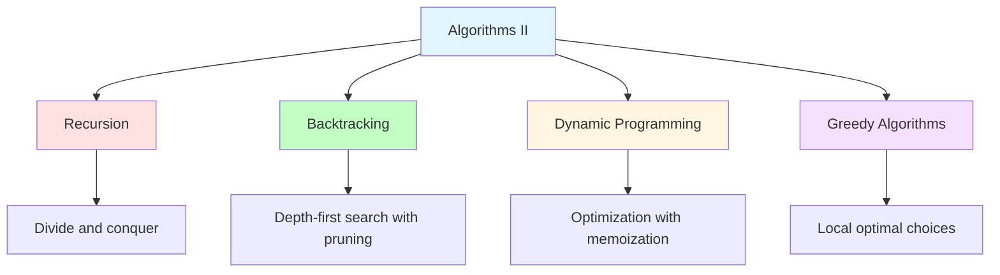

## 🔄 Recursion

### What is Recursion?

Recursion is a method where the solution to a problem depends on solutions to smaller instances of the same problem.

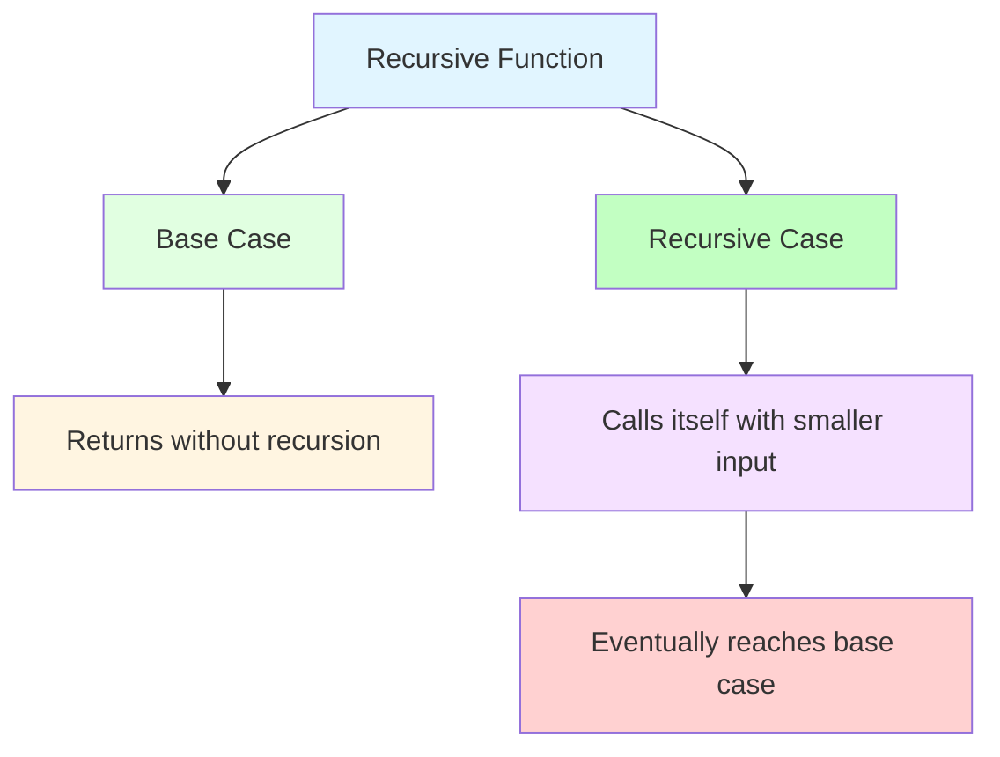

### Recursion Components

**Base Case**: The condition that stops the recursion
**Recursive Case**: The part that calls itself with modified input

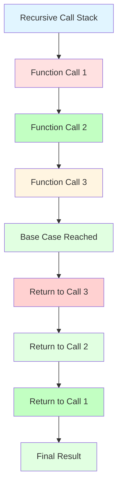

### Factorial Example

```python
def factorial(n):
    # Base case
    if n <= 1:
        return 1
    
    # Recursive case
    return n * factorial(n - 1)
```

**Execution Trace:**
```
factorial(5)
├── 5 * factorial(4)
│   ├── 4 * factorial(3)
│   │   ├── 3 * factorial(2)
│   │   │   ├── 2 * factorial(1)
│   │   │   │   └── 1 (base case)
│   │   │   └── 2 * 1 = 2
│   │   └── 3 * 2 = 6
│   └── 4 * 6 = 24
└── 5 * 24 = 120
```

### Fibonacci Sequence

**Naive Recursive Approach:**
```python
def fibonacci_naive(n):
    if n <= 1:
        return n
    return fibonacci_naive(n - 1) + fibonacci_naive(n - 2)
# Time: O(2^n), Space: O(n)
```

**Problem with Naive Approach:**
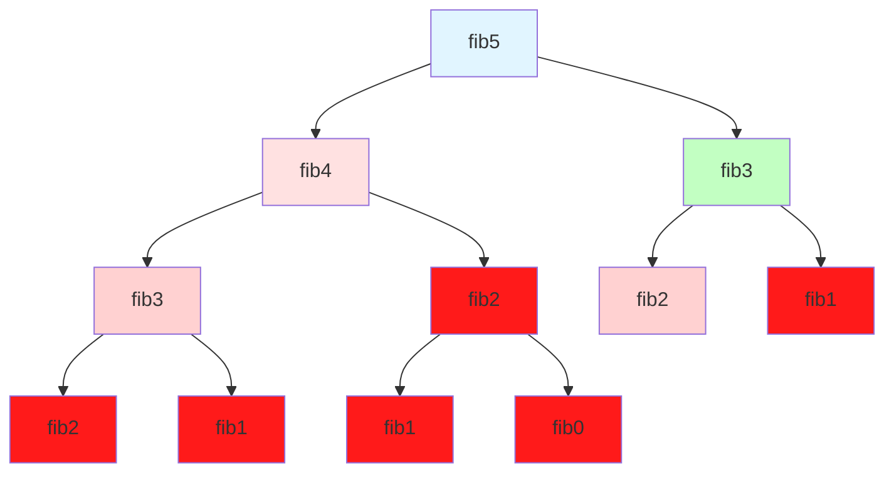

**Optimized with Memoization:**
```python
def fibonacci_memo(n, memo={}):
    if n in memo:
        return memo[n]
    if n <= 1:
        return n
    
    memo[n] = fibonacci_memo(n - 1, memo) + fibonacci_memo(n - 2, memo)
    return memo[n]
# Time: O(n), Space: O(n)
```

### Tree Traversal with Recursion

**In-order Traversal:**
```python
def inorder_traversal(root):
    if not root:
        return []
    
    return (inorder_traversal(root.left) + 
            [root.val] + 
            inorder_traversal(root.right))
```

**Maximum Depth:**
```python
def max_depth(root):
    if not root:
        return 0
    
    left_depth = max_depth(root.left)
    right_depth = max_depth(root.right)
    
    return max(left_depth, right_depth) + 1
```

### Common Recursive Patterns

**Divide and Conquer:**
```python
def solve_problem(problem):
    if problem is small:
        return solve_directly(problem)
    
    subproblems = divide(problem)
    solutions = [solve_problem(sub) for sub in subproblems]
    return combine(solutions)
```

**Backtracking Framework:**
```python
def backtrack(path, choices):
    if goal(path):
        result.append(path)
        return
    
    for choice in choices:
        if is_valid(choice):
            make_choice(choice)
            backtrack(path, choices)
            undo_choice(choice)
```

## 🔙 Backtracking

### What is Backtracking?

Backtracking is an algorithm for finding all solutions to computational problems, particularly constraint satisfaction problems. It builds candidates incrementally and abandons each partial candidate as soon as it determines it cannot be completed.

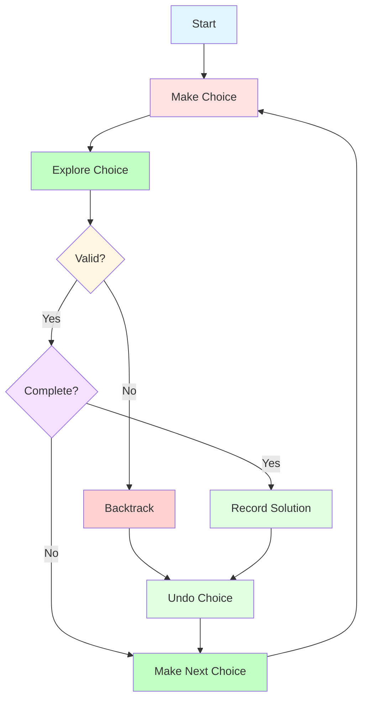

### Subsets Problem

**Problem**: Generate all possible subsets of a set.

```mermaid
graph TD
    A[Start: empty] --> B[Include 1]
    A --> C[Exclude 1]
    B --> D[Include 2]
    B --> E[Exclude 2]
    C --> F[Include 2]
    C --> G[Exclude 2]
    D --> H[[1,2]]
    E --> I[[1]]
    F --> J[[2]]
    G --> K[[]]
    
    style A fill:#e1f5ff
    style B fill:#ffe1e1
    style C fill:#c2ffc2
    style D fill:#fff5e1
    style E fill:#f5e1ff
    style F fill:#ffd1d1
    style G fill:#e1ffe1
    style H fill:#c2ffc2
    style I fill:#ffd1d1
    style J fill:#e1ffe1
    style K fill:#c2ffc2
```

**Implementation:**
```python
def subsets(nums):
    result = []
    
    def backtrack(start, current):
        result.append(current[:])
        
        for i in range(start, len(nums)):
            current.append(nums[i])
            backtrack(i + 1, current)
            current.pop()
    
    backtrack(0, [])
    return result
```

### Permutations Problem

**Problem**: Generate all possible permutations of a set.

```mermaid
graph TD
    A[Start: []] --> B[Add 1]
    B --> C[Add 2]
    C --> D[Add 3]
    D --> E[[1,2,3]]
    C --> F[Add 3]
    F --> G[[1,3,2]]
    B --> H[Add 3]
    H --> I[Add 2]
    I --> J[[1,3,2]]
    
    style A fill:#e1f5ff
    style B fill:#ffe1e1
    style C fill:#c2ffc2
    style D fill:#fff5e1
    style E fill:#e1ffe1
    style F fill:#ffd1d1
    style G fill:#e1ffe1
    style H fill:#c2ffc2
    style I fill:#ffd1d1
    style J fill:#e1ffe1
```

**Implementation:**
```python
def permutations(nums):
    result = []
    
    def backtrack(current, remaining):
        if not remaining:
            result.append(current[:])
            return
        
        for i in range(len(remaining)):
            current.append(remaining[i])
            backtrack(current, remaining[:i] + remaining[i+1:])
            current.pop()
    
    backtrack([], nums)
    return result
```

### N-Queens Problem

**Problem**: Place N queens on an N×N chessboard so that no two queens attack each other.

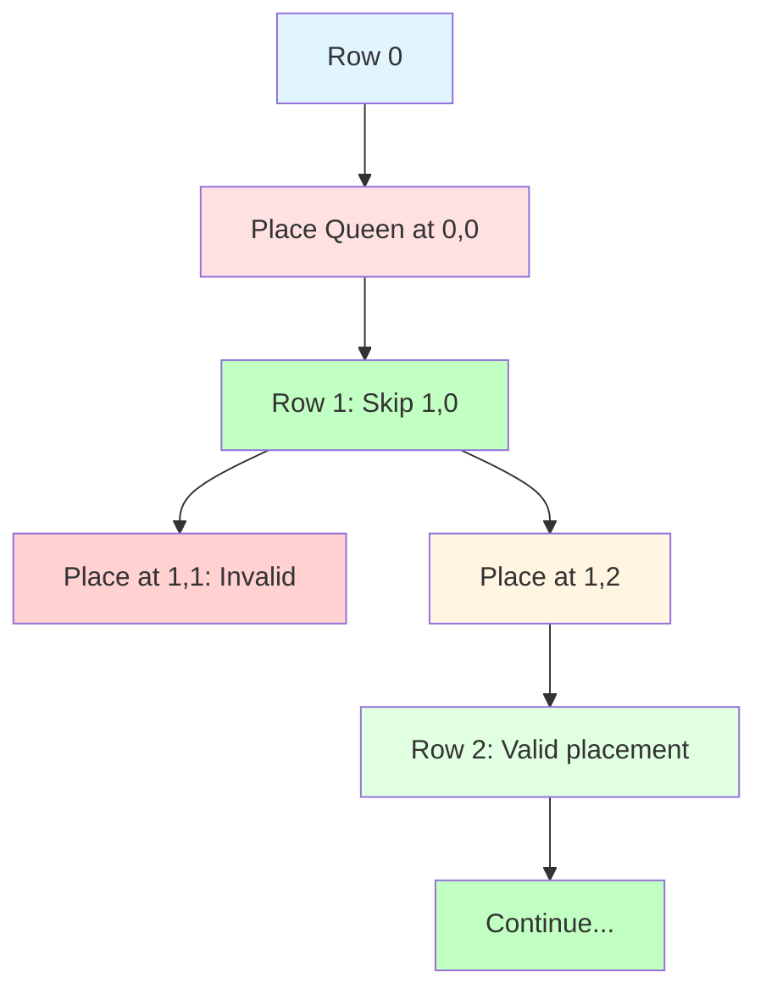

**Implementation:**
```python
def solve_n_queens(n):
    result = []
    
    def is_valid(board, row, col):
        # Check column
        for i in range(row):
            if board[i] == col:
                return False
            # Check diagonals
            if abs(board[i] - col) == row - i:
                return False
        return True
    
    def backtrack(board, row):
        if row == n:
            result.append(board[:])
            return
        
        for col in range(n):
            if is_valid(board, row, col):
                board[row] = col
                backtrack(board, row + 1)
                board[row] = -1
    
    backtrack([-1] * n, 0)
    return result
```

### Combination Sum Problem

**Problem**: Find all unique combinations that sum to target.

```python
def combination_sum(candidates, target):
    result = []
    
    def backtrack(start, current, remaining):
        if remaining == 0:
            result.append(current[:])
            return
        if remaining < 0:
            return
        
        for i in range(start, len(candidates)):
            current.append(candidates[i])
            backtrack(i, current, remaining - candidates[i])
            current.pop()
    
    backtrack(0, [], target)
    return result
```

## 💎 Dynamic Programming

### What is Dynamic Programming?

Dynamic programming is an optimization technique that solves complex problems by breaking them down into simpler subproblems. It stores the results of subproblems to avoid redundant calculations.

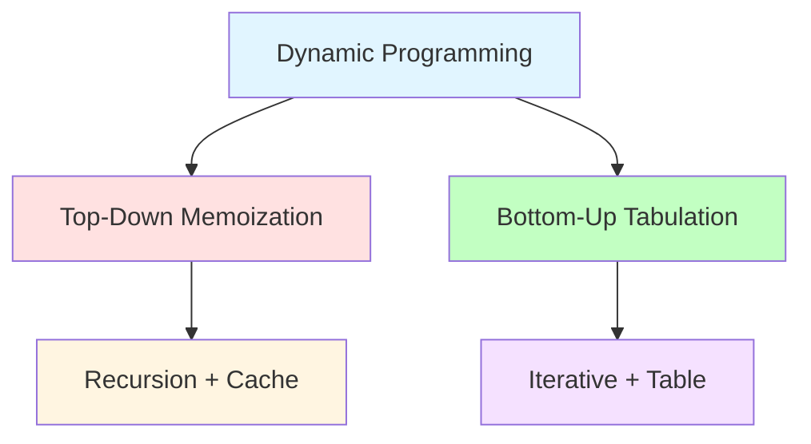

### DP Characteristics

**Optimal Substructure**: Optimal solution can be constructed from optimal solutions of subproblems
**Overlapping Subproblems**: Same subproblems are solved multiple times

### Fibonacci with DP

**Top-Down (Memoization):**
```python
def fibonacci_memo(n, memo={}):
    if n in memo:
        return memo[n]
    if n <= 1:
        return n
    
    memo[n] = fibonacci_memo(n - 1, memo) + fibonacci_memo(n - 2, memo)
    return memo[n]
```

**Bottom-Up (Tabulation):**
```python
def fibonacci_tab(n):
    if n <= 1:
        return n
    
    dp = [0] * (n + 1)
    dp[1] = 1
    
    for i in range(2, n + 1):
        dp[i] = dp[i - 1] + dp[i - 2]
    
    return dp[n]
```

**Space-Optimized:**
```python
def fibonacci_optimized(n):
    if n <= 1:
        return n
    
    prev2, prev1 = 0, 1
    
    for i in range(2, n + 1):
        current = prev1 + prev2
        prev2, prev1 = prev1, current
    
    return prev1
```

### Climbing Stairs Problem

**Problem**: You can climb 1 or 2 steps. How many ways to reach the top?

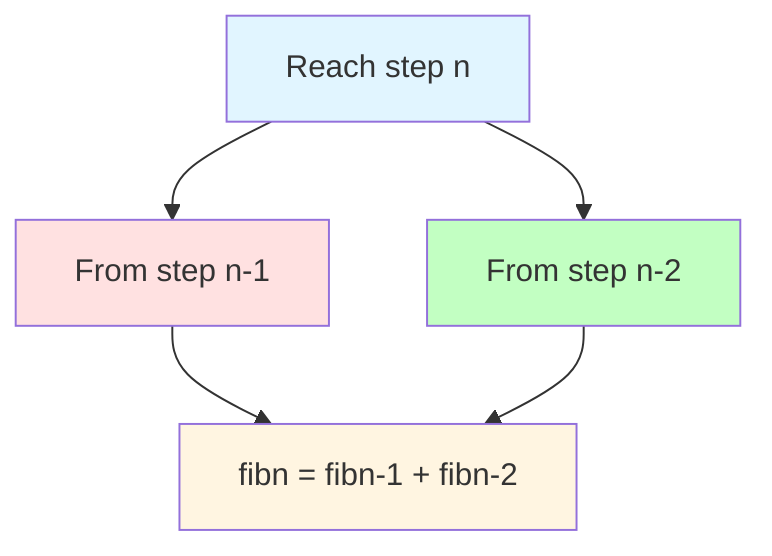

**Implementation:**
```python
def climb_stairs(n):
    if n <= 2:
        return n
    
    dp = [0] * (n + 1)
    dp[1] = 1
    dp[2] = 2
    
    for i in range(3, n + 1):
        dp[i] = dp[i - 1] + dp[i - 2]
    
    return dp[n]
```

### Longest Common Subsequence

**Problem**: Find the longest subsequence common to two strings.

```mermaid
graph TD
    A[LCS X,Y] --> B[If X[i] == Y[j]]
    A --> C[If X[i] != Y[j]]
    
    B --> D[1 + LCS X[:i], Y[:j]]
    C --> E[maxLCS X[:i], Y:j-1, LCS X:i-1, Y[:j]]
    
    style A fill:#e1f5ff
    style B fill:#e1ffe1
    style C fill:#c2ffc2
    style D fill:#fff5e1
    style E fill:#f5e1ff
```

**Implementation:**
```python
def longest_common_subsequence(text1, text2):
    m, n = len(text1), len(text2)
    dp = [[0] * (n + 1) for _ in range(m + 1)]
    
    for i in range(1, m + 1):
        for j in range(1, n + 1):
            if text1[i - 1] == text2[j - 1]:
                dp[i][j] = dp[i - 1][j - 1] + 1
            else:
                dp[i][j] = max(dp[i - 1][j], dp[i][j - 1])
    
    return dp[m][n]
```

### Knapsack Problem

**Problem**: Maximize value with weight constraint.

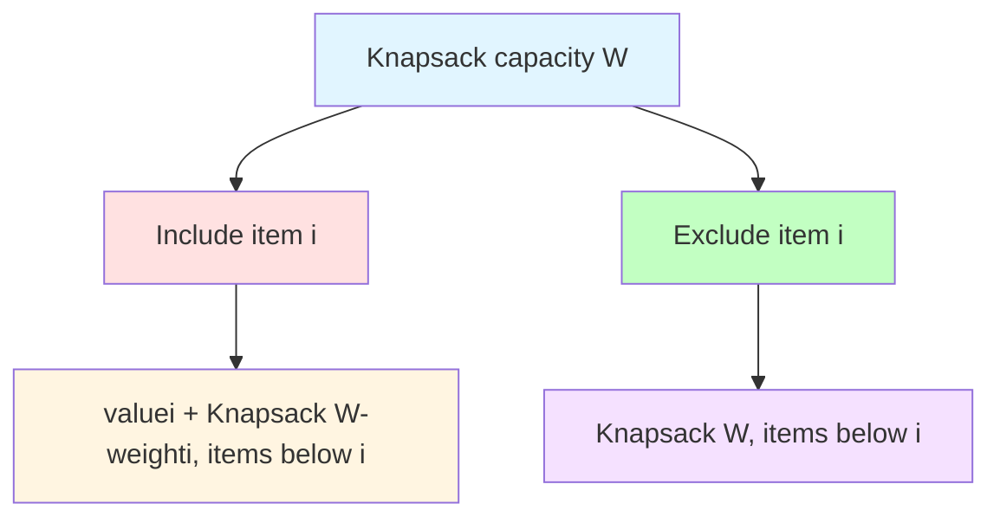

**Implementation:**
```python
def knapsack(weights, values, capacity):
    n = len(weights)
    dp = [[0] * (capacity + 1) for _ in range(n + 1)]
    
    for i in range(1, n + 1):
        for w in range(capacity + 1):
            if weights[i - 1] <= w:
                dp[i][w] = max(
                    values[i - 1] + dp[i - 1][w - weights[i - 1]],
                    dp[i - 1][w]
                )
            else:
                dp[i][w] = dp[i - 1][w]
    
    return dp[n][capacity]
```

### Coin Change Problem

**Problem**: Find minimum number of coins to make amount.

```python
def coin_change(coins, amount):
    dp = [float('inf')] * (amount + 1)
    dp[0] = 0
    
    for coin in coins:
        for i in range(coin, amount + 1):
            dp[i] = min(dp[i], dp[i - coin] + 1)
    
    return dp[amount] if dp[amount] != float('inf') else -1
```

## 🎯 Greedy Algorithms

### What is Greedy Algorithm?

Greedy algorithms make the locally optimal choice at each step with the hope of finding a global optimum. They don't always work, but when they do, they're very efficient.

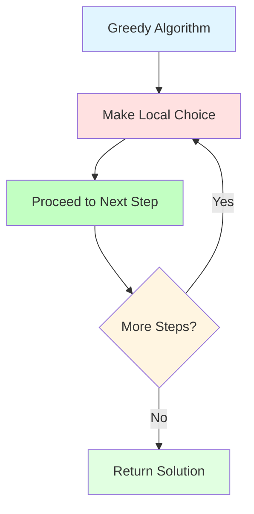

### When Greedy Works

**Greedy Choice Property**: Local optimal choices lead to global optimum
**Optimal Substructure**: Optimal solution contains optimal solutions to subproblems

### Activity Selection Problem

**Problem**: Select maximum number of non-overlapping activities.

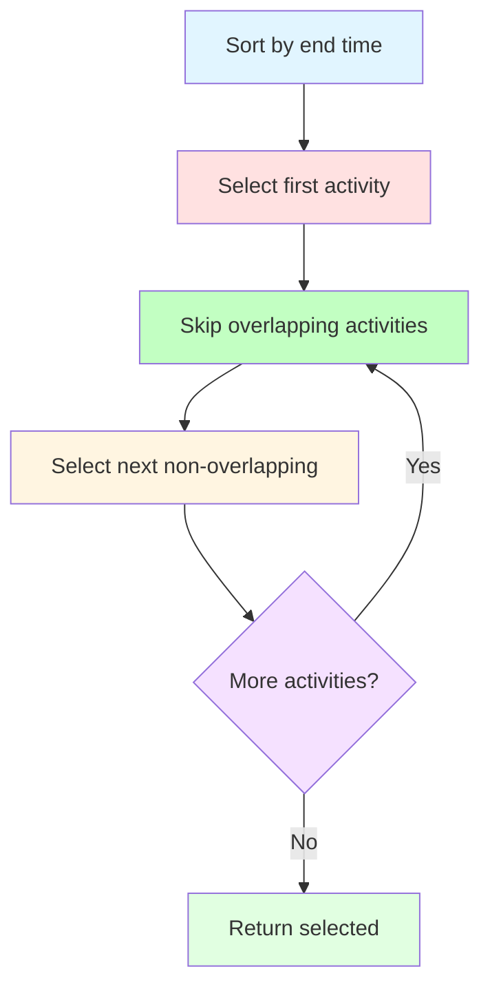

**Implementation:**
```python
def activity_selection(activities):
    # Sort by end time
    activities.sort(key=lambda x: x[1])
    
    selected = []
    last_end = -float('inf')
    
    for start, end in activities:
        if start >= last_end:
            selected.append((start, end))
            last_end = end
    
    return selected
```

### Huffman Coding

**Problem**: Create optimal prefix codes for characters.

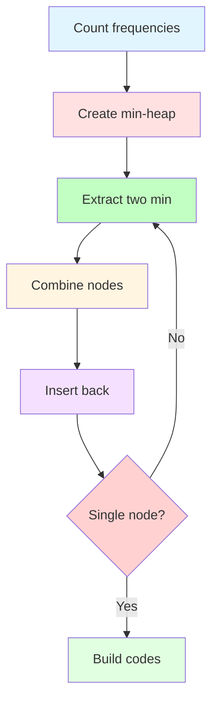

**Implementation:**
```python
import heapq
from collections import Counter

class HuffmanNode:
    def __init__(self, char, freq):
        self.char = char
        self.freq = freq
        self.left = None
        self.right = None
    
    def __lt__(self, other):
        return self.freq < other.freq

def huffman_coding(text):
    # Count frequencies
    freq = Counter(text)
    
    # Create min-heap
    heap = [HuffmanNode(char, freq) for char, freq in freq.items()]
    heapq.heapify(heap)
    
    # Build tree
    while len(heap) > 1:
        left = heapq.heappop(heap)
        right = heapq.heappop(heap)
        
        merged = HuffmanNode(None, left.freq + right.freq)
        merged.left = left
        merged.right = right
        
        heapq.heappush(heap, merged)
    
    # Generate codes
    codes = {}
    
    def generate_codes(node, code):
        if node.char:
            codes[node.char] = code
            return
        generate_codes(node.left, code + '0')
        generate_codes(node.right, code + '1')
    
    if heap:
        generate_codes(heap[0], '')
    
    return codes
```

### Fractional Knapsack

**Problem**: Maximize value with weight constraint (can take fractions).

```python
def fractional_knapsack(weights, values, capacity):
    n = len(weights)
    items = [(values[i] / weights[i], weights[i], values[i]) 
             for i in range(n)]
    items.sort(reverse=True, key=lambda x: x[0])
    
    total_value = 0
    remaining_capacity = capacity
    
    for ratio, weight, value in items:
        if remaining_capacity >= weight:
            total_value += value
            remaining_capacity -= weight
        else:
            fraction = remaining_capacity / weight
            total_value += value * fraction
            break
    
    return total_value
```

## 🔄 Algorithm Selection Guide

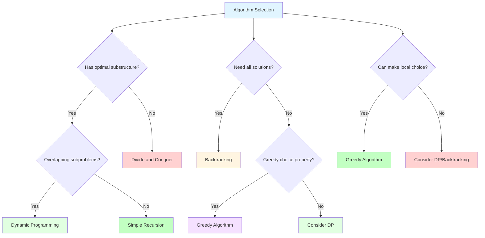

## 🧪 Practice Problems

### Recursion (Day 1-2)
1. **Factorial**: Basic recursion
2. **Fibonacci**: Recursion with memoization
3. **Tree Traversal**: Recursive tree operations

### Backtracking (Day 3-4)
1. **Subsets**: Generate all subsets
2. **Permutations**: Generate all permutations
3. **N-Queens**: Classic backtracking problem

### Dynamic Programming (Day 5-7)
1. **Climbing Stairs**: Simple DP
2. **Longest Common Subsequence**: 2D DP
3. **Coin Change**: Unbounded knapsack variant

### Greedy (Day 8)
1. **Activity Selection**: Interval scheduling
2. **Jump Game**: Greedy decision making
3. **Partition Labels**: String partitioning

## 🎯 Daily Exercises (1-Hour Schedule)

### Day 1: Recursion (10 + 20 + 25 + 5)
**Learning (10 min):**
- Read recursion section
- Study call stack diagrams
- Understand base vs recursive case

**Examples (20 min):**
- Implement factorial and Fibonacci
- Practice tree traversal recursion
- Understand recursion depth

**Practice (25 min):**
- Solve "Factorial" (practice)
- Solve "Fibonacci Number" on LeetCode (Easy)
- Solve "Maximum Depth of Binary Tree" (Easy)

**Review (5 min):**
- Review recursion patterns
- Note which problems felt natural

### Day 2: Backtracking (10 + 20 + 25 + 5)
**Learning (10 min):**
- Read backtracking section
- Study backtracking framework
- Understand pruning

**Examples (20 min):**
- Implement subsets generation
- Practice permutations
- Understand backtracking vs brute force

**Practice (25 min):**
- Solve "Subsets" on LeetCode (Medium)
- Solve "Permutations" on LeetCode (Medium)
- Solve "Combination Sum" on LeetCode (Medium)

**Review (5 min):**
- Review backtracking patterns
- Note pruning strategies

### Day 3: Dynamic Programming (10 + 20 + 25 + 5)
**Learning (10 min):**
- Read DP section
- Understand memoization vs tabulation
- Study DP characteristics

**Examples (20 min):**
- Implement Fibonacci with both approaches
- Practice climbing stairs
- Understand DP table filling

**Practice (25 min):**
- Solve "Climbing Stairs" on LeetCode (Easy)
- Solve "Coin Change" on LeetCode (Medium)
- Solve "Longest Increasing Subsequence" (Medium)

**Review (5 min):**
- Review DP patterns
- Note when to use memoization vs tabulation

### Day 4: Greedy Algorithms (10 + 20 + 25 + 5)
**Learning (10 min):**
- Read greedy section
- Understand greedy choice property
- Study when greedy works

**Examples (20 min):**
- Implement activity selection
- Practice interval scheduling
- Understand greedy vs DP

**Practice (25 min):**
- Solve "Jump Game" on LeetCode (Medium)
- Solve "Activity Selection" (practice)
- Solve "Partition Labels" on LeetCode (Medium)

**Review (5 min):**
- Review greedy patterns
- Note when greedy is applicable

### Day 5-8: Mixed Practice (10 + 20 + 25 + 5)
**Learning (10 min):**
- Review all algorithm types
- Study selection guide
- Understand hybrid approaches

**Examples (20 min):**
- Practice combining techniques
- Study complex problem patterns
- Understand algorithm composition

**Practice (25 min):**
- Solve LeetCode medium/hard problems
- Focus on choosing optimal approach
- Practice implementing from scratch

**Review (5 min):**
- Review your algorithm choices
- Note areas that need more practice

## 📋 Weekly Summary

### Week 5 Goals
- [ ] Master recursive problem-solving
- [ ] Apply backtracking to combinatorial problems
- [ ] Implement dynamic programming solutions
- [ ] Recognize when greedy algorithms work
- [ ] Choose optimal algorithmic paradigm

### Week 5 Checklist
- [ ] Completed all daily exercises
- [ ] Can implement recursive solutions without reference
- [ ] Can apply backtracking to various problems
- [ ] Can identify DP problems and implement solutions
- [ ] Can recognize greedy problems
- [ ] Ready to move to system design

## 🚀 Next Steps

After mastering advanced algorithms:
1. **Move to File 06**: System Design Fundamentals
2. **Apply these algorithms** to real-world system design problems
3. **Practice algorithm combinations** in system design contexts
4. **Learn optimization techniques** for large-scale systems

## 💡 Key Takeaways

1. **Recursion** is powerful but requires careful base case handling
2. **Backtracking** explores all possibilities with pruning
3. **Dynamic programming** optimizes by storing subproblem results
4. **Greedy algorithms** are efficient but only work with specific properties
5. **Algorithm choice** depends on problem structure and constraints

---

**You're now ready for system design!** → [06_SYSTEM_DESIGN_FUNDAMENTALS.md](./06_SYSTEM_DESIGN_FUNDAMENTALS.md)
