# System Design Fundamentals - Scalability, Availability, CAP Theorem

## 🎯 Learning Objectives

By the end of this file, you will:
- Understand system design fundamentals
- Master scalability concepts (vertical vs horizontal)
- Learn availability and reliability principles
- Understand CAP theorem and its implications
- Apply these concepts to real-world system design

## 📊 System Design Overview

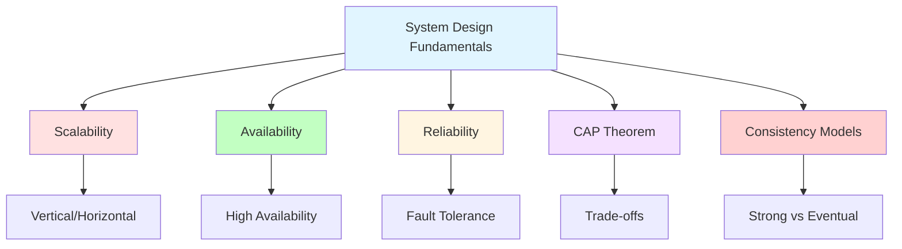

## 📈 Scalability

### What is Scalability?

Scalability is the ability of a system to handle growing amounts of work by adding resources to the system.

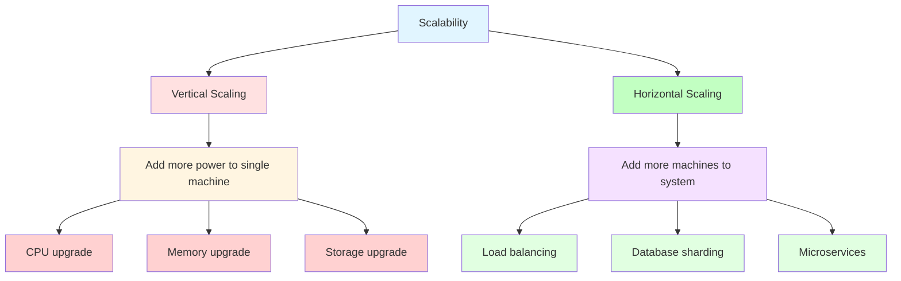

### Vertical Scaling (Scale Up)

**Definition**: Increasing the capacity of a single server.

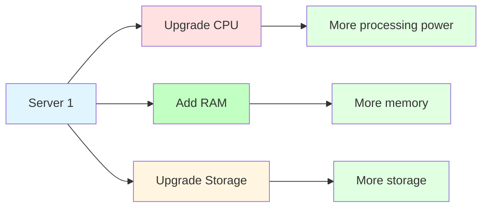

**Advantages:**
- Simpler to implement
- No code changes required
- Lower initial complexity

**Disadvantages:**
- Hardware limits (ceiling)
- Single point of failure
- Expensive for high-end hardware
- Downtime during upgrades

**When to Use:**
- Early stage startups
- Simple applications
- Budget constraints
- Before hitting hardware limits

### Horizontal Scaling (Scale Out)

**Definition**: Adding more servers to handle increased load.

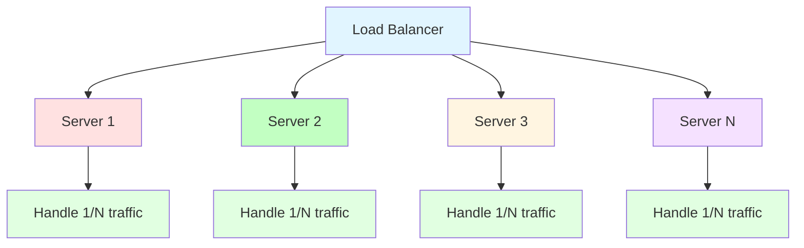

**Advantages:**
- Theoretically unlimited scaling
- Better fault tolerance
- Cost-effective (commodity hardware)
- Gradual scaling

**Disadvantages:**
- More complex architecture
- Requires load balancing
- Data consistency challenges
- Higher operational complexity

**When to Use:**
- High traffic applications
- Fault tolerance required
- Growing user base
- Long-term scalability needs

### Load Balancing

**Definition**: Distributing incoming network traffic across multiple servers.

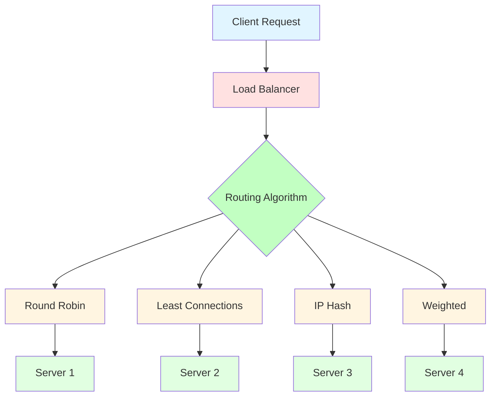

**Load Balancing Algorithms:**

1. **Round Robin**: Distributes requests sequentially
2. **Least Connections**: Routes to server with fewest active connections
3. **IP Hash**: Routes based on client IP (session persistence)
4. **Weighted**: Distributes based on server capacity

**Health Checks:**
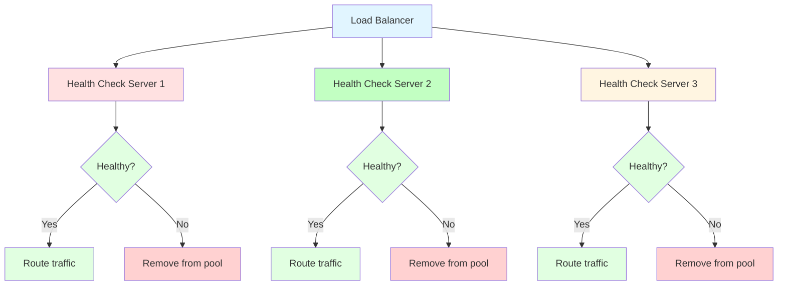

## 🟢 Availability

### What is Availability?

Availability is the proportion of time a system is in a functioning condition. It's often expressed as a percentage.

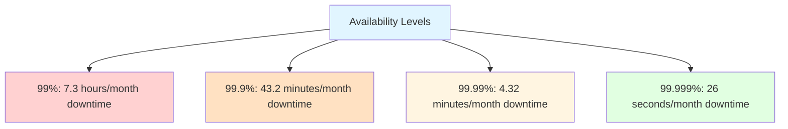

### Availability Calculation

**Availability = (Total Time - Downtime) / Total Time × 100%**

**Examples:**
- 99% availability = 7.3 hours downtime per month
- 99.9% availability = 43.2 minutes downtime per month
- 99.99% availability = 4.32 minutes downtime per month
- 99.999% availability = 26 seconds downtime per month

### High Availability Techniques

**Redundancy:**
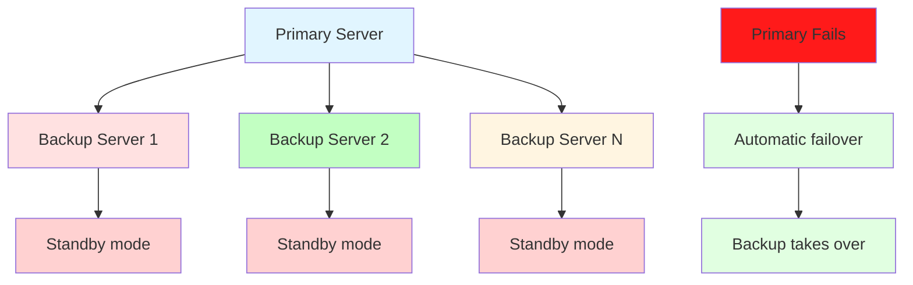

**Failover Mechanisms:**
- **Active-Passive**: One active, others standby
- **Active-Active**: All servers active, share load
- **Geographic Redundancy**: Servers in different locations

### Disaster Recovery

**RPO (Recovery Point Objective)**: Maximum acceptable data loss
**RTO (Recovery Time Objective)**: Maximum acceptable downtime

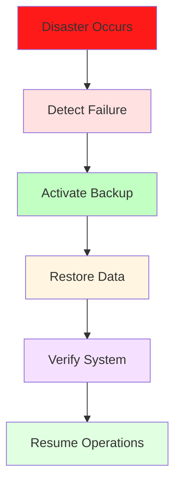

## 🔧 Reliability

### What is Reliability?

Reliability is the ability of a system to perform its intended function consistently and correctly over time.

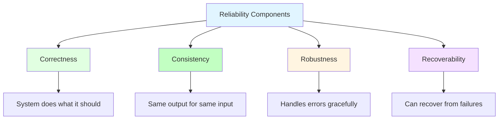

### Fault Tolerance

**Definition**: The ability of a system to continue operating properly in the event of failure of some of its components.

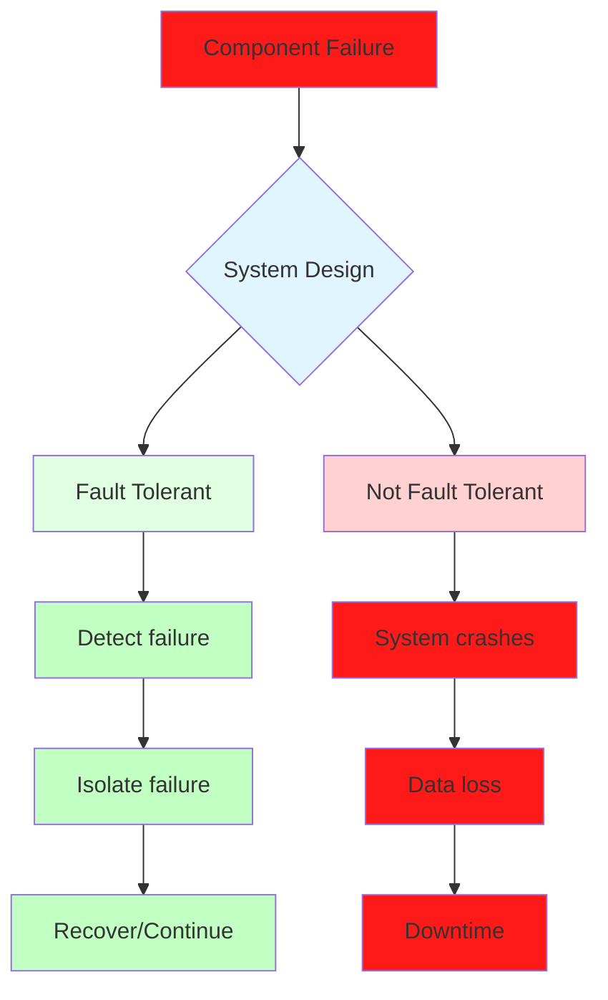

### Redundancy Patterns

**Active-Active Redundancy:**
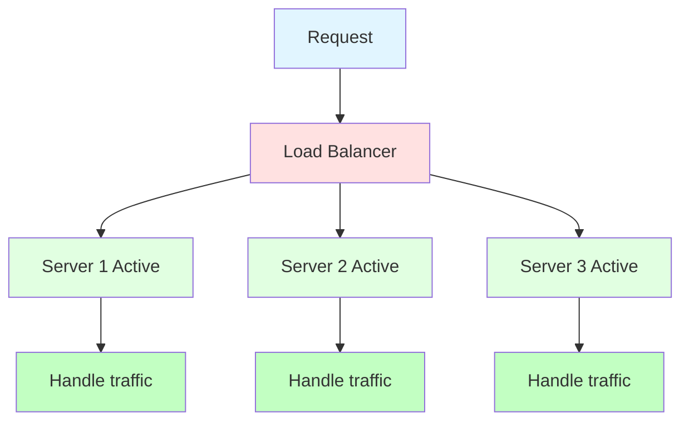

**Active-Passive Redundancy:**
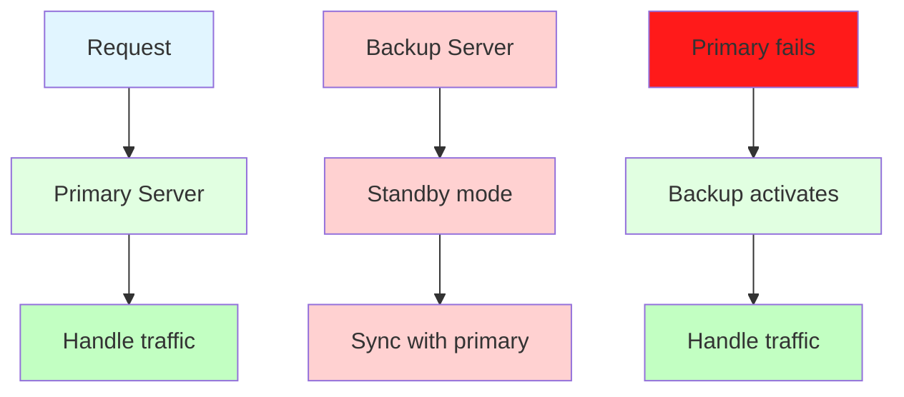

## 📐 CAP Theorem

### What is CAP Theorem?

CAP theorem states that a distributed system can only simultaneously provide two out of the following three guarantees:

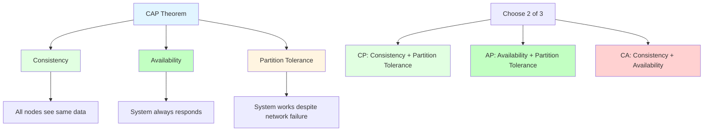

### Consistency (C)

**Definition**: Every read receives the most recent write or an error.

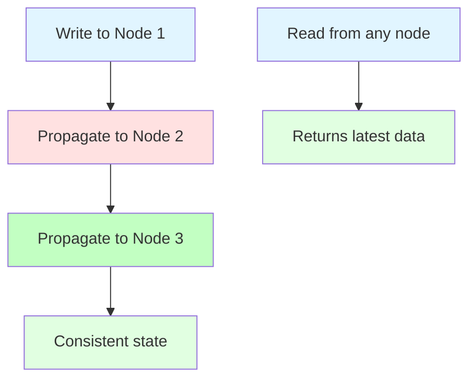

**Examples:**
- Relational databases with strong consistency
- Distributed transactions
- Synchronous replication

### Availability (A)

**Definition**: Every request receives a (non-error) response, without the guarantee that it contains the most recent write.

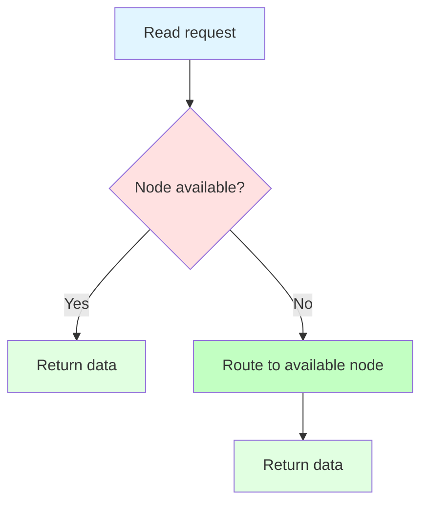

**Examples:**
- DNS system
- CDN networks
- NoSQL databases with eventual consistency

### Partition Tolerance (P)

**Definition**: The system continues to operate despite an arbitrary number of messages being dropped or delayed by the network between nodes.

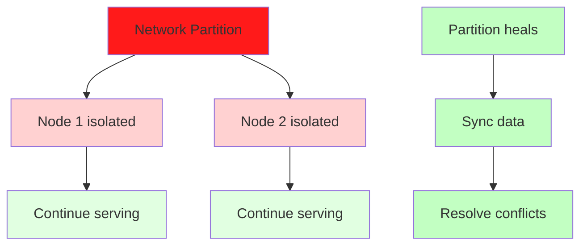

**Examples:**
- All distributed systems must handle partitions
- Network failures are inevitable
- System must decide: CP or AP

### CAP Trade-offs

**CP Systems (Consistency + Partition Tolerance):**
- Prioritize data consistency over availability
- Will reject requests during partitions
- Examples: MongoDB, HBase, Redis

**AP Systems (Availability + Partition Tolerance):**
- Prioritize availability over consistency
- May return stale data during partitions
- Examples: Cassandra, DynamoDB, CouchDB

**CA Systems (Consistency + Availability):**
- Not truly distributed (single node)
- Not possible in distributed systems
- Examples: Single-node databases

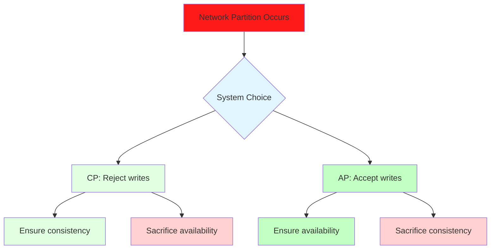

## 🔄 Consistency Models

### Strong Consistency

**Definition**: All clients see the same data at the same time.

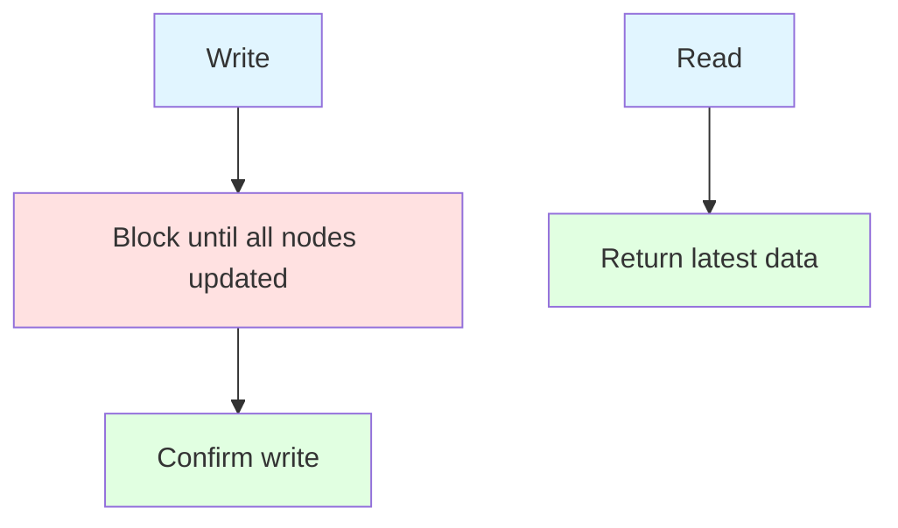

**Advantages:**
- Data is always consistent
- No conflicts to resolve
- Simple to reason about

**Disadvantages:**
- Higher latency
- Lower availability
- More complex to implement

### Eventual Consistency

**Definition**: System guarantees that if no new updates are made, eventually all accesses will return the last updated value.

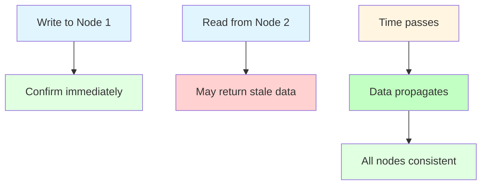

**Advantages:**
- Low latency
- High availability
- Better scalability

**Disadvantages:**
- May return stale data
- Conflicts to resolve
- Complex to reason about

### Consistency Levels

```mermaid
graph TD
    A[Consistency Spectrum] --> B[Strong]
    A --> C[Weak]
    A --> D[Eventual]
    
    B --> E[All nodes always consistent]
    C --> F[Session consistency]
    D --> G[Eventually consistent]
    
    style A fill:#e1f5ff
    style B fill:#e1ffe1
    style C fill:#ffe1c2
    style D fill:#ffd1d1
    style E fill:#e1ffe1
    style F fill:#ffe1c2
    style G fill:#ffd1d1
```

## 🎯 System Design Selection Guide

```mermaid
graph TD
    A[System Design Decision] --> B{Need strong consistency?}
    A --> C{Need high availability?}
    A --> D{Need low latency?}
    
    B -->|Yes| E[CP System]
    B -->|No| F[AP System]
    
    C -->|Yes| G[Horizontal scaling]
    C -->|No| H[Vertical scaling]
    
    D -->|Yes| I[Eventual consistency]
    D -->|No| J[Strong consistency]
    
    style A fill:#e1f5ff
    style E fill:#e1ffe1
    style F fill:#c2ffc2
    style G fill:#e1ffe1
    style H fill:#ffd1d1
    style I fill:#c2ffc2
    style J fill:#e1ffe1
```

## 🧪 Practice Problems

### Scalability (Day 1-2)
1. **Design URL Shortener**: Handle millions of URLs
2. **Design Web Crawler**: Scale for billions of pages
3. **Design Twitter Timeline**: Handle massive concurrent users

### Availability (Day 3-4)
1. **Design Chat System**: High availability for messaging
2. **Design File Storage**: Geographic redundancy
3. **Design API Gateway**: Load balancing and failover

### CAP Theorem (Day 5-6)
1. **Design Shopping Cart**: Consistency vs availability
2. **Design Leaderboard**: Real-time vs eventual consistency
3. **Design Notification System**: Partition tolerance

## 🎯 Daily Exercises (1-Hour Schedule)

### Day 1: Scalability (10 + 20 + 25 + 5)
**Learning (10 min):**
- Read scalability section
- Study vertical vs horizontal scaling
- Understand load balancing

**Examples (20 min):**
- Design a scalable URL shortener
- Practice load balancing strategies
- Understand database sharding

**Practice (25 min):**
- Design URL shortener architecture
- Calculate capacity requirements
- Plan scaling strategy

**Review (5 min):**
- Review scaling decisions
- Note trade-offs you considered

### Day 2: Availability (10 + 20 + 25 + 5)
**Learning (10 min):**
- Read availability section
- Study redundancy patterns
- Understand failover mechanisms

**Examples (20 min):**
- Design high availability system
- Practice disaster recovery planning
- Understand health checks

**Practice (25 min):**
- Design high availability chat system
- Plan failover strategy
- Calculate availability targets

**Review (5 min):**
- Review availability techniques
- Note which patterns you understood

### Day 3: CAP Theorem (10 + 20 + 25 + 5)
**Learning (10 min):**
- Read CAP theorem section
- Understand consistency models
- Study trade-offs

**Examples (20 min):**
- Analyze systems for CAP properties
- Practice choosing CP vs AP
- Understand consistency levels

**Practice (25 min):**
- Design shopping cart system
- Choose consistency model
- Justify CAP trade-offs

**Review (5 min):**
- Review CAP implications
- Note when to choose each property

### Day 4-6: Mixed Practice (10 + 20 + 25 + 5)
**Learning (10 min):**
- Review all concepts
- Study selection guide
- Understand hybrid approaches

**Examples (20 min):**
- Practice combining concepts
- Study real-world systems
- Understand architectural decisions

**Practice (25 min):**
- Design complete systems
- Apply all concepts
- Document trade-offs

**Review (5 min):**
- Review your design decisions
- Note areas that need more practice

## 📋 Weekly Summary

### Week 6 Goals
- [ ] Understand scalability principles
- [ ] Design highly available systems
- [ ] Apply CAP theorem to system design
- [ ] Choose appropriate consistency models
- [ ] Document architectural trade-offs

### Week 6 Checklist
- [ ] Completed all daily exercises
- [ ] Can design scalable systems
- [ ] Can implement high availability
- [ ] Can apply CAP theorem
- [ ] Can choose consistency models
- [ ] Ready to move to system design patterns

## 🚀 Next Steps

After mastering system design fundamentals:
1. **Move to File 07**: System Design Patterns
2. **Apply these concepts** to specific design patterns
3. **Practice real-world system design** interviews
4. **Learn advanced techniques** for complex systems

## 💡 Key Takeaways

1. **Scalability** requires choosing between vertical and horizontal scaling
2. **Availability** is achieved through redundancy and failover
3. **CAP theorem** forces trade-offs in distributed systems
4. **Consistency models** range from strong to eventual
5. **System design** is about making informed trade-offs

---

**You're now ready for system design patterns!** → [07_SYSTEM_DESIGN_PATTERNS.md](./07_SYSTEM_DESIGN_PATTERNS.md)
