# System Design Patterns - Load Balancing, Caching, Database Design

## 🎯 Learning Objectives

By the end of this file, you will:
- Master load balancing strategies and algorithms
- Understand caching techniques and implementation
- Learn database design principles
- Apply these patterns to real-world systems
- Make informed architectural decisions

## 📊 System Design Patterns Overview

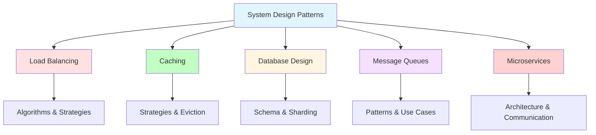
```mermaid
graph TD
    A[System Design Patterns] --> B[Load Balancing]
    A --> C[Caching]
    A --> D[Database Design]
    A --> E[Message Queues]
    A --> F[Microservices]
    
    B --> G[Algorithms & Strategies]
    C --> H[Strategies & Eviction]
    D --> I[Schema & Sharding]
    E --> J[Patterns & Use Cases]
    F --> K[Architecture & Communication]
    
    style A fill:#e1f5ff
    style B fill:#ffe1e1
    style C fill:#c2ffc2
    style D fill:#fff5e1
    style E fill:#f5e1ff
    style F fill:#ffd1d1
```

## ⚖️ Load Balancing

### What is Load Balancing?

Load balancing distributes incoming network traffic across multiple servers to ensure no single server bears too much demand.

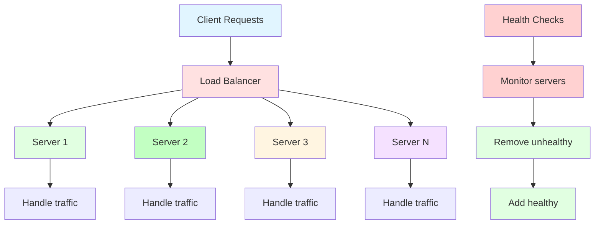
```mermaid
graph TD
    A[Client Requests] --> B[Load Balancer]
    B --> C[Server 1]
    B --> D[Server 2]
    B --> E[Server 3]
    B --> F[Server N]
    
    C --> G[Handle traffic]
    D --> H[Handle traffic]
    E --> I[Handle traffic]
    F --> J[Handle traffic]
    
    K[Health Checks] --> L[Monitor servers]
    L --> M[Remove unhealthy]
    M --> N[Add healthy]
    
    style A fill:#e1f5ff
    style B fill:#ffe1e1
    style C fill:#e1ffe1
    style D fill:#c2ffc2
    style E fill:#fff5e1
    style F fill:#f5e1ff
    style K fill:#ffd1d1
    style L fill:#ffd1d1
    style M fill:#e1ffe1
    style N fill:#e1ffe1
```

### Load Balancing Algorithms

#### Round Robin

**Description**: Distributes requests sequentially to each server.

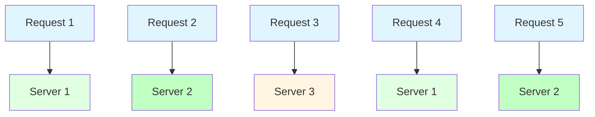
```mermaid
graph TD
    A[Request 1] --> B[Server 1]
    A2[Request 2] --> C[Server 2]
    A3[Request 3] --> D[Server 3]
    A4[Request 4] --> E[Server 1]
    A5[Request 5] --> F[Server 2]
    
    style A fill:#e1f5ff
    style A2 fill:#e1f5ff
    style A3 fill:#e1f5ff
    style A4 fill:#e1f5ff
    style A5 fill:#e1f5ff
    style B fill:#e1ffe1
    style C fill:#c2ffc2
    style D fill:#fff5e1
    style E fill:#e1ffe1
    style F fill:#c2ffc2
```

**Advantages:**
- Simple to implement
- Fair distribution
- No server state needed

**Disadvantages:**
- Ignores server capacity
- Ignores current load
- Session persistence issues

**When to Use:**
- Servers have similar capacity
- Stateless applications
- Simple use cases

#### Least Connections

**Description**: Routes requests to server with fewest active connections.

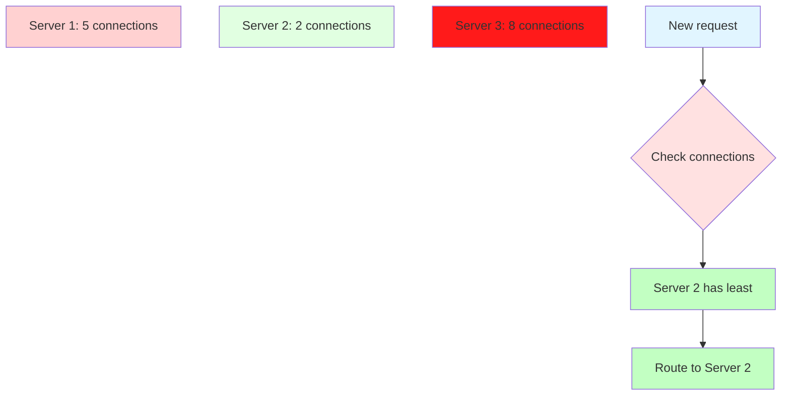
```mermaid
graph TD
    A[Server 1: 5 connections]
    B[Server 2: 2 connections]
    C[Server 3: 8 connections]
    
    D[New request] --> E{Check connections}
    E --> F[Server 2 has least]
    F --> G[Route to Server 2]
    
    style A fill:#ffd1d1
    style B fill:#e1ffe1
    style C fill:#ff1a1a
    style D fill:#e1f5ff
    style E fill:#ffe1e1
    style F fill:#c2ffc2
    style G fill:#c2ffc2
```

**Advantages:**
- Considers current load
- Better distribution
- Handles varying request times

**Disadvantages:**
- Requires connection tracking
- More complex
- May not consider request duration

**When to Use:**
- Requests have varying processing times
- Real-time monitoring available
- Need better load distribution

#### IP Hash

**Description**: Routes based on client IP address (session persistence).

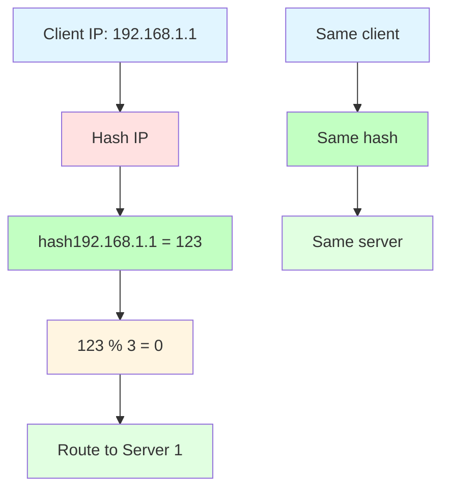
```mermaid
graph TD
    A[Client IP: 192.168.1.1] --> B[Hash IP]
    B --> C[hash192.168.1.1 = 123]
    C --> D[123 % 3 = 0]
    D --> E[Route to Server 1]
    
    F[Same client] --> G[Same hash]
    G --> H[Same server]
    
    style A fill:#e1f5ff
    style B fill:#ffe1e1
    style C fill:#c2ffc2
    style D fill:#fff5e1
    style E fill:#e1ffe1
    style F fill:#e1f5ff
    style G fill:#c2ffc2
    style H fill:#e1ffe1
```

**Advantages:**
- Session persistence
- Same client always to same server
- Simple to implement

**Disadvantages:**
- Uneven distribution
- Adding/removing servers affects distribution
- Not suitable for all applications

**When to Use:**
- Session-based applications
- Stateful services
- Need client-server affinity

#### Weighted Round Robin

**Description**: Distributes based on server capacity/weight.

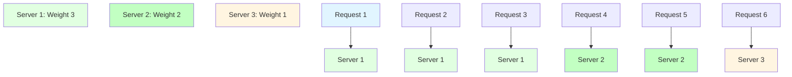
```mermaid
graph TD
    A[Server 1: Weight 3]
    B[Server 2: Weight 2]
    C[Server 3: Weight 1]
    
    D[Request 1] --> E[Server 1]
    D2[Request 2] --> F[Server 1]
    D3[Request 3] --> G[Server 1]
    D4[Request 4] --> H[Server 2]
    D5[Request 5] --> I[Server 2]
    D6[Request 6] --> J[Server 3]
    
    style A fill:#e1ffe1
    style B fill:#c2ffc2
    style C fill:#fff5e1
    style D fill:#e1f5ff
    style E fill:#e1ffe1
    style F fill:#e1ffe1
    style G fill:#e1ffe1
    style H fill:#c2ffc2
    style I fill:#c2ffc2
    style J fill:#fff5e1
```

**Advantages:**
- Considers server capacity
- Better resource utilization
- Fair distribution based on capability

**Disadvantages:**
- Requires weight configuration
- More complex
- Manual weight adjustment

**When to Use:**
- Servers have different capacities
- Heterogeneous infrastructure
- Need optimal resource usage

### Load Balancer Placement

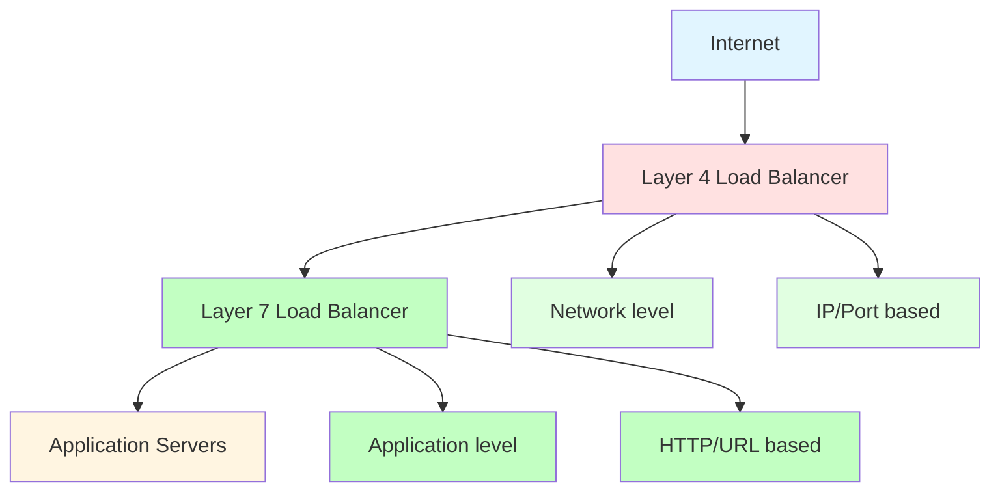
```mermaid
graph TD
    A[Internet] --> B[Layer 4 Load Balancer]
    B --> C[Layer 7 Load Balancer]
    C --> D[Application Servers]
    
    B --> E[Network level]
    B --> F[IP/Port based]
    
    C --> G[Application level]
    C --> H[HTTP/URL based]
    
    style A fill:#e1f5ff
    style B fill:#ffe1e1
    style C fill:#c2ffc2
    style D fill:#fff5e1
    style E fill:#e1ffe1
    style F fill:#e1ffe1
    style G fill:#c2ffc2
    style H fill:#c2ffc2
```

**Layer 4 (Transport Layer):**
- Based on IP address and port
- Fast and efficient
- Limited routing capabilities

**Layer 7 (Application Layer):**
- Based on HTTP content (URL, headers)
- More intelligent routing
- Higher latency but more features

## 💾 Caching

### What is Caching?

Caching stores frequently accessed data in fast storage to reduce latency and load on backend systems.

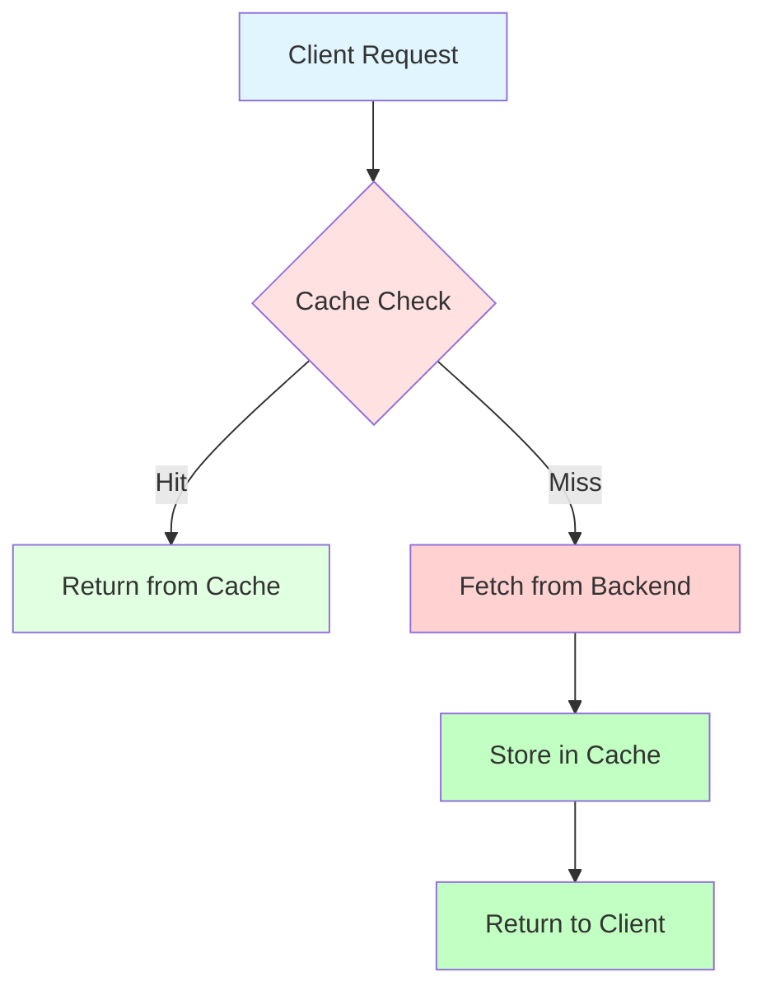
```mermaid
graph TD
    A[Client Request] --> B{Cache Check}
    B -->|Hit| C[Return from Cache]
    B -->|Miss| D[Fetch from Backend]
    D --> E[Store in Cache]
    E --> F[Return to Client]
    
    style A fill:#e1f5ff
    style B fill:#ffe1e1
    style C fill:#e1ffe1
    style D fill:#ffd1d1
    style E fill:#c2ffc2
    style F fill:#c2ffc2
```

### Caching Strategies

#### Cache Aside (Lazy Loading)

**Description**: Application manages cache, loads data on cache miss.

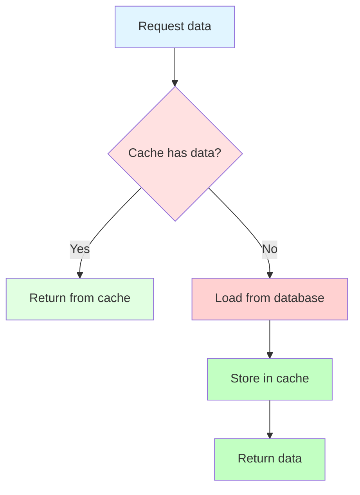
```mermaid
graph TD
    A[Request data] --> B{Cache has data?}
    B -->|Yes| C[Return from cache]
    B -->|No| D[Load from database]
    D --> E[Store in cache]
    E --> F[Return data]
    
    style A fill:#e1f5ff
    style B fill:#ffe1e1
    style C fill:#e1ffe1
    style D fill:#ffd1d1
    style E fill:#c2ffc2
    style F fill:#c2ffc2
```

**Implementation:**
```python
def get_user(user_id):
    # Check cache
    user = cache.get(f"user:{user_id}")
    if user:
        return user
    
    # Cache miss - load from database
    user = db.query("SELECT * FROM users WHERE id = ?", user_id)
    
    # Store in cache
    cache.set(f"user:{user_id}", user, ttl=3600)
    
    return user
```

**Advantages:**
- Simple to implement
- Only caches needed data
- Application controls caching

**Disadvantages:**
- Stale data possible
- Cache stampede on cold start
- Three round trips on miss

#### Write Through

**Description**: Write to cache and database simultaneously.

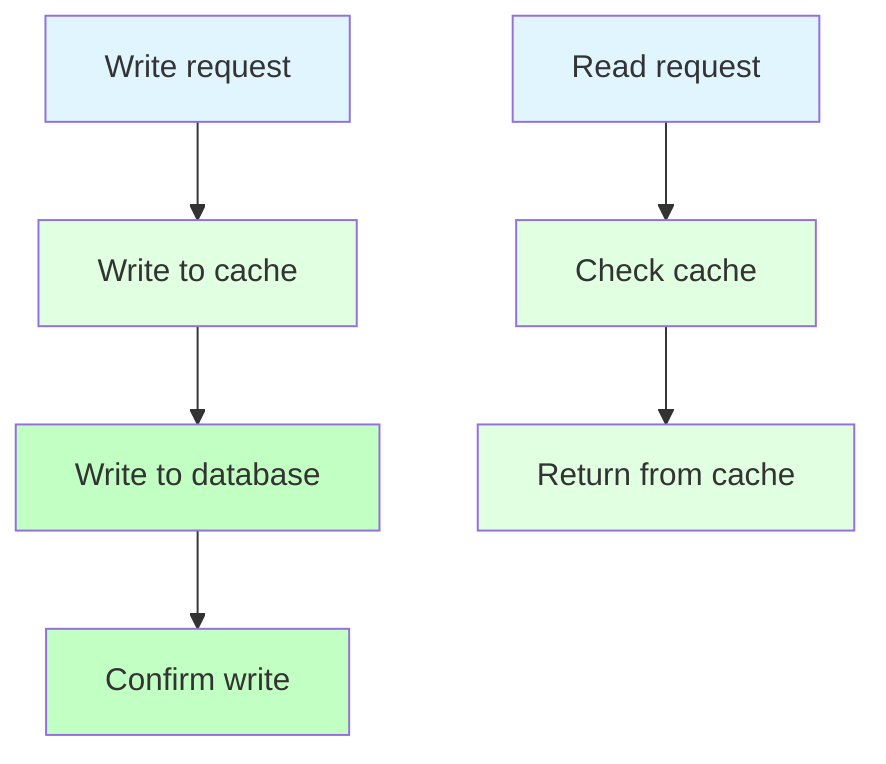
```mermaid
graph TD
    A[Write request] --> B[Write to cache]
    B --> C[Write to database]
    C --> D[Confirm write]
    
    E[Read request] --> F[Check cache]
    F --> G[Return from cache]
    
    style A fill:#e1f5ff
    style B fill:#e1ffe1
    style C fill:#c2ffc2
    style D fill:#c2ffc2
    style E fill:#e1f5ff
    style F fill:#e1ffe1
    style G fill:#e1ffe1
```

**Implementation:**
```python
def update_user(user_id, data):
    # Update cache
    cache.set(f"user:{user_id}", data, ttl=3600)
    
    # Update database
    db.execute("UPDATE users SET data = ? WHERE id = ?", data, user_id)
    
    return data
```

**Advantages:**
- Data always in cache
- Consistent reads
- Simple implementation

**Disadvantages:**
- Slower writes (two writes)
- Wasted cache writes for rarely accessed data
- Higher write latency

#### Write Back (Write Behind)

**Description**: Write to cache immediately, persist to database asynchronously.

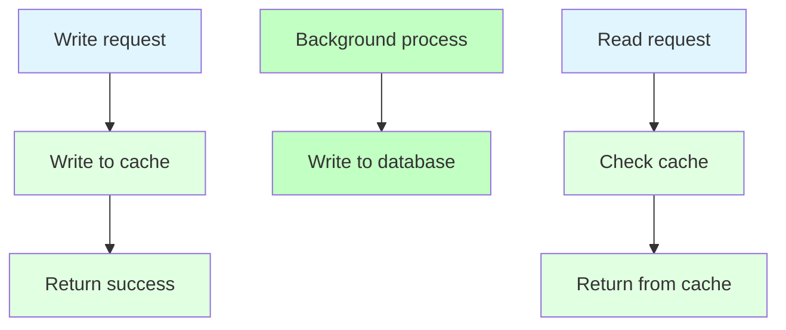
```mermaid
graph TD
    A[Write request] --> B[Write to cache]
    B --> C[Return success]
    D[Background process] --> E[Write to database]
    
    F[Read request] --> G[Check cache]
    G --> H[Return from cache]
    
    style A fill:#e1f5ff
    style B fill:#e1ffe1
    style C fill:#e1ffe1
    style D fill:#c2ffc2
    style E fill:#c2ffc2
    style F fill:#e1f5ff
    style G fill:#e1ffe1
    style H fill:#e1ffe1
```

**Advantages:**
- Fast writes
- Reduces database load
- Good for write-heavy workloads

**Disadvantages:**
- Data loss if cache fails
- Complex implementation
- Consistency challenges

#### Write Around

**Description**: Write directly to database, cache on read.

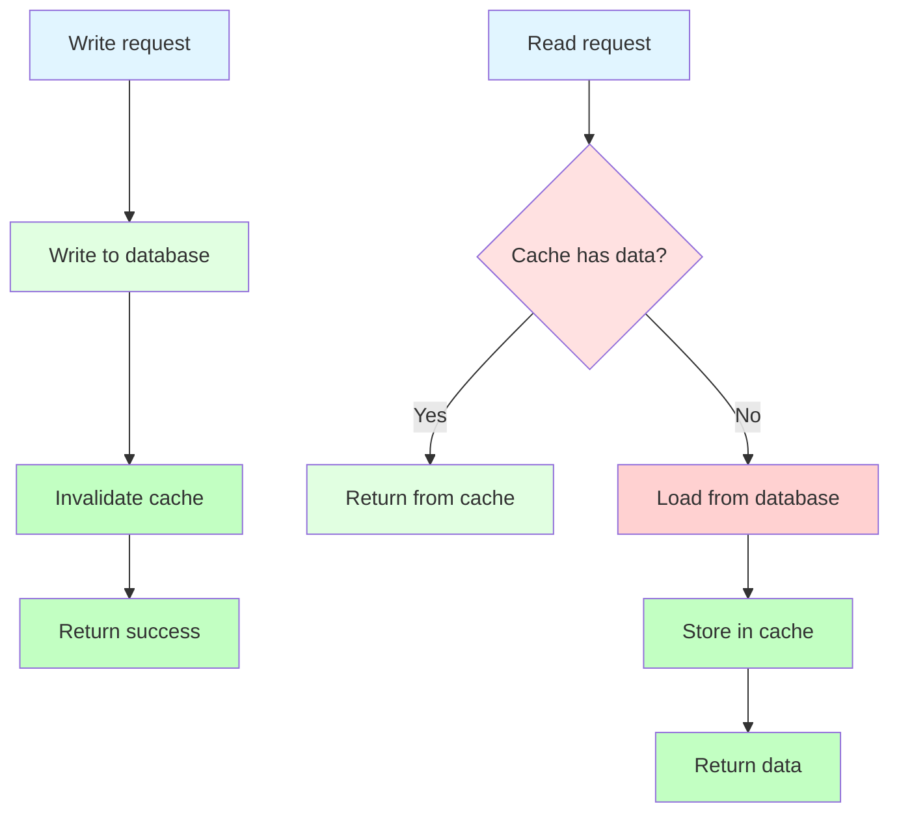
```mermaid
graph TD
    A[Write request] --> B[Write to database]
    B --> C[Invalidate cache]
    C --> D[Return success]
    
    E[Read request] --> F{Cache has data?}
    F -->|Yes| G[Return from cache]
    F -->|No| H[Load from database]
    H --> I[Store in cache]
    I --> J[Return data]
    
    style A fill:#e1f5ff
    style B fill:#e1ffe1
    style C fill:#c2ffc2
    style D fill:#c2ffc2
    style E fill:#e1f5ff
    style F fill:#ffe1e1
    style G fill:#e1ffe1
    style H fill:#ffd1d1
    style I fill:#c2ffc2
    style J fill:#c2ffc2
```

**Advantages:**
- Cache only accessed data
- No wasted cache writes
- Good for read-once data

**Disadvantages:**
- Cache misses on first read
- Stale data possible
- Higher read latency on misses

### Cache Eviction Policies

#### LRU (Least Recently Used)

**Description**: Evict least recently accessed items.

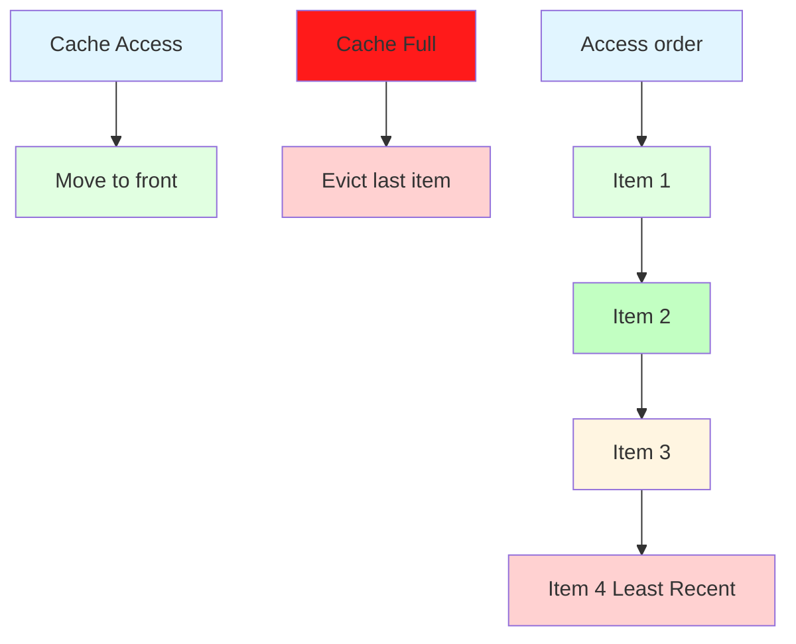
```mermaid
graph TD
    A[Cache Access] --> B[Move to front]
    C[Cache Full] --> D[Evict last item]
    
    E[Access order] --> F[Item 1]
    F --> G[Item 2]
    G --> H[Item 3]
    H --> I[Item 4 Least Recent]
    
    style A fill:#e1f5ff
    style B fill:#e1ffe1
    style C fill:#ff1a1a
    style D fill:#ffd1d1
    style E fill:#e1f5ff
    style F fill:#e1ffe1
    style G fill:#c2ffc2
    style H fill:#fff5e1
    style I fill:#ffd1d1
```

**Advantages:**
- Simple to implement
- Good temporal locality
- Widely used

**Disadvantages:**
- May not reflect actual usage patterns
- Can be expensive to maintain
- Cache pollution possible

#### LFU (Least Frequently Used)

**Description**: Evict least frequently accessed items.

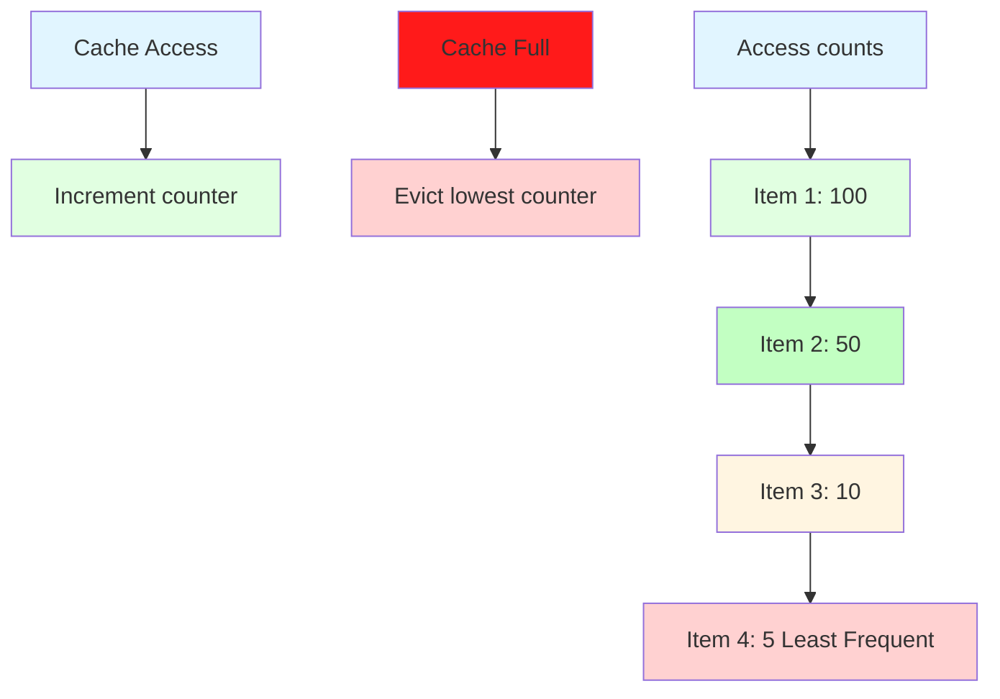
```mermaid
graph TD
    A[Cache Access] --> B[Increment counter]
    C[Cache Full] --> D[Evict lowest counter]
    
    E[Access counts] --> F[Item 1: 100]
    F --> G[Item 2: 50]
    G --> H[Item 3: 10]
    H --> I[Item 4: 5 Least Frequent]
    
    style A fill:#e1f5ff
    style B fill:#e1ffe1
    style C fill:#ff1a1a
    style D fill:#ffd1d1
    style E fill:#e1f5ff
    style F fill:#e1ffe1
    style G fill:#c2ffc2
    style H fill:#fff5e1
    style I fill:#ffd1d1
```

**Advantages:**
- Reflects actual usage
- Good for long-term patterns
- Avoids cache pollution

**Disadvantages:**
- Complex to implement
- May not adapt to changing patterns
- Higher overhead

#### FIFO (First In First Out)

**Description**: Evict oldest items first.

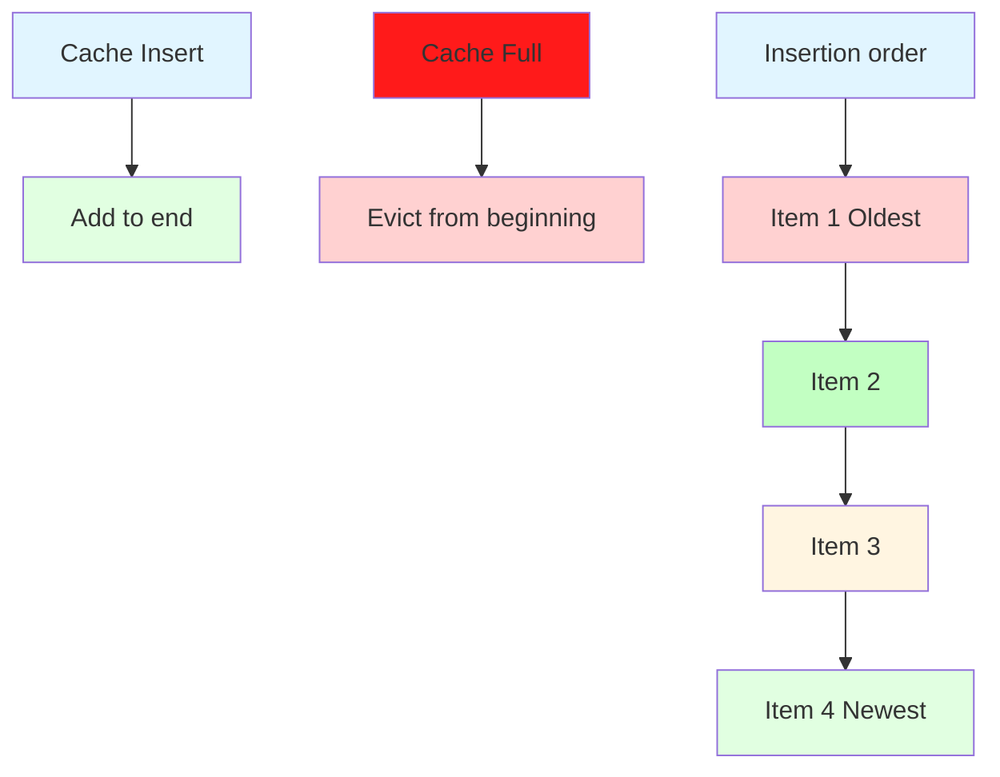
```mermaid
graph TD
    A[Cache Insert] --> B[Add to end]
    C[Cache Full] --> D[Evict from beginning]
    
    E[Insertion order] --> F[Item 1 Oldest]
    F --> G[Item 2]
    G --> H[Item 3]
    H --> I[Item 4 Newest]
    
    style A fill:#e1f5ff
    style B fill:#e1ffe1
    style C fill:#ff1a1a
    style D fill:#ffd1d1
    style E fill:#e1f5ff
    style F fill:#ffd1d1
    style G fill:#c2ffc2
    style H fill:#fff5e1
    style I fill:#e1ffe1
```

**Advantages:**
- Simple to implement
- Low overhead
- Predictable behavior

**Disadvantages:**
- Doesn't consider access patterns
- May evict frequently used items
- Poor performance for many workloads

### Cache Invalidation

**Time to Live (TTL):**
```python
# Cache with expiration
cache.set("key", value, ttl=3600)  # 1 hour
```

**Explicit Invalidation:**
```python
# Invalidate on update
def update_user(user_id, data):
    db.update(user_id, data)
    cache.delete(f"user:{user_id}")
```

**Cache Busting:**
```python
# Version-based invalidation
cache.set(f"user:{user_id}:v2", value, ttl=3600)
```

## 🗄️ Database Design

### Database Types

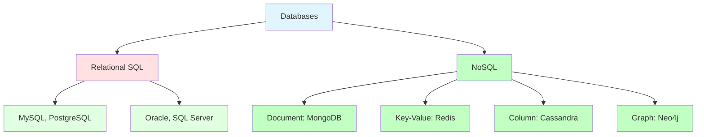
```mermaid
graph TD
    A[Databases] --> B[Relational SQL]
    A --> C[NoSQL]
    
    B --> D[MySQL, PostgreSQL]
    B --> E[Oracle, SQL Server]
    
    C --> F[Document: MongoDB]
    C --> G[Key-Value: Redis]
    C --> H[Column: Cassandra]
    C --> I[Graph: Neo4j]
    
    style A fill:#e1f5ff
    style B fill:#ffe1e1
    style C fill:#c2ffc2
    style D fill:#e1ffe1
    style E fill:#e1ffe1
    style F fill:#c2ffc2
    style G fill:#c2ffc2
    style H fill:#c2ffc2
    style I fill:#c2ffc2
```

### Relational Database Design

**Normalization:**
- **1NF**: Eliminate repeating groups
- **2NF**: Remove partial dependencies
- **3NF**: Remove transitive dependencies

**Example Schema:**
```sql
-- Users table
CREATE TABLE users (
    id INT PRIMARY KEY AUTO_INCREMENT,
    username VARCHAR(50) UNIQUE NOT NULL,
    email VARCHAR(100) UNIQUE NOT NULL,
    created_at TIMESTAMP DEFAULT CURRENT_TIMESTAMP
);

-- Posts table
CREATE TABLE posts (
    id INT PRIMARY KEY AUTO_INCREMENT,
    user_id INT NOT NULL,
    title VARCHAR(200) NOT NULL,
    content TEXT,
    created_at TIMESTAMP DEFAULT CURRENT_TIMESTAMP,
    FOREIGN KEY (user_id) REFERENCES users(id)
);

-- Comments table
CREATE TABLE comments (
    id INT PRIMARY KEY AUTO_INCREMENT,
    post_id INT NOT NULL,
    user_id INT NOT NULL,
    content TEXT NOT NULL,
    created_at TIMESTAMP DEFAULT CURRENT_TIMESTAMP,
    FOREIGN KEY (post_id) REFERENCES posts(id),
    FOREIGN KEY (user_id) REFERENCES users(id)
);
```

### Indexing

**What is Indexing?**
Indexing creates data structures to improve data retrieval speed.

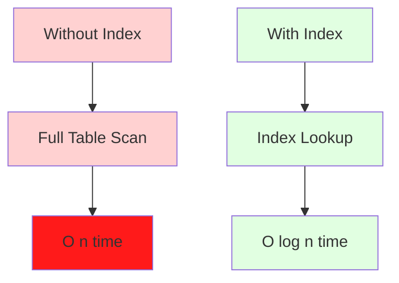
```mermaid
graph TD
    A[Without Index] --> B[Full Table Scan]
    B --> C[O n time]
    
    D[With Index] --> E[Index Lookup]
    E --> F[O log n time]
    
    style A fill:#ffd1d1
    style B fill:#ffd1d1
    style C fill:#ff1a1a
    style D fill:#e1ffe1
    style E fill:#e1ffe1
    style F fill:#e1ffe1
```

**Index Types:**
- **B-Tree Index**: Default for most databases
- **Hash Index**: Fast equality checks
- **Full-Text Index**: Text search
- **Composite Index**: Multiple columns

**When to Index:**
- Frequently queried columns
- WHERE clause columns
- JOIN columns
- ORDER BY columns

**When NOT to Index:**
- Small tables
- Frequently updated columns
- Columns with low cardinality

### Database Sharding

**What is Sharding?**
Sharding distributes data across multiple database instances.

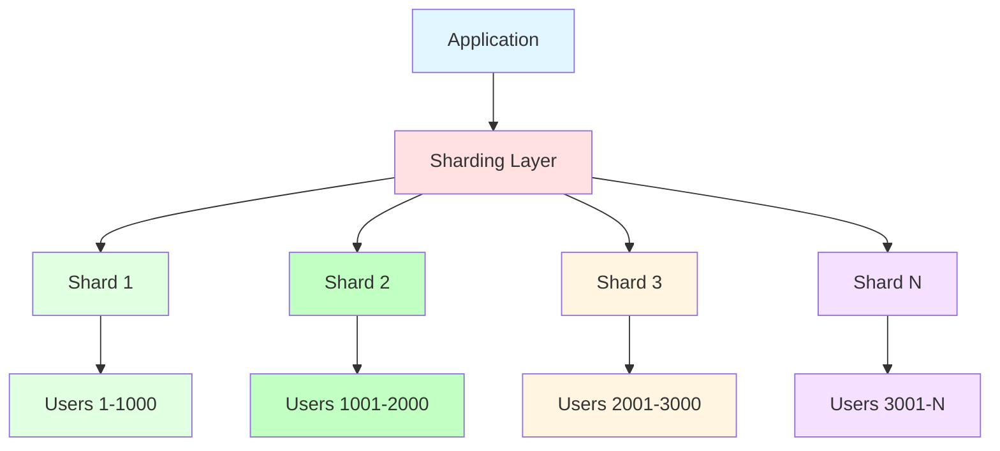
```mermaid
graph TD
    A[Application] --> B[Sharding Layer]
    B --> C[Shard 1]
    B --> D[Shard 2]
    B --> E[Shard 3]
    B --> F[Shard N]
    
    C --> G[Users 1-1000]
    D --> H[Users 1001-2000]
    E --> I[Users 2001-3000]
    F --> J[Users 3001-N]
    
    style A fill:#e1f5ff
    style B fill:#ffe1e1
    style C fill:#e1ffe1
    style D fill:#c2ffc2
    style E fill:#fff5e1
    style F fill:#f5e1ff
    style G fill:#e1ffe1
    style H fill:#c2ffc2
    style I fill:#fff5e1
    style J fill:#f5e1ff
```

**Sharding Strategies:**

1. **Horizontal Sharding**: Distribute rows across shards
2. **Vertical Sharding**: Distribute columns across shards
3. **Hash-based Sharding**: Use hash function to determine shard
4. **Range-based Sharding**: Use value ranges to determine shard

**Advantages:**
- Horizontal scaling
- Better performance
- Geographic distribution

**Disadvantages:**
- Complex implementation
- Cross-shard queries
- Rebalancing challenges

### Database Replication

**Master-Slave Replication:**
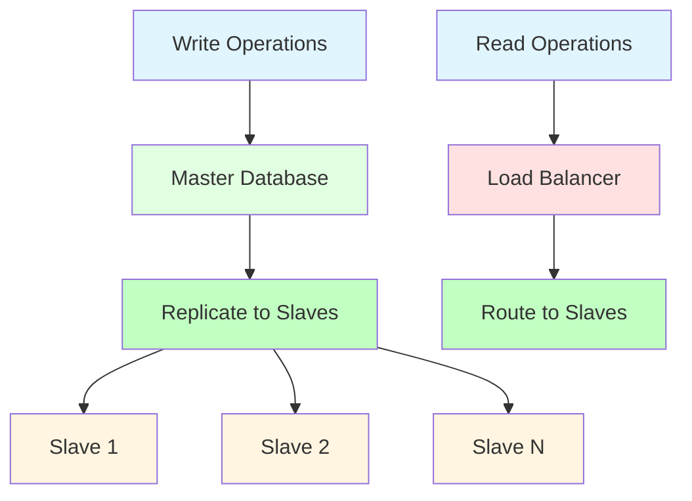
```mermaid
graph TD
    A[Write Operations] --> B[Master Database]
    B --> C[Replicate to Slaves]
    C --> D[Slave 1]
    C --> E[Slave 2]
    C --> F[Slave N]
    
    G[Read Operations] --> H[Load Balancer]
    H --> I[Route to Slaves]
    
    style A fill:#e1f5ff
    style B fill:#e1ffe1
    style C fill:#c2ffc2
    style D fill:#fff5e1
    style E fill:#fff5e1
    style F fill:#fff5e1
    style G fill:#e1f5ff
    style H fill:#ffe1e1
    style I fill:#c2ffc2
```

**Advantages:**
- Read scalability
- High availability
- Backup/failover

**Disadvantages:**
- Replication lag
- Complex consistency
- More infrastructure

## 🔄 System Design Pattern Selection

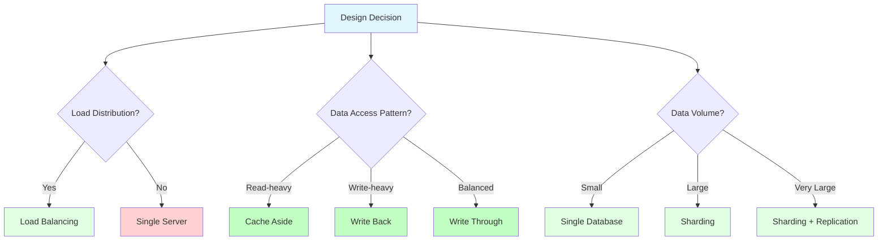
```mermaid
graph TD
    A[Design Decision] --> B{Load Distribution?}
    A --> C{Data Access Pattern?}
    A --> D{Data Volume?}
    
    B -->|Yes| E[Load Balancing]
    B -->|No| F[Single Server]
    
    C -->|Read-heavy| G[Cache Aside]
    C -->|Write-heavy| H[Write Back]
    C -->|Balanced| I[Write Through]
    
    D -->|Small| J[Single Database]
    D -->|Large| K[Sharding]
    D -->|Very Large| L[Sharding + Replication]
    
    style A fill:#e1f5ff
    style E fill:#e1ffe1
    style F fill:#ffd1d1
    style G fill:#c2ffc2
    style H fill:#c2ffc2
    style I fill:#c2ffc2
    style J fill:#e1ffe1
    style K fill:#e1ffe1
    style L fill:#e1ffe1
```

## 🧪 Practice Problems

### Load Balancing (Day 1-2)
1. **Design API Gateway**: Implement load balancing
2. **Design Web Server**: Handle SSL termination
3. **Design CDN**: Geographic load balancing

### Caching (Day 3-4)
1. **Design Session Store**: Implement caching
2. **Design Product Catalog**: Cache strategies
3. **Design Leaderboard**: Cache invalidation

### Database Design (Day 5-6)
1. **Design Social Network**: Schema design
2. **Design E-commerce**: Database sharding
3. **Design Analytics**: Data modeling

## 🎯 Daily Exercises (1-Hour Schedule)

### Day 1: Load Balancing (10 + 20 + 25 + 5)
**Learning (10 min):**
- Read load balancing section
- Study different algorithms
- Understand health checks

**Examples (20 min):**
- Implement round robin load balancer
- Practice least connections algorithm
- Understand layer 4 vs layer 7

**Practice (25 min):**
- Design API gateway with load balancing
- Choose appropriate algorithm
- Plan health check strategy

**Review (5 min):**
- Review load balancing decisions
- Note algorithm trade-offs

### Day 2: Caching (10 + 20 + 25 + 5)
**Learning (10 min):**
- Read caching section
- Study caching strategies
- Understand eviction policies

**Examples (20 min):**
- Implement cache aside pattern
- Practice cache invalidation
- Understand TTL strategies

**Practice (25 min):**
- Design session store with caching
- Choose caching strategy
- Plan invalidation approach

**Review (5 min):**
- Review caching decisions
- Note which strategy fits best

### Day 3: Database Design (10 + 20 + 25 + 5)
**Learning (10 min):**
- Read database design section
- Study normalization
- Understand indexing

**Examples (20 min):**
- Design normalized schema
- Practice indexing strategies
- Understand sharding approaches

**Practice (25 min):**
- Design social network database
- Plan sharding strategy
- Choose indexing approach

**Review (5 min):**
- Review database design
- Note trade-offs considered

### Day 4-6: Mixed Practice (10 + 20 + 25 + 5)
**Learning (10 min):**
- Review all patterns
- Study selection guide
- Understand pattern composition

**Examples (20 min):**
- Practice combining patterns
- Study real-world architectures
- Understand pattern interactions

**Practice (25 min):**
- Design complete system
- Apply all patterns
- Document trade-offs

**Review (5 min):**
- Review your design decisions
- Note areas that need more practice

## 📋 Weekly Summary

### Week 7 Goals
- [ ] Master load balancing algorithms
- [ ] Implement caching strategies
- [ ] Design effective database schemas
- [ ] Apply patterns to real systems
- [ ] Document architectural decisions

### Week 7 Checklist
- [ ] Completed all daily exercises
- [ ] Can implement load balancing
- [ ] Can design caching strategies
- [ ] Can design database schemas
- [ ] Can apply patterns effectively
- [ ] Ready to move to advanced system design

## 🚀 Next Steps

After mastering system design patterns:
1. **Move to File 08**: Advanced System Design
2. **Apply these patterns** to complex distributed systems
3. **Practice real-world system design** interviews
4. **Learn advanced techniques** for large-scale systems

## 💡 Key Takeaways

1. **Load balancing** is essential for scalability and availability
2. **Caching strategies** depend on read/write patterns
3. **Database design** requires understanding of data access patterns
4. **System patterns** should be chosen based on requirements
5. **Trade-offs** are inevitable in system design

---

**You're now ready for advanced system design!** → [08_ADVANCED_SYSTEM_DESIGN.md](./08_ADVANCED_SYSTEM_DESIGN.md)
