# Advanced System Design - Distributed Systems, Messaging, Real-time Systems

## 🎯 Learning Objectives

By the end of this file, you will:
- Master distributed system concepts
- Understand message queue patterns
- Learn real-time system design
- Apply advanced techniques to complex systems
- Design large-scale distributed architectures

## 📊 Advanced System Design Overview

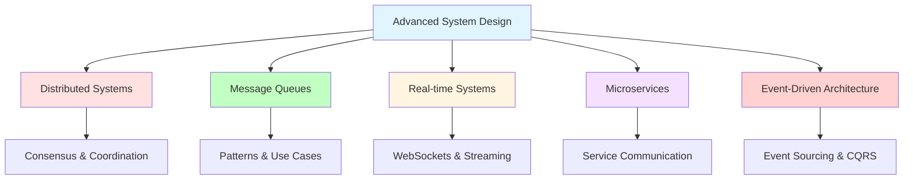

## 🌐 Distributed Systems

### What are Distributed Systems?

Distributed systems are collections of independent computers that appear to users as a single coherent system.

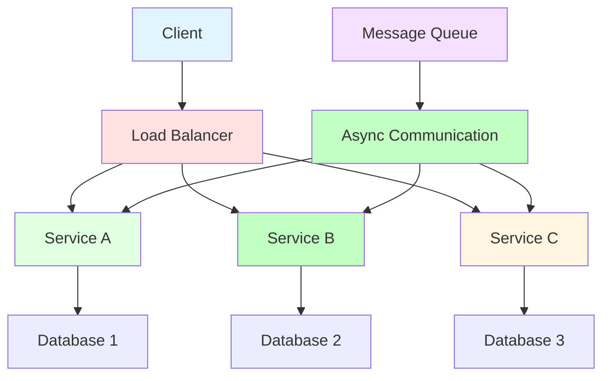

### Distributed System Challenges

**Network Issues:**
- Latency and jitter
- Packet loss
- Network partitions
- Unreliable communication

**Consistency Issues:**
- Data synchronization
- Conflict resolution
- Distributed transactions
- Consistency models

**Coordination Issues:**
- Leader election
- Distributed locking
- Consensus algorithms
- Failure detection

### Consensus Algorithms

#### Paxos

**Description**: Family of protocols for solving consensus in a network of unreliable processors.

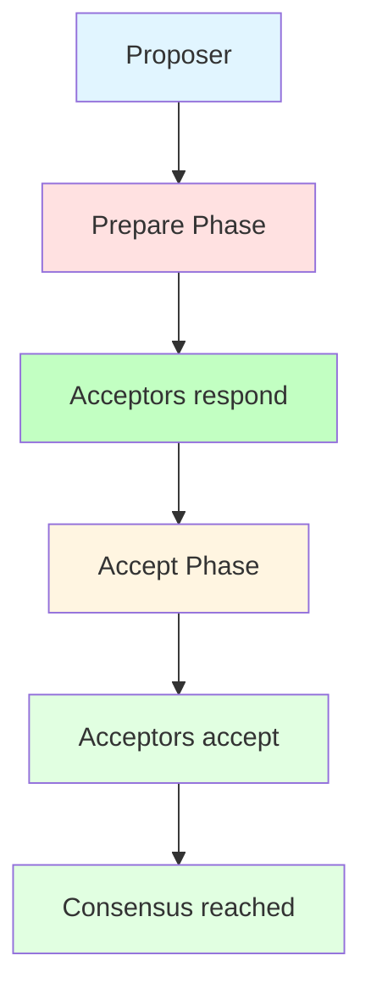

**Phases:**
1. **Prepare**: Proposer sends prepare request to acceptors
2. **Promise**: Acceptors promise not to accept other proposals
3. **Accept**: Proposer sends accept request
4. **Accepted**: Acceptors accept the proposal

**When to Use:**
- Need strong consistency
- Can tolerate higher latency
- Critical consensus operations

#### Raft

**Description**: Consensus algorithm designed to be understandable.

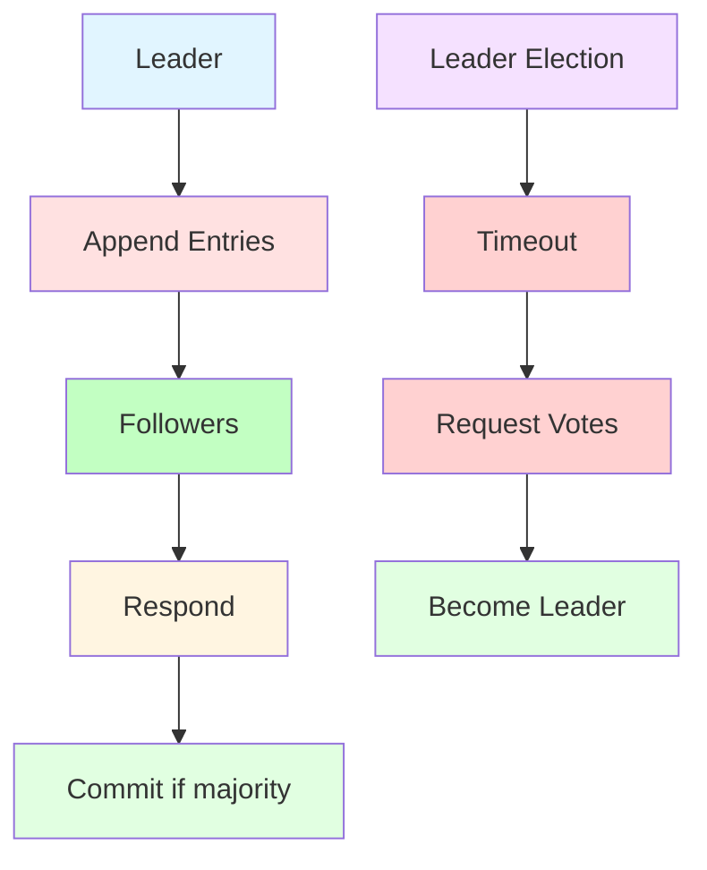

**States:**
- **Leader**: Handles all client requests
- **Follower**: Respond to leader requests
- **Candidate**: Transient state during election

**When to Use:**
- Need understandable consensus
- Leader-based architecture
- Fault tolerance required

### Distributed Locking

**What is Distributed Locking?**
Mechanism to provide mutual exclusion across distributed systems.

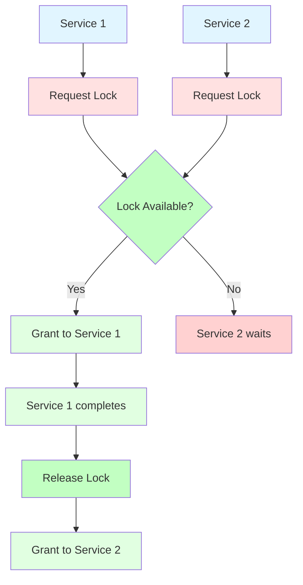

**Implementation Approaches:**
1. **Database-based**: Using database locks
2. **Redis-based**: Using Redis SETNX
3. **ZooKeeper-based**: Using ZooKeeper ephemeral nodes
4. **Etcd-based**: Using etcd transactions

**Example (Redis):**
```python
def acquire_lock(lock_key, timeout=10):
    # Try to acquire lock
    result = redis.set(lock_key, "locked", nx=True, ex=timeout)
    return result is not None

def release_lock(lock_key):
    # Release lock
    redis.delete(lock_key)
```

## 📨 Message Queues

### What are Message Queues?

Message queues enable asynchronous communication between services by decoupling message senders from receivers.

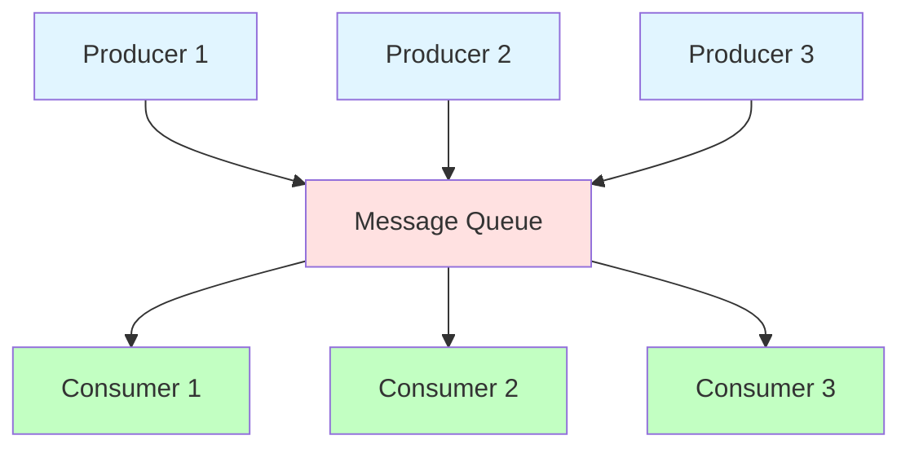

### Message Queue Patterns

#### Point-to-Point

**Description**: Each message consumed by single consumer.

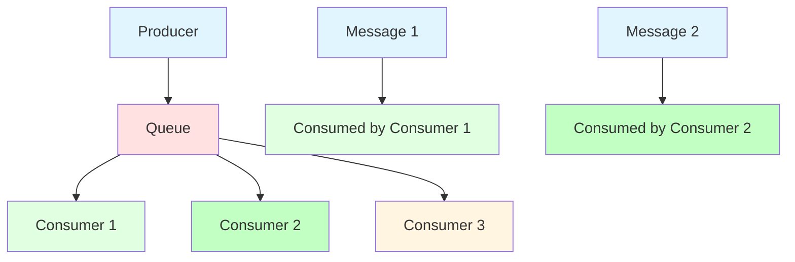

**Use Cases:**
- Task queues
- Job processing
- Order processing

#### Publish-Subscribe

**Description**: Each message consumed by multiple consumers.

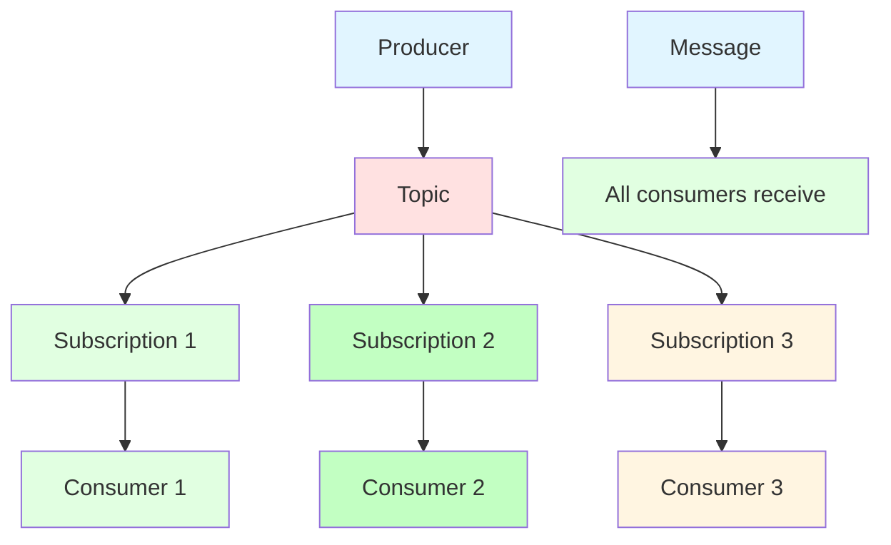

**Use Cases:**
- Event notification
- Real-time updates
- Log aggregation

#### Request-Reply

**Description**: Synchronous-like communication over async queue.

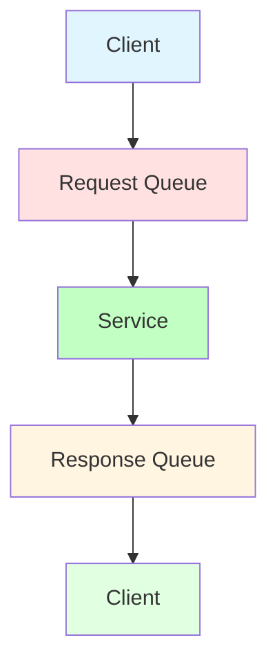

**Use Cases:**
- Remote procedure calls
- Query-response patterns
- Synchronous over async

### Message Queue Implementations

**RabbitMQ:**
- Feature-rich message broker
- Supports multiple protocols
- Flexible routing
- Good for complex routing

**Apache Kafka:**
- Distributed streaming platform
- High throughput
- Persistent storage
- Good for event streaming

**Amazon SQS:**
- Fully managed service
- Simple to use
- Auto-scaling
- Good for AWS environments

**Redis Streams:**
- Lightweight
- Built into Redis
- Simple API
- Good for simple use cases

### Message Queue Use Cases

**Asynchronous Processing:**
```python
# Producer
def send_email(email_data):
    queue.publish('email_queue', email_data)

# Consumer
def process_email():
    message = queue.consume('email_queue')
    send_email(message.data)
```

**Event Sourcing:**
```python
# Event publisher
def publish_event(event):
    queue.publish('events', event)

# Event subscriber
def handle_event(event):
    if event.type == 'USER_CREATED':
        create_user_profile(event.data)
    elif event.type == 'ORDER_PLACED':
        process_order(event.data)
```

**Rate Limiting:**
```python
# Rate limiting with queue
def process_request(request):
    queue.publish('requests', request)
    
def rate_limited_consumer():
    while True:
        request = queue.consume('requests')
        process(request)
        sleep(1)  # Rate limit
```

## ⚡ Real-time Systems

### What are Real-time Systems?

Real-time systems process data and provide responses within strict time constraints.

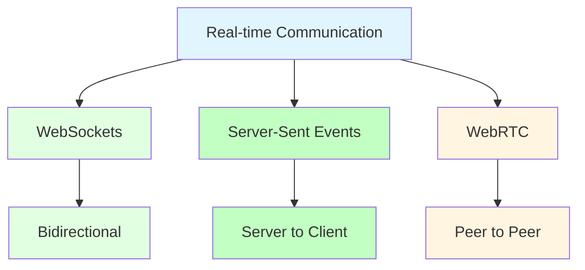

### WebSockets

**Description**: Full-duplex communication channel over a single TCP connection.

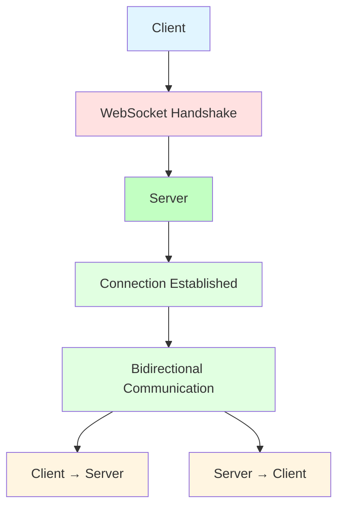

**WebSocket Lifecycle:**
1. **Handshake**: HTTP upgrade request
2. **Connection**: Persistent TCP connection
3. **Communication**: Bidirectional data exchange
4. **Close**: Connection termination

**Use Cases:**
- Chat applications
- Real-time collaboration
- Live updates
- Gaming

**Example:**
```python
# Server (Python with Flask-SocketIO)
from flask_socketio import SocketIO, emit

socketio = SocketIO(app)

@socketio.on('message')
def handle_message(data):
    emit('message', data, broadcast=True)

# Client (JavaScript)
const socket = io();
socket.emit('message', {text: 'Hello'});
socket.on('message', (data) => {
    console.log(data);
});
```

### Server-Sent Events (SSE)

**Description**: Server pushes data to client over HTTP.

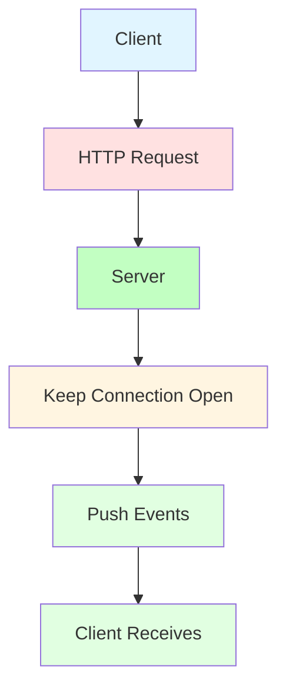

**Use Cases:**
- Live feeds
- Stock tickers
- Notifications
- One-way updates

**Example:**
```python
# Server (Flask)
from flask import Response, stream_with_context

@app.route('/stream')
def stream():
    def event_stream():
        while True:
            yield f"data: {get_update()}\n\n"
    return Response(stream_with_context(event_stream()),
                   mimetype='text/event-stream')

# Client (JavaScript)
const eventSource = new EventSource('/stream');
eventSource.onmessage = (event) => {
    console.log(event.data);
};
```

### Real-time System Design

**Architecture Pattern:**
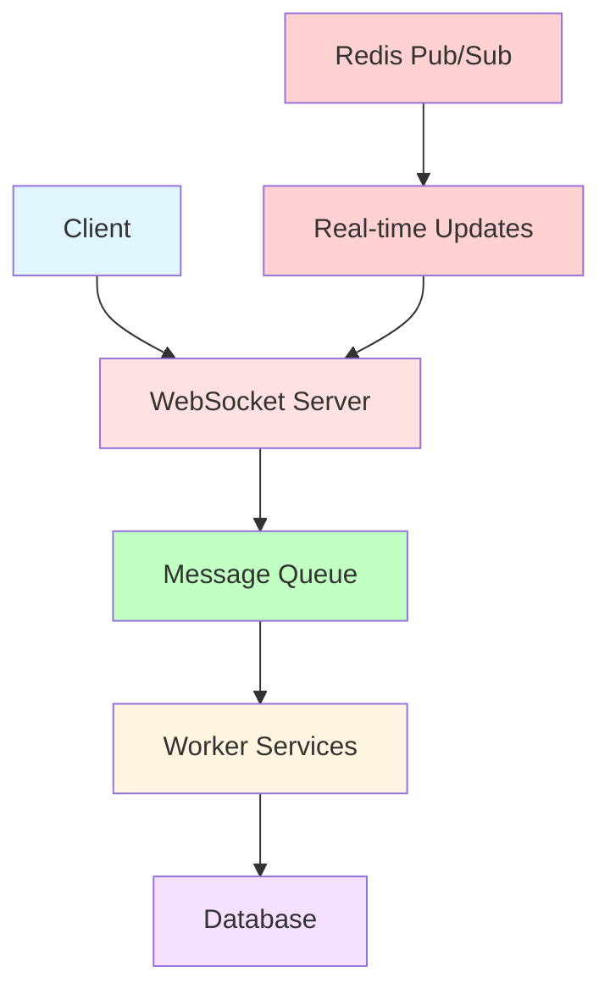

**Scaling Considerations:**
- **Connection Management**: Handle many concurrent connections
- **State Management**: Session state and user presence
- **Message Ordering**: Ensure message delivery order
- **Fault Tolerance**: Handle server failures gracefully

## 🔧 Microservices Architecture

### What are Microservices?

Microservices architecture structures an application as a collection of loosely coupled services.

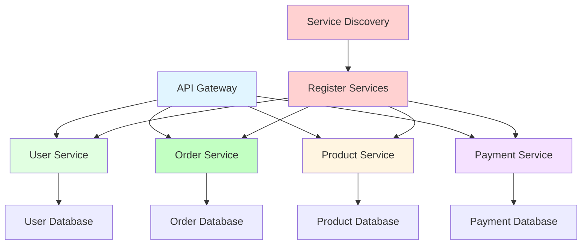

### Microservices Communication

**Synchronous (HTTP/REST):**
```python
# Service A calling Service B
import requests

def get_user_orders(user_id):
    response = requests.get(f'http://order-service/orders/{user_id}')
    return response.json()
```

**Asynchronous (Message Queue):**
```python
# Service A publishing event
def publish_order_event(order_data):
    queue.publish('order_events', order_data)

# Service B consuming event
def handle_order_event(event):
    process_order(event.data)
```

**Service Discovery:**
```python
# Service registration
def register_service(service_name, address):
    registry.register(service_name, address)

# Service discovery
def discover_service(service_name):
    return registry.get_address(service_name)
```

### Microservices Patterns

**API Gateway Pattern:**
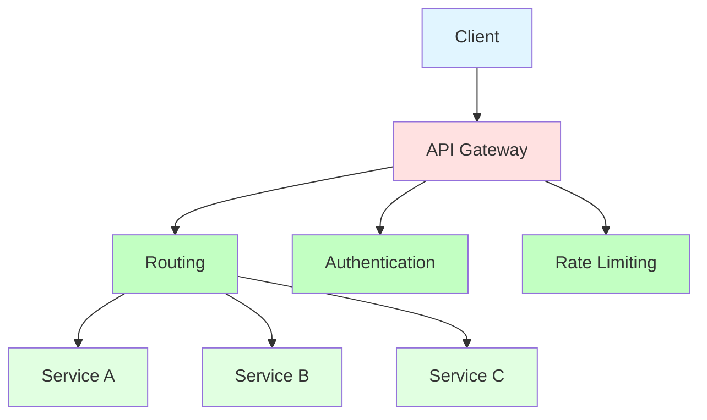

**Circuit Breaker Pattern:**
```python
class CircuitBreaker:
    def __init__(self, failure_threshold=5, timeout=60):
        self.failure_count = 0
        self.failure_threshold = failure_threshold
        self.timeout = timeout
        self.state = 'closed'
        self.last_failure_time = None
    
    def call(self, func):
        if self.state == 'open':
            if time.time() - self.last_failure_time > self.timeout:
                self.state = 'half-open'
            else:
                raise Exception('Circuit breaker is open')
        
        try:
            result = func()
            self.failure_count = 0
            self.state = 'closed'
            return result
        except Exception as e:
            self.failure_count += 1
            self.last_failure_time = time.time()
            if self.failure_count >= self.failure_threshold:
                self.state = 'open'
            raise e
```

## 📊 Event-Driven Architecture

### What is Event-Driven Architecture?

Event-driven architecture uses events to trigger and communicate between decoupled services.

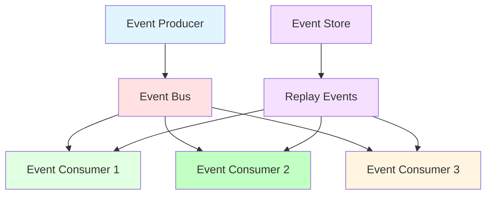

### Event Sourcing

**Description**: Store state as a sequence of events.

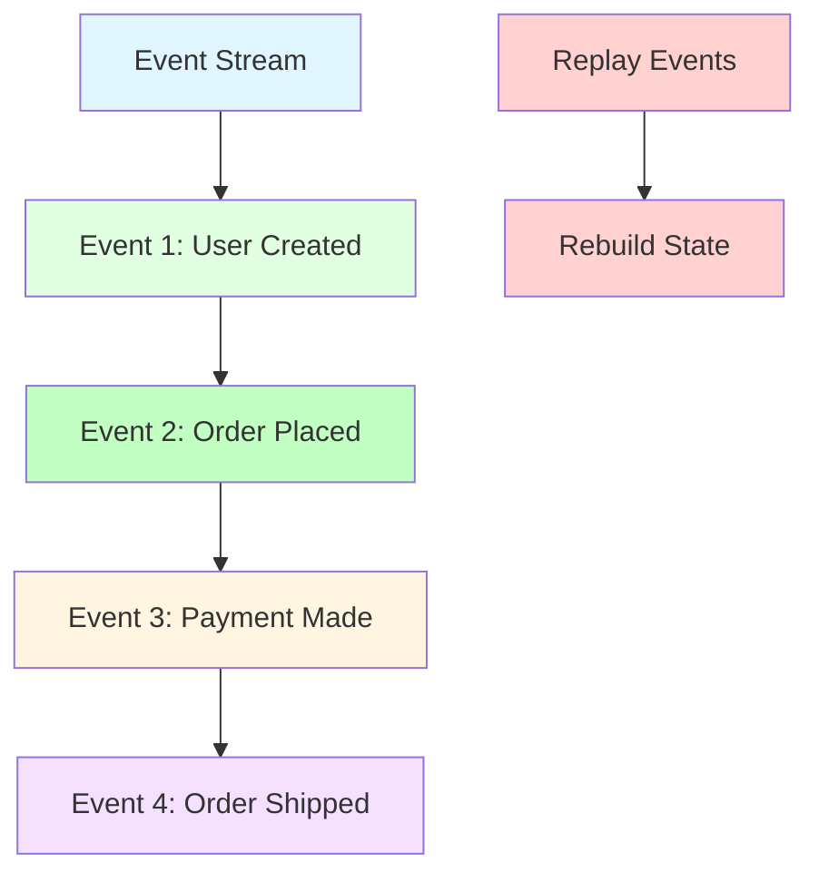

**Advantages:**
- Complete audit trail
- Temporal queries
- Event replay
- Debugging support

**Disadvantages:**
- Complexity
- Event schema evolution
- Need for projections
- Learning curve

### CQRS (Command Query Responsibility Segregation)

**Description**: Separate models for read and write operations.

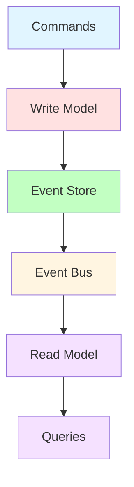

**Advantages:**
- Optimized read/write models
- Scalability
- Flexibility
- Performance

**Disadvantages:**
- Complexity
- Eventual consistency
- More code
- Synchronization challenges

## 🎯 Advanced System Design Selection

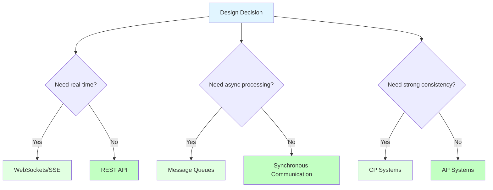

## 🧪 Practice Problems

### Distributed Systems (Day 1-2)
1. **Design Distributed Cache**: Implement distributed locking
2. **Design Leader Election**: Implement Raft algorithm
3. **Design Distributed Counter**: Handle concurrency

### Message Queues (Day 3-4)
1. **Design Event Sourcing**: Implement event store
2. **Design Message Broker**: Implement pub/sub
3. **Design Async Processing**: Handle failures

### Real-time Systems (Day 5-6)
1. **Design Chat Application**: Implement WebSockets
2. **Design Live Dashboard**: Implement SSE
3. **Design Multiplayer Game**: Handle real-time updates

## 🎯 Daily Exercises (1-Hour Schedule)

### Day 1: Distributed Systems (10 + 20 + 25 + 5)
**Learning (10 min):**
- Read distributed systems section
- Study consensus algorithms
- Understand distributed locking

**Examples (20 min):**
- Implement simple distributed lock
- Practice leader election
- Understand consistency challenges

**Practice (25 min):**
- Design distributed cache system
- Choose consensus algorithm
- Plan failure handling

**Review (5 min):**
- Review distributed system decisions
- Note consistency trade-offs

### Day 2: Message Queues (10 + 20 + 25 + 5)
**Learning (10 min):**
- Read message queue section
- Study queue patterns
- Understand implementations

**Examples (20 min):**
- Implement point-to-point queue
- Practice pub/sub pattern
- Understand message durability

**Practice (25 min):**
- Design event sourcing system
- Choose queue implementation
- Plan message ordering

**Review (5 min):**
- Review message queue decisions
- Note pattern trade-offs

### Day 3: Real-time Systems (10 + 20 + 25 + 5)
**Learning (10 min):**
- Read real-time systems section
- Study WebSockets and SSE
- Understand scaling challenges

**Examples (20 min):**
- Implement WebSocket server
- Practice SSE implementation
- Understand connection management

**Practice (25 min):**
- Design chat application
- Choose real-time technology
- Plan scaling strategy

**Review (5 min):**
- Review real-time decisions
- Note scaling considerations

### Day 4-6: Mixed Practice (10 + 20 + 25 + 5)
**Learning (10 min):**
- Review all advanced concepts
- Study selection guide
- Understand pattern composition

**Examples (20 min):**
- Practice combining patterns
- Study real-world architectures
- Understand system interactions

**Practice (25 min):**
- Design complete distributed system
- Apply all advanced patterns
- Document trade-offs

**Review (5 min):**
- Review your design decisions
- Note areas that need more practice

## 📋 Weekly Summary

### Week 8 Goals
- [ ] Understand distributed system challenges
- [ ] Implement message queue patterns
- [ ] Design real-time systems
- [ ] Apply microservices patterns
- [ ] Master event-driven architecture

### Week 8 Checklist
- [ ] Completed all daily exercises
- [ ] Can design distributed systems
- [ ] Can implement message queues
- [ ] Can design real-time systems
- [ ] Can apply microservices patterns
- [ ] Ready for practice and integration

## 🚀 Next Steps

After mastering advanced system design:
1. **Move to File 09**: Practice Schedule
2. **Apply these concepts** to comprehensive system design
3. **Practice mock interviews** with system design questions
4. **Review and integrate** all learned concepts

## 💡 Key Takeaways

1. **Distributed systems** require handling network and consistency challenges
2. **Message queues** enable async communication and decoupling
3. **Real-time systems** need careful connection and state management
4. **Microservices** provide scalability but add complexity
5. **Event-driven architecture** enables loose coupling and flexibility

---

**You're now ready for practice and integration!** → [09_PRACTICE_SCHEDULE.md](./09_PRACTICE_SCHEDULE.md)
