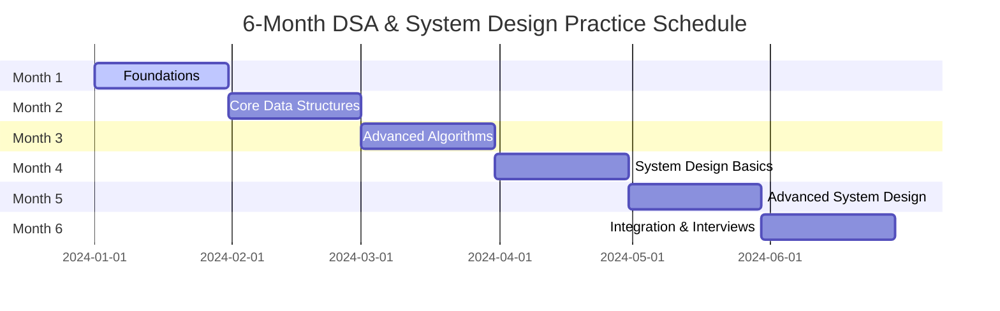
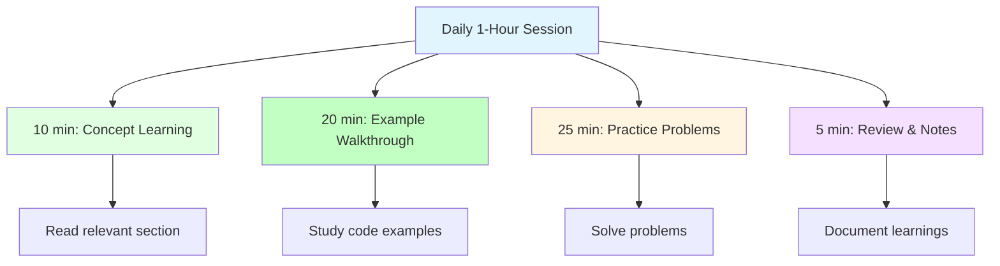

# Practice Schedule - 6-Month Learning Plan

## 📅 6-Month Overview

This practice schedule breaks down your 1-hour daily sessions into weekly themes with specific focus areas and problem sets.



## 🎯 Daily 1-Hour Structure



## 📊 Month 1: Foundations (Weeks 1-4)

### Week 1: Space & Time Complexity

**Daily Focus:**
- **Day 1**: Big O notation basics
- **Day 2**: Time complexity analysis
- **Day 3**: Space complexity analysis
- **Day 4**: Common complexity patterns
- **Day 5**: Complexity trade-offs
- **Day 6-7**: Mixed practice and review

**Daily Problems:**
- **Day 1**: Single Number, Contains Duplicate
- **Day 2**: Missing Number, Move Zeroes
- **Day 3**: First Missing Positive, Valid Anagram
- **Day 4**: Plus One, Remove Duplicates
- **Day 5**: Rotate Array, Best Time to Buy Stock

**Weekly Goal:** 15 problems solved, understand Big O notation

### Week 2: Basic Data Structures

**Daily Focus:**
- **Day 1**: Arrays and strings
- **Day 2**: Linked lists
- **Day 3**: Stacks
- **Day 4**: Queues
- **Day 5**: Mixed data structures
- **Day 6-7**: Integration practice

**Daily Problems:**
- **Day 1**: Two Sum, 3Sum, 4Sum
- **Day 2**: Reverse Linked List, Middle of Linked List
- **Day 3**: Valid Parentheses, Min Stack
- **Day 4**: Implement Queue using Stacks, Design Circular Queue
- **Day 5**: LRU Cache, Design Twitter

**Weekly Goal:** 20 problems solved, implement basic data structures

### Week 3: Intermediate Data Structures

**Daily Focus:**
- **Day 1**: Trees and BST
- **Day 2**: Tree traversals
- **Day 3**: Heaps
- **Day 4**: Hash tables
- **Day 5**: Graphs basics
- **Day 6-7**: Advanced data structures

**Daily Problems:**
- **Day 1**: Maximum Depth, Validate BST, Lowest Common Ancestor
- **Day 2**: Binary Tree Level Order, Zigzag Level Order
- **Day 3**: Kth Largest Element, Top K Frequent Elements
- **Day 4**: Group Anagrams, Longest Consecutive Sequence
- **Day 5**: Number of Islands, Course Schedule

**Weekly Goal:** 25 problems solved, master intermediate data structures

### Week 4: Data Structures Review

**Daily Focus:**
- **Day 1**: Arrays and strings review
- **Day 2**: Linked lists and stacks review
- **Day 3**: Trees and heaps review
- **Day 4**: Hash tables and graphs review
- **Day 5**: Comprehensive data structure problems
- **Day 6-7**: Mock interview and review

**Daily Problems:**
- **Day 1**: Longest Substring Without Repeating, Valid Palindrome
- **Day 2**: Add Two Numbers, Reorder List
- **Day 3**: Construct Binary Tree, Serialize/Deserialize
- **Day 4**: Word Ladder, Clone Graph
- **Day 5**: Word Search, Sudoku Solver

**Weekly Goal:** 25 problems solved, review all data structures

## 📊 Month 2: Core Data Structures & Basic Algorithms (Weeks 5-8)

### Week 5: Sorting & Searching

**Daily Focus:**
- **Day 1**: Sorting algorithms
- **Day 2**: Binary search
- **Day 3**: Search variations
- **Day 4**: Two pointers
- **Day 5**: Mixed searching
- **Day 6-7**: Algorithm practice

**Daily Problems:**
- **Day 1**: Sort Colors, Merge Intervals, Sort List
- **Day 2**: Search in Rotated Array, Find Minimum
- **Day 3**: Search Insert Position, Search Range
- **Day 4**: Two Sum II, Container With Most Water
- **Day 5**: 3Sum Closest, 4Sum II

**Weekly Goal:** 20 problems solved, master sorting and searching

### Week 6: Advanced Searching & Sliding Window

**Daily Focus:**
- **Day 1**: Advanced binary search
- **Day 2**: Sliding window basics
- **Day 3**: Fixed sliding window
- **Day 4**: Variable sliding window
- **Day 5**: Mixed techniques
- **Day 6-7**: Integration practice

**Daily Problems:**
- **Day 1**: Median of Two Sorted Arrays, Search 2D Matrix
- **Day 2**: Minimum Size Subarray, Fruit Into Baskets
- **Day 3**: Maximum Subarray, Fixed Window
- **Day 4**: Longest Substring, Minimum Window Substring
- **Day 5**: Permutation in String, Find All Anagrams

**Weekly Goal:** 20 problems solved, master sliding window

### Week 7: Basic Algorithms

**Daily Focus:**
- **Day 1**: Recursion basics
- **Day 2**: Recursive patterns
- **Day 3**: Backtracking introduction
- **Day 4**: Simple backtracking
- **Day 5**: Algorithm combinations
- **Day 6-7**: Problem solving

**Daily Problems:**
- **Day 1**: Climbing Stairs, Fibonacci, Factorial
- **Day 2**: Tree problems recursively, Power of Two
- **Day 3**: Subsets, Permutations
- **Day 4**: Combination Sum, Letter Combinations
- **Day 5**: Generate Parentheses, Palindrome Partitioning

**Weekly Goal:** 20 problems solved, understand recursion and backtracking

### Week 8: Algorithm Review

**Daily Focus:**
- **Day 1**: Sorting and searching review
- **Day 2**: Sliding window review
- **Day 3**: Recursion review
- **Day 4**: Backtracking review
- **Day 5**: Comprehensive algorithm problems
- **Day 6-7**: Mock interview and review

**Daily Problems:**
- **Day 1**: Sort List, Merge K Sorted Lists
- **Day 2**: Sliding Window Maximum, Longest Repeating Character
- **Day 3**: Unique Paths, Robot in Grid
- **Day 4**: N-Queens, Word Search II
- **Day 5**: Combination Sum III, Split Array

**Weekly Goal:** 25 problems solved, review all algorithms

## 📊 Month 3: Advanced Algorithms (Weeks 9-12)

### Week 9: Dynamic Programming

**Daily Focus:**
- **Day 1**: DP basics and memoization
- **Day 2**: 1D DP problems
- **Day 3**: 2D DP problems
- **Day 4**: DP optimizations
- **Day 5**: Mixed DP problems
- **Day 6-7**: DP practice

**Daily Problems:**
- **Day 1**: Climbing Stairs, Fibonacci, House Robber
- **Day 2**: Coin Change, Word Break, Decode Ways
- **Day 3**: Unique Paths, Minimum Path Sum, Edit Distance
- **Day 4**: Longest Increasing Subsequence, Longest Common Subsequence
- **Day 5**: Palindromic Substrings, Partition Equal Subset Sum

**Weekly Goal:** 20 problems solved, understand DP fundamentals

### Week 10: Advanced DP & Greedy

**Daily Focus:**
- **Day 1**: DP with states
- **Day 2**: Greedy algorithms
- **Day 3**: Greedy applications
- **Day 4**: DP vs Greedy
- **Day 5**: Mixed optimization
- **Day 6-7**: Advanced practice

**Daily Problems:**
- **Day 1**: Best Time to Buy Stock, Maximal Square
- **Day 2**: Jump Game, Gas Station, Candy
- **Day 3**: Interval Scheduling, Activity Selection
- **Day 4**: Partition Labels, Task Scheduler
- **Day 5**: Jump Game II, Can Jump

**Weekly Goal:** 20 problems solved, master DP and greedy

### Week 11: Advanced Recursion & Backtracking

**Daily Focus:**
- **Day 1**: Advanced recursion
- **Day 2**: Complex backtracking
- **Day 3**: Optimization techniques
- **Day 4**: Pruning strategies
- **Day 5**: Mixed backtracking
- **Day 6-7**: Problem solving

**Daily Problems:**
- **Day 1**: Word Ladder II, Word Search II
- **Day 2**: N-Queens II, Sudoku Solver
- **Day 3**: Restore IP Addresses, Binary Watch
- **Day 4**: Combination Sum II, Subsets II
- **Day 5**: Permutations II, Palindrome Partitioning II

**Weekly Goal:** 20 problems solved, master advanced backtracking

### Week 12: Algorithm Mastery

**Daily Focus:**
- **Day 1**: DP review
- **Day 2**: Greedy review
- **Day 3**: Backtracking review
- **Day 4**: Mixed algorithm problems
- **Day 5**: Comprehensive review
- **Day 6-7**: Mock interview and review

**Daily Problems:**
- **Day 1**: Triangle, Minimum Path Sum II
- **Day 2**: Merge Intervals, Non-overlapping Intervals
- **Day 3**: Generate Parentheses II, Phone Letter Combinations
- **Day 4**: Combination Sum III, Partition to K Equal Sums
- **Day 5**: Scramble String, Interleaving String

**Weekly Goal:** 25 problems solved, achieve algorithm mastery

## 📊 Month 4: System Design Fundamentals (Weeks 13-16)

### Week 13: Scalability & Availability

**Daily Focus:**
- **Day 1**: Vertical vs horizontal scaling
- **Day 2**: Load balancing
- **Day 3**: High availability
- **Day 4**: Redundancy patterns
- **Day 5**: System design basics
- **Day 6-7**: Design practice

**Daily Design Problems:**
- **Day 1**: Design URL Shortener
- **Day 2**: Design Web Crawler
- **Day 3**: Design File Storage
- **Day 4**: Design API Gateway
- **Day 5**: Design Load Balancer

**Weekly Goal:** 5 system designs, understand scalability

### Week 14: CAP Theorem & Consistency

**Daily Focus:**
- **Day 1**: CAP theorem deep dive
- **Day 2**: Consistency models
- **Day 3**: Distributed transactions
- **Day 4**: Eventual consistency
- **Day 5**: Consistency trade-offs
- **Day 6-7**: Design practice

**Daily Design Problems:**
- **Day 1**: Design Shopping Cart
- **Day 2**: Design Chat System
- **Day 3**: Design Leaderboard
- **Day 4**: Design Notification System
- **Day 5**: Design File System

**Weekly Goal:** 5 system designs, understand consistency

### Week 15: Database Design

**Daily Focus:**
- **Day 1**: Relational database design
- **Day 2**: NoSQL database design
- **Day 3**: Indexing strategies
- **Day 4**: Sharding and partitioning
- **Day 5**: Database replication
- **Day 6-7**: Design practice

**Daily Design Problems:**
- **Day 1**: Design Social Network Database
- **Day 2**: Design E-commerce Database
- **Day 3**: Design Chat Database
- **Day 4**: Design Analytics Database
- **Day 5**: Design User Management System

**Weekly Goal:** 5 system designs, master database design

### Week 16: System Design Review

**Daily Focus:**
- **Day 1**: Scalability review
- **Day 2**: Availability review
- **Day 3**: CAP theorem review
- **Day 4**: Database design review
- **Day 5**: Comprehensive system design
- **Day 6-7**: Mock system design interview

**Daily Design Problems:**
- **Day 1**: Design Twitter Timeline
- **Day 2**: Design Instagram
- **Day 3**: Design YouTube
- **Day 4**: Design Uber
- **Day 5**: Design Airbnb

**Weekly Goal:** 5 complex system designs, review fundamentals

## 📊 Month 5: Advanced System Design (Weeks 17-20)

### Week 17: Caching & Load Balancing

**Daily Focus:**
- **Day 1**: Caching strategies
- **Day 2**: Cache invalidation
- **Day 3**: Load balancing algorithms
- **Day 4**: CDN design
- **Day 5**: Performance optimization
- **Day 6-7**: Design practice

**Daily Design Problems:**
- **Day 1**: Design Caching Layer
- **Day 2**: Design Session Store
- **Day 3**: Design Product Catalog
- **Day 4**: Design CDN
- **Day 5**: Design API Gateway

**Weekly Goal:** 5 system designs, master caching and load balancing

### Week 18: Message Queues & Async Processing

**Daily Focus:**
- **Day 1**: Message queue patterns
- **Day 2**: Event-driven architecture
- **Day 3**: Async processing
- **Day 4**: Event sourcing
- **Day 5**: CQRS pattern
- **Day 6-7**: Design practice

**Daily Design Problems:**
- **Day 1**: Design Message Queue
- **Day 2**: Design Event Bus
- **Day 3**: Design Email Service
- **Day 4**: Design Notification System
- **Day 5**: Design Event Sourcing System

**Weekly Goal:** 5 system designs, master message queues

### Week 19: Real-time Systems

**Daily Focus:**
- **Day 1**: WebSockets
- **Day 2**: Server-Sent Events
- **Day 3**: Real-time architecture
- **Day 4**: Connection management
- **Day 5**: Real-time scaling
- **Day 6-7**: Design practice

**Daily Design Problems:**
- **Day 1**: Design Chat Application
- **Day 2**: Design Real-time Collaboration
- **Day 3**: Design Live Dashboard
- **Day 4**: Design Multiplayer Game
- **Day 5**: Design Stock Trading Platform

**Weekly Goal:** 5 system designs, master real-time systems

### Week 20: Microservices & Distributed Systems

**Daily Focus:**
- **Day 1**: Microservices architecture
- **Day 2**: Service communication
- **Day 3**: Service discovery
- **Day 4**: Distributed transactions
- **Day 5**: Microservices patterns
- **Day 6-7**: Design practice

**Daily Design Problems:**
- **Day 1**: Design Microservices Architecture
- **Day 2**: Design Service Mesh
- **Day 3**: Design Distributed Cache
- **Day 4**: Design Distributed Lock
- **Day 5**: Design Distributed Counter

**Weekly Goal:** 5 system designs, master microservices

## 📊 Month 6: Integration & Interviews (Weeks 21-24)

### Week 21: Comprehensive DSA Practice

**Daily Focus:**
- **Day 1**: Arrays and strings intensive
- **Day 2**: Linked lists and trees intensive
- **Day 3**: Graphs and heaps intensive
- **Day 4**: DP and algorithms intensive
- **Day 5**: Mixed DSA problems
- **Day 6-7**: Mock DSA interviews

**Daily Problems:**
- **Day 1**: 5 medium array/string problems
- **Day 2**: 5 medium linked list/tree problems
- **Day 3**: 5 medium graph/heap problems
- **Day 4**: 5 medium DP/algorithm problems
- **Day 5**: 5 mixed medium problems

**Weekly Goal:** 25 medium problems, DSA readiness

### Week 22: Comprehensive System Design Practice

**Daily Focus:**
- **Day 1**: Scalability intensive
- **Day 2**: Database design intensive
- **Day 3**: Caching and performance intensive
- **Day 4**: Real-time systems intensive
- **Day 5**: Complex system design
- **Day 6-7**: Mock system design interviews

**Daily Design Problems:**
- **Day 1**: Design a system handling 1M QPS
- **Day 2**: Design database for social network
- **Day 3**: Design caching layer for e-commerce
- **Day 4**: Design real-time chat for 1M users
- **Day 5**: Design complete system for popular app

**Weekly Goal:** 5 complex system designs, system design readiness

### Week 23: Mock Interviews & Weak Areas

**Daily Focus:**
- **Day 1**: DSA mock interview 1
- **Day 2**: System design mock interview 1
- **Day 3**: Focus on weak DSA areas
- **Day 4**: Focus on weak system design areas
- **Day 5**: Mixed practice
- **Day 6-7**: Review and refinement

**Daily Activities:**
- **Day 1**: Complete DSA mock interview, review gaps
- **Day 2**: Complete system design mock interview, review gaps
- **Day 3**: Practice problems in weak DSA areas
- **Day 4**: Practice designs in weak system design areas
- **Day 5**: Timed practice session

**Weekly Goal:** Identify and strengthen weak areas

### Week 24: Final Preparation

**Daily Focus:**
- **Day 1**: Comprehensive DSA review
- **Day 2**: Comprehensive system design review
- **Day 3**: Light practice only
- **Day 4**: Light practice only
- **Day 5**: Rest and mental preparation
- **Day 6-7**: Ready for interviews

**Daily Activities:**
- **Day 1**: Review key DSA concepts and patterns
- **Day 2**: Review key system design concepts
- **Day 3**: Light practice, 2-3 easy problems
- **Day 4**: Light practice, 1 system design
- **Day 5**: Rest, review notes, stay calm

**Weekly Goal:** Peak readiness for interviews

## 📈 Progress Tracking

### Weekly Targets

| Week | DSA Problems | System Designs | Focus Area |
|------|-------------|----------------|------------|
| 1-4 | 85 | 0 | Data Structures |
| 5-8 | 85 | 0 | Basic Algorithms |
| 9-12 | 85 | 0 | Advanced Algorithms |
| 13-16 | 0 | 20 | System Design Basics |
| 17-20 | 0 | 20 | Advanced System Design |
| 21-24 | 50 | 10 | Integration & Interviews |

### Monthly Targets

| Month | Total DSA Problems | Total System Designs | Milestone |
|-------|-------------------|---------------------|----------|
| 1 | 85 | 0 | Data Structures Mastery |
| 2 | 85 | 0 | Algorithm Mastery |
| 3 | 85 | 0 | Advanced Algorithm Mastery |
| 4 | 0 | 20 | System Design Fundamentals |
| 5 | 0 | 20 | Advanced System Design |
| 6 | 50 | 10 | Interview Ready |

### Total Goals

- **DSA Problems**: 390 problems
- **System Designs**: 50 designs
- **Total Study Time**: 180 hours (1 hour daily × 180 days)

## 🎯 Success Metrics

### Quantitative Metrics
- **Problem Solving Rate**: 85% completion rate
- **Accuracy**: 70% first-attempt accuracy
- **Speed**: Solve medium problems in 20-30 minutes
- **Design Quality**: Complete system designs in 45 minutes

### Qualitative Metrics
- **Understanding**: Can explain concepts clearly
- **Application**: Can apply patterns to new problems
- **Communication**: Can articulate design decisions
- **Confidence**: Feel prepared for interviews

## 📝 Daily Checklist

```markdown
## Study Session - [Date]

### Topic: [Topic Name]
- File: [File Number]
- Section: [Specific Section]

### Learning (10 min)
- [ ] Read concept explanation
- [ ] Study diagrams
- [ ] Take notes

### Examples (20 min)
- [ ] Review code examples
- [ ] Trace through examples manually
- [ ] Understand the "why"

### Practice (25 min)
- [ ] Solve problem 1: [Problem Name]
- [ ] Solve problem 2: [Problem Name]
- [ ] Time yourself

### Review (5 min)
- [ ] Check solutions
- [ ] Note optimizations
- [ ] Plan tomorrow's focus

### Notes
- What I learned:
- What was challenging:
- Areas to improve:
```

## 🚀 Getting Started

1. **Start Week 1**: Begin with space and time complexity
2. **Follow Daily Schedule**: Stick to 1-hour sessions
3. **Track Progress**: Use the progress tracker
4. **Adjust as Needed**: Modify schedule based on your pace
5. **Stay Consistent**: Consistency is key to success

---

**You're now ready to start your 6-month journey!** → [10_LEETCODE_MAPPING.md](./10_LEETCODE_MAPPING.md)
