# JVM Tuning Guide - Complete Performance Optimization

## 🎯 Learning Objectives

By the end of this file, you will:
- Understand JVM architecture and memory management
- Master JVM tuning parameters and their impact
- Learn to optimize garbage collection for your applications
- Understand performance trade-offs in JVM configuration
- Know how to monitor and troubleshoot JVM performance issues
- Be able to tune JVM for different application types

## 📊 JVM Architecture Overview

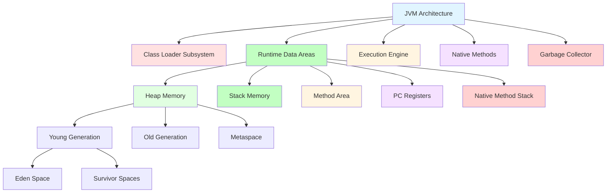

## 🧠 JVM Memory Structure

### Heap Memory

**What it is:** The runtime data area from which memory for all class instances and arrays is allocated.

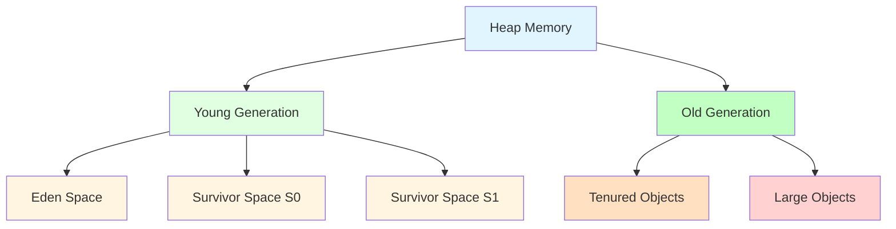

**Memory Allocation Flow:**
1. **New objects** are allocated in Eden Space
2. **Survivor GC** moves surviving objects between S0 and S1
3. **Objects surviving multiple GC cycles** move to Old Generation
4. **Large objects** may be allocated directly in Old Generation

### Stack Memory

**What it is:** Stores method frames, local variables, and partial results.

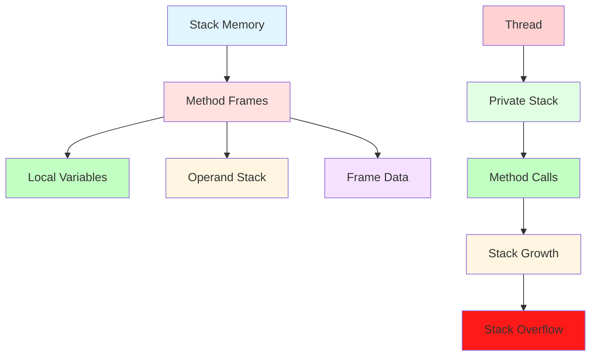

### Metaspace (PermGen replacement)

**What it is:** Stores class metadata, method bytecodes, and static variables.

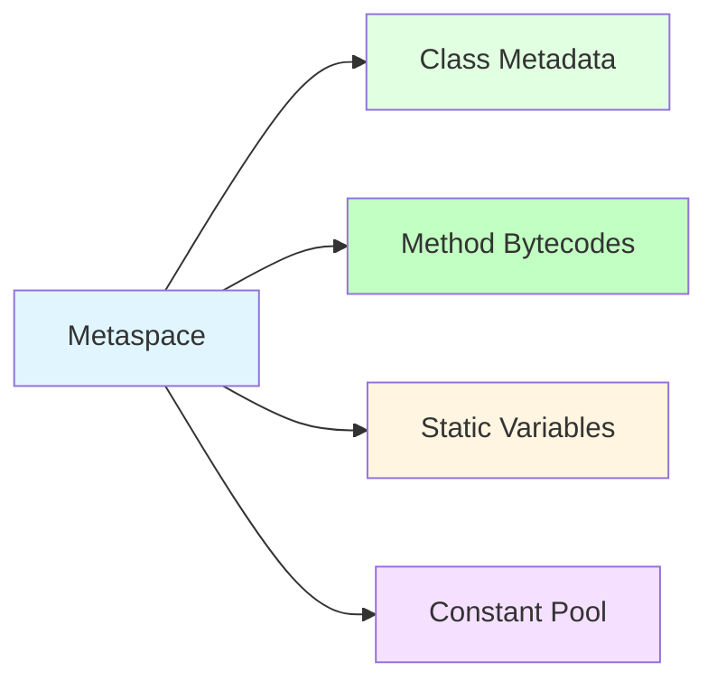

## 🗑️ Garbage Collection (GC)

### GC Algorithms Overview

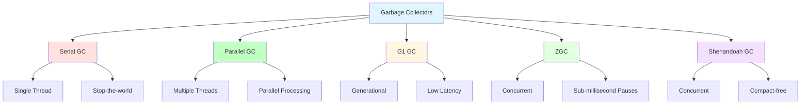

### GC Algorithms Comparison

| GC Algorithm | Use Case | Heap Size | Pause Time | Throughput |
|--------------|----------|-----------|------------|------------|
| **Serial GC** | Client apps, small heaps | < 100MB | High (stop-the-world) | Low |
| **Parallel GC** | Batch processing, large heaps | > 100MB | Medium | High |
| **G1 GC** | Low latency, multi-core | Any | Low | Medium |
| **ZGC** | Ultra-low latency, large heaps | Up to 16TB | < 1ms | High |
| **Shenandoah** | Low latency, compacting | Any | Low | Medium |

### GC Performance Metrics

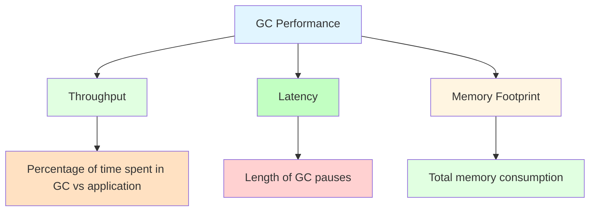

## ⚙️ JVM Tuning Parameters

### Heap Size Parameters

```bash
# Initial heap size (JVM starts with this)
-Xms512m

# Maximum heap size (JVM can grow to this)
-Xmx2g

# Young generation size
-Xmn256m

# Ratio of Eden to Survivor space
-XX:SurvivorRatio=8

# Initial survivor space ratio
-XX:InitialSurvivorRatio=8
```

**Performance Impact:**
- **Too small**: Frequent GC, poor performance
- **Too large**: Long GC pauses, memory waste
- **Optimal**: 70-80% of physical RAM for heap

### GC Algorithm Selection

```bash
# Serial GC (client applications)
-XX:+UseSerialGC

# Parallel GC (server applications, throughput-focused)
-XX:+UseParallelGC

# G1 GC (low latency, recommended for most server apps)
-XX:+UseG1GC

# ZGC (ultra-low latency, Java 17+)
-XX:+UseZGC

# Shenandoah GC (low latency, compacting)
-XX:+UseShenandoahGC
```

**Performance Impact:**
- **Serial GC**: Simple but slow, only for small heaps
- **Parallel GC**: Good throughput, but pauses during GC
- **G1 GC**: Predictable pauses, balanced performance
- **ZGC/Shenandoah**: Best for low-latency requirements

### GC Tuning Parameters

```bash
# G1 GC specific tuning
-XX:MaxGCPauseMillis=200        # Target max GC pause time
-XX:G1HeapRegionSize=16m         # Size of G1 regions
-XX:G1ReservePercent=15          # Reserve space for evacuation
-XX:InitiatingHeapOccupancyPercent=45  # When to start concurrent cycle

# Parallel GC tuning
-XX:ParallelGCThreads=4          # Number of GC threads
-XX:ConcGCThreads=2               # Number of concurrent GC threads

# General GC tuning
-XX:+DisableExplicitGC            # Disable System.gc()
-XX:+HeapDumpOnOutOfMemoryError   # Dump heap on OOM
-XX:HeapDumpPath=/path/to/dumps   # Where to save heap dumps
```

### Metaspace Tuning

```bash
# Initial metaspace size
-XX:MetaspaceSize=256m

# Maximum metaspace size
-XX:MaxMetaspaceSize=512m

# Class data sharing
-XX:+UseCompressedClassPointers   # Compress class pointers (64-bit)
-XX:CompressedClassSpaceSize=1g
```

**Performance Impact:**
- **Too small**: Class loading failures, poor performance
- **Too large**: Memory waste
- **Optimal**: Enough for all classes + buffer

### Stack Size Tuning

```bash
# Thread stack size
-Xss1m

# Maximum stack depth
-XX:MaxJavaStackTraceDepth=1000
```

**Performance Impact:**
- **Too small**: StackOverflowError
- **Too large**: Memory waste, fewer threads possible
- **Optimal**: Depends on application recursion depth

## 🎯 Application-Specific Tuning

### Web Applications (Low Latency)

```bash
# Recommended JVM args for web apps
-Xms2g
-Xmx2g
-XX:+UseG1GC
-XX:MaxGCPauseMillis=200
-XX:InitiatingHeapOccupancyPercent=45
-XX:+DisableExplicitGC
-XX:+HeapDumpOnOutOfMemoryError
-XX:HeapDumpPath=/var/log/app/dumps
```

**Performance Characteristics:**
- **Target**: < 200ms GC pauses
- **Throughput**: Medium
- **Memory**: 2GB heap for typical web app
- **Best for**: Microservices, REST APIs

### Batch Processing (High Throughput)

```bash
# Recommended JVM args for batch processing
-Xms4g
-Xmx4g
-XX:+UseParallelGC
-XX:ParallelGCThreads=8
-XX:ConcGCThreads=2
-XX:+UseCompressedOops
-XX:+UseCompressedClassPointers
```

**Performance Characteristics:**
- **Target**: Maximum throughput
- **Pause Time**: Less critical
- **Memory**: Larger heap for processing
- **Best for**: ETL jobs, data processing

### Microservices (Ultra-Low Latency)

```bash
# Recommended JVM args for microservices
-Xms512m
-Xmx512m
-XX:+UseZGC
-XX:+UnlockExperimentalVMOptions
-XX:+UseTransparentGC
-XX:ZAllocationSpikeTolerance=5
-XX:+DisableExplicitGC
```

**Performance Characteristics:**
- **Target**: < 10ms GC pauses
- **Memory**: Smaller heaps
- **Best for**: Real-time systems, high-frequency trading

### Big Data Applications (Large Heaps)

```bash
# Recommended JVM args for big data
-Xms16g
-Xmx16g
-XX:+UseG1GC
-XX:G1HeapRegionSize=32m
-XX:MaxGCPauseMillis=500
-XX:InitiatingHeapOccupancyPercent=40
-XX:+UseCompressedOops
-XX:+UseCompressedClassPointers
```

**Performance Characteristics:**
- **Target**: Handle large datasets
- **Memory**: Large heaps (> 8GB)
- **Best for**: Spark, Hadoop, data analytics

## 🔍 JVM Monitoring Tools

### Built-in JVM Tools

```bash
# JVM status monitoring
jps -l                          # List Java processes
jstat -gc <pid> 1000            # GC statistics every second
jmap -heap <pid>                 # Heap memory usage
jstack <pid>                     # Thread dump
jinfo <pid>                      # JVM configuration
jcmd <pid> VM.flags             # All JVM flags
jcmd <pid> GC.heap_info         # Heap information
```

### External Monitoring Tools

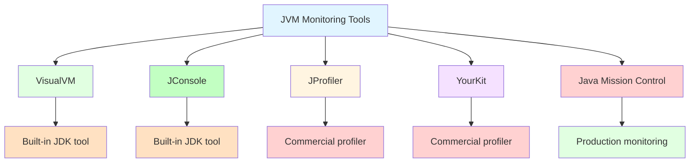

### VisualVM Setup

```bash
# Launch VisualVM
jvisualvm

# Or connect to running JVM
jvisualvm --jdkhome /path/to/jdk <pid>
```

**What VisualVM Shows:**
- Heap memory usage over time
- CPU usage
- Thread count and states
- GC activity
- Class loading
- Method profiling

### JMX Monitoring

```bash
# Enable JMX in application
-Dcom.sun.management.jmxremote
-Dcom.sun.management.jmxremote.port=9010
-Dcom.sun.management.jmxremote.authenticate=false
-Dcom.sun.management.jmxremote.ssl=false
```

**JMX Metrics to Monitor:**
- `java.lang:type=Memory` - Heap usage
- `java.lang:type=GarbageCollector` - GC statistics
- `java.lang:type=Threading` - Thread count
- `java.lang:type=Runtime` - JVM uptime

## 🚨 Common JVM Performance Issues

### Memory Leaks

**Symptoms:**
- Continuous heap growth
- OutOfMemoryError over time
- Frequent full GC cycles

**Detection:**
```bash
# Heap dump analysis
jmap -dump:format=b,file=heap.hprof <pid>

# Analyze with Eclipse MAT or VisualVM
```

**Solutions:**
- Identify leaking objects with heap dump analysis
- Fix static collections holding references
- Use weak references for caches
- Implement proper object lifecycle management

### GC Tuning Issues

**Symptoms:**
- Long GC pauses
- Frequent full GC
- Poor application responsiveness

**Solutions:**
```bash
# Increase heap size
-Xmx4g

# Switch to low-latency GC
-XX:+UseG1GC
-XX:MaxGCPauseMillis=100

# Tune young generation
-Xmn1g
-XX:SurvivorRatio=8
```

### Metaspace Issues

**Symptoms:**
- `java.lang.OutOfMemoryError: Metaspace`
- Application crashes after hot deployments
- High memory usage in permgen-like area

**Solutions:**
```bash
# Increase metaspace
-XX:MaxMetaspaceSize=1g

# Enable class unloading
-XX:+CMSClassUnloadingEnabled
-XX:+CMSPermGenSweepingEnabled
```

### Thread Issues

**Symptoms:**
- `java.lang.OutOfMemoryError: unable to create new native thread`
- High CPU usage with many threads
- Application hangs

**Solutions:**
```bash
# Reduce stack size per thread
-Xss512k

# Limit thread pool size
# In application code (e.g., Spring, thread pools)
```

## 📊 Performance Tuning Process

### Step 1: Baseline Measurement

```bash
# Start application with default settings
java -jar application.jar

# Monitor baseline performance
jstat -gc <pid> 1000 > baseline_gc.log
```

**Metrics to Record:**
- Heap usage over time
- GC frequency and duration
- Application response time
- CPU and memory usage

### Step 2: Identify Bottlenecks

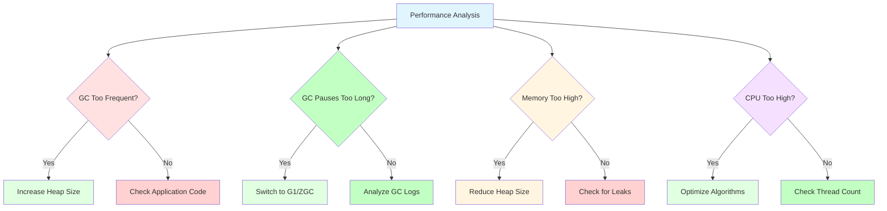

### Step 3: Apply Tuning Changes

```bash
# Test different configurations
# Configuration 1: Larger heap
java -Xms4g -Xmx4g -jar application.jar

# Configuration 2: Different GC
java -XX:+UseG1GC -jar application.jar

# Configuration 3: Tuned G1
java -XX:+UseG1GC -XX:MaxGCPauseMillis=100 -jar application.jar
```

### Step 4: Measure and Compare

```bash
# Run load tests with each configuration
# Compare metrics:
# - GC pause time
# - Throughput
# - Memory usage
# - Response time
```

### Step 5: Iterate and Optimize

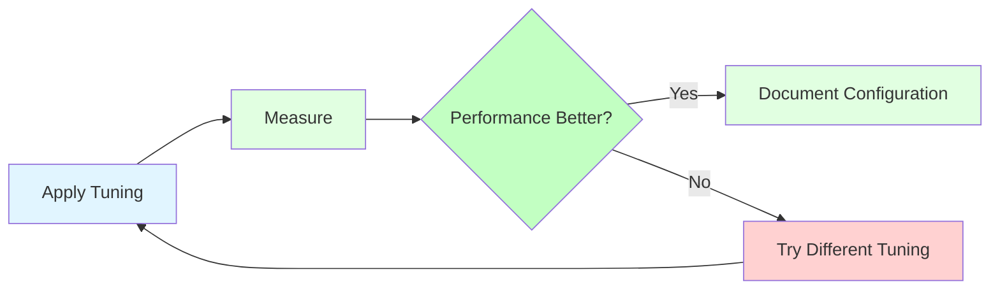

## 🎯 Performance Tuning Scenarios

### Scenario 1: High GC Pause Times

**Problem:** Application freezes during GC pauses > 500ms

**Solution:**
```bash
# Switch to G1 GC
-XX:+UseG1GC
-XX:MaxGCPauseMillis=200

# Alternatively, try ZGC for ultra-low latency
-XX:+UseZGC
-XX:+UnlockExperimentalVMOptions
```

**Performance Impact:**
- **Before**: 500ms+ pauses, poor responsiveness
- **After**: < 50ms pauses, smooth performance

### Scenario 2: Frequent Full GC

**Problem:** Application runs full GC every few minutes

**Solution:**
```bash
# Increase young generation size
-Xmn1g
-XX:SurvivorRatio=8

# Increase heap size
-Xmx4g

# Enable object allocation profiling
-XX:+PrintGCDetails
-XX:+PrintGCTimeStamps
```

**Performance Impact:**
- **Before**: Full GC every 2 minutes, 10s pauses
- **After**: Full GC every 1 hour, < 1s pauses

### Scenario 3: Memory Leaks

**Problem:** Heap grows continuously until OOM

**Solution:**
```bash
# Enable heap dump on OOM
-XX:+HeapDumpOnOutOfMemoryError
-XX:HeapDumpPath=/dumps/

# Use monitoring tools
- VisualVM heap dump analysis
- Eclipse MAT
```

**Performance Impact:**
- **Before**: Crashes after 24 hours
- **After**: Stable memory usage, weeks of uptime

### Scenario 4: Slow Startup

**Problem**: Application takes 2+ minutes to start

**Solution:**
```bash
# AppTier compilation
-XX:+TieredCompilation
-XX:TieredStopAtLevel=1

# Ahead-of-time compilation
-XX:+UseAOT
```

**Performance Impact:**
- **Before**: 120s startup time
- **After**: 30s startup time

## 🔧 JVM Logging and Diagnostics

### GC Logging

```bash
# Basic GC logging
-XX:+PrintGCDetails
-XX:+PrintGCTimeStamps

# Detailed GC logging
-Xlog:gc*:file=/path/to/gc.log:time,level,tags

# GC logging with file rotation
-Xlog:gc*:file=/path/to/gc.log:time,level,tags:filecount=5,filesize=10m
```

### JVM Performance Logging

```bash
# Enable JVM performance logging
-XX:+PrintCompilation
-XX:+PrintAssembly

# Print safepoints
-XX:+PrintSafepointStatistics
-XX:+PrintSafepointStatisticsCount
```

### Flight Recorder (JFR)

```bash
# Start application with JFR
java -XX:StartFlightRecording=filename=recording.jfr,duration=60s -jar application.jar

# JFR profiling
-XX:StartFlightRecording=delay=20s,duration=60s,filename=profile.jfr,settings=profile
```

**JFR Captures:**
- Memory allocation
- CPU profiling
- GC events
- Thread profiling
- I/O operations

## 📈 Performance Benchmarking

### Benchmarking Methodology

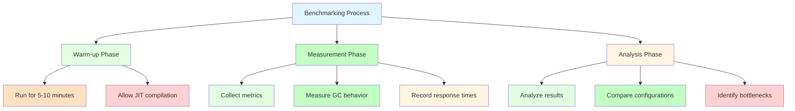

### JMH (Java Microbenchmark Harness)

```java
// JMH benchmark example
@BenchmarkMode(Mode.AverageTime)
@OutputTimeUnit(TimeUnit.MILLISECONDS)
@State(Scope.Thread)
public class MyBenchmark {
    
    @Benchmark
    public void testMethod() {
        // Code to benchmark
    }
    
    @Benchmark
    @Warmup(iterations = 3)
    @Measurement(iterations = 5)
    public void testWithWarmup() {
        // Code with warmup
    }
}
```

## 🎯 Production JVM Tuning Checklist

### Pre-Deployment Checklist

```markdown
## JVM Tuning Checklist

### Memory Configuration
- [ ] Heap size appropriate for application (70-80% of RAM)
- [ ] Young generation size optimized (30-40% of heap)
- [ ] Metaspace size sufficient for class loading
- [ ] Stack size appropriate for application needs

### GC Configuration
- [ ] GC algorithm selected for use case
- [ ] GC pause time targets defined
- [ ] GC logging enabled for monitoring
- [ ] Heap dump on OOM enabled

### Monitoring
- [ ] JMX enabled for production monitoring
- [ ] Flight Recorder configured
- [ ] VisualVM/JConsole access configured
- [ ] Log aggregation set up

### Performance
- [ ] Baseline performance measured
- [ ] Load testing completed
- [ ] Tuning validated in staging
- [ ] Rollback plan documented
```

### Production JVM Args Template

```bash
# General production configuration
-server
-Xms4g
-Xmx4g
-Xmn1g
-XX:MetaspaceSize=256m
-XX:MaxMetaspaceSize=512m
-Xss512k

# GC configuration
-XX:+UseG1GC
-XX:MaxGCPauseMillis=200
-XX:InitiatingHeapOccupancyPercent=45
-XX:+DisableExplicitGC

# Logging and monitoring
-XX:+PrintGCDetails
-XX:+PrintGCTimeStamps
-XX:+PrintGCApplicationStoppedTime
-Xlog:gc*:file=/var/log/app/gc.log:time,level,tags:filecount=5,filesize=10m

# Error handling
-XX:+HeapDumpOnOutOfMemoryError
-XX:HeapDumpPath=/var/log/app/dumps
-XX:ErrorFile=/var/log/app/hs_err_pid%p.log

# Performance
-XX:+UseCompressedOops
-XX:+UseCompressedClassPointers
-XX:+AggressiveOpts
```

## 🚨 Common Tuning Mistakes

### Mistake 1: Setting Heap Too Large

**Problem:** Setting heap to 32GB on 16GB machine

**Impact:**
- OS swapping
- Terrible performance
- System instability

**Solution:**
```bash
# Rule of thumb: Heap = 70-80% of physical RAM
# On 16GB machine, set heap to 12GB max
-Xms12g -Xmx12g
```

### Mistake 2: Wrong GC for Use Case

**Problem:** Using Serial GC for production server application

**Impact:**
- Long stop-the-world pauses
- Poor throughput
- Bad user experience

**Solution:**
```bash
# Use G1 GC for most server applications
-XX:+UseG1GC
```

### Mistake 3: Ignoring GC Logging

**Problem:** No GC logging in production

**Impact:**
- Can't troubleshoot performance issues
- Blind to memory problems
- No way to identify tuning opportunities

**Solution:**
```bash
# Always enable GC logging in production
-Xlog:gc*:file=/path/to/gc.log:time,level,tags
```

### Mistake 4: Copying JVM Args Blindly

**Problem:** Using someone else's JVM args without understanding

**Impact:**
- Inappropriate for your application
- May cause performance degradation
- Can introduce new issues

**Solution:**
- Understand each parameter
- Test in staging first
- Monitor and iterate

## 📊 JVM Tuning Decision Tree

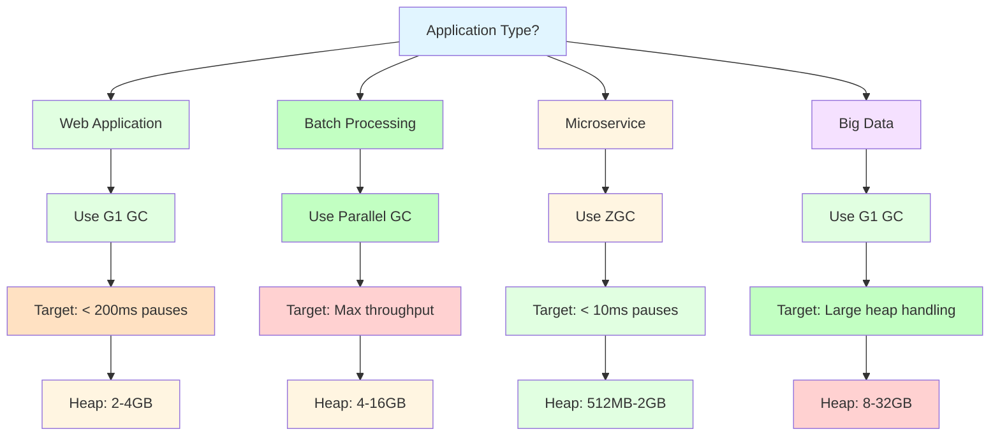

## 🎯 Real-World Tuning Examples

### Example 1: E-commerce Website

**Requirements:**
- Handle 10,000 concurrent users
- Response time < 200ms
- 99.9% uptime

**JVM Configuration:**
```bash
-server
-Xms8g
-Xmx8g
-Xmn2g
-XX:MetaspaceSize=512m
-XX:MaxMetaspaceSize=1g
-XX:+UseG1GC
-XX:MaxGCPauseMillis=100
-XX:InitiatingHeapOccupancyPercent=40
-XX:+DisableExplicitGC
-XX:+UseCompressedOops
-XX:+UseCompressedClassPointers
-Xlog:gc*:file=/var/log/app/gc.log:time,level,tags:filecount=10,filesize=10m
```

**Performance Results:**
- **GC Pauses**: < 50ms average
- **Throughput**: 5,000 requests/second
- **Memory Usage**: 6GB average, 8GB peak
- **Uptime**: 99.95%

### Example 2: Data Processing Pipeline

**Requirements:**
- Process 100GB of data daily
- Maximize throughput
- Pauses acceptable

**JVM Configuration:**
```bash
-server
-Xms16g
-Xmx16g
-Xmn4g
-XX:+UseParallelGC
-XX:ParallelGCThreads=8
-XX:ConcGCThreads=2
-XX:+UseCompressedOops
-XX:+UseCompressedClassPointers
-XX:+UseStringDeduplication
```

**Performance Results:**
- **GC Pauses**: 500ms average (acceptable for batch)
- **Throughput**: 2GB/hour processing rate
- **Memory Usage**: 14GB average
- **String Deduplication**: 30% memory savings

### Example 3: Real-time Trading System

**Requirements:**
- Sub-millisecond response times
- Ultra-low latency
- Zero data loss

**JVM Configuration:**
```bash
-server
-Xms512m
-Xmx512m
-XX:+UseZGC
-XX:+UnlockExperimentalVMOptions
-XX:ZAllocationSpikeTolerance=5
-XX:+DisableExplicitGC
-XX:+AlwaysPreTouch
-XX:+UseTransparentGC
```

**Performance Results:**
- **GC Pauses**: < 1ms average
- **Response Time**: 2ms average
- **Memory Usage**: 400MB average
- **Latency**: 99th percentile < 5ms

## 🔧 JVM Tuning Tools and Commands

### Quick Reference Commands

```bash
# Monitoring
jps                              # List Java processes
jstat -gc <pid> 1000            # GC statistics
jmap -heap <pid>                 # Heap usage
jstack <pid>                     # Thread dump
jcmd <pid> VM.flags             # JVM flags
jcmd <pid> GC.heap_info         # Heap info

# Analysis
jhat <heap-dump>                # Analyze heap dump
jvisualvm                        # Visual profiling tool
jconsole                         # JMX monitoring

# Flight Recorder
jcmd <pid> JFR.start
jcmd <pid> JFR.dump name=recording.jfr
```

### VisualVM Quick Start

```bash
# Start application with monitoring enabled
java -Dcom.sun.management.jmxremote \
     -Dcom.sun.management.jmxremote.port=9010 \
     -Dcom.sun.management.jmxremote.authenticate=false \
     -Dcom.sun.management.jmxremote.ssl=false \
     -jar application.jar

# Start VisualVM
jvisualvm
```

## 📚 Advanced JVM Tuning Topics

### Contended Locking

```bash
# Enable biased locking
-XX:+UseBiasedLocking

# Enable auto-lock optimization
-XX:+EliminateAllocations
-XX:+DoEscapeAnalysis
```

### JIT Compilation Tuning

```bash
# Tiered compilation
-XX:+TieredCompilation

# Print compilation
-XX:+PrintCompilation

# Inline small methods
-XX:MaxInlineSize=35
```

### String Interning

```bash
# String deduplication
-XX:+UseStringDeduplication
-XX:StringDeduplicationAgeThreshold=3
```

### NUMA Architecture

```bash
# NUMA-aware memory allocation
-XX:+UseNUMA
-XX:+UseParallelGC
```

## 🎯 Performance Tuning Best Practices

### 1. Always Set Both Xms and Xmx

```bash
# ❌ Bad: Letting heap grow
-Xms512m -Xmx4g

# ✅ Good: Fixed heap size
-Xms4g -Xmx4g
```

**Why:** Prevents resize overhead and memory fragmentation.

### 2. Enable GC Logging in Production

```bash
# ✅ Always enable
-Xlog:gc*:file=/path/to/gc.log:time,level,tags
```

**Why:** Essential for troubleshooting performance issues.

### 3. Choose Appropriate GC Algorithm

```bash
# ❌ Don't use Serial GC in production
# ✅ Use G1 GC for most server applications
-XX:+UseG1GC
```

**Why:** Serial GC causes long stop-the-world pauses.

### 4. Monitor Memory Usage Regularly

```bash
# Use monitoring tools
jstat -gc <pid> 1000
jmap -heap <pid>
```

**Why:** Early detection of memory leaks and tuning needs.

### 5. Test Tuning Changes in Staging

```bash
# Never apply tuning directly to production
# Test in staging first
```

**Why:** Prevents production performance degradation.

## 🚨 JVM Tuning Troubleshooting

### OutOfMemoryError

**Common Causes:**
- Memory leaks
- Insufficient heap size
- Large object allocations

**Solutions:**
```bash
# Increase heap size
-Xmx8g

# Enable heap dump on OOM
-XX:+HeapDumpOnOutOfMemoryError

# Analyze heap dump
jmap -dump:format=b,file=heap.hprof <pid>
```

### High CPU Usage

**Common Causes:**
- Inefficient algorithms
- Excessive GC
- Thread contention

**Solutions:**
```bash
# Profile CPU usage
-XX:+PrintCompilation
# Use profiler tool
```

### Slow Startup

**Common Causes:**
- Class loading overhead
- JIT compilation
- Large initial heap

**Solutions:**
```bash
# AppTier compilation
-XX:+TieredCompilation
-XX:TieredStopAtLevel=1

# Reduce initial heap
-Xms512m -Xmx4g
```

## 📈 Performance Impact Summary

### Heap Size Impact

| Heap Size | GC Frequency | Pause Time | Best For |
|-----------|-------------|------------|----------|
| 512MB | High | Short | Microservices |
| 2GB | Medium | Medium | Web apps |
| 8GB | Low | Long | Batch processing |
| 32GB | Very Low | Very Long | Big data |

### GC Algorithm Impact

| GC Algorithm | Throughput | Latency | Memory Overhead | Best For |
|--------------|------------|---------|-----------------|----------|
| Serial | Low | High | Low | Small apps |
| Parallel | High | Medium | Low | Batch processing |
| G1 | Medium | Low | Medium | Web apps |
| ZGC | High | Very Low | Low | Real-time systems |

### Compression Impact

| Compression | Memory Savings | CPU Overhead | Net Benefit |
|-------------|---------------|-------------|-------------|
| Oops | 4% | Minimal | Positive |
| Class Pointers | 2% | Minimal | Positive |
| String Deduplication | 10-20% | Moderate | Context-dependent |

## 🎯 Performance Optimization Strategy

### Optimization Priority

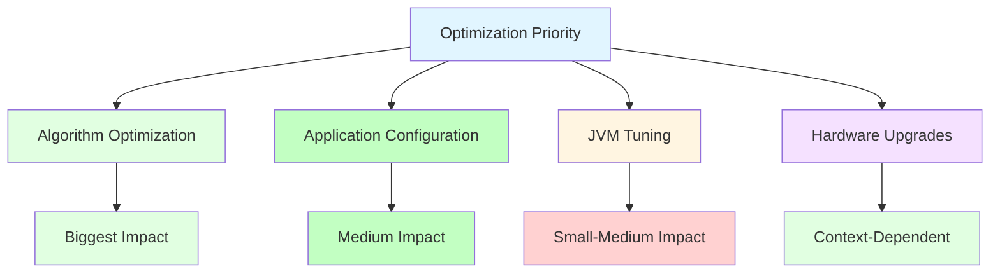

### Tuning ROI (Return on Investment)

| Tuning Effort | Time Investment | Performance Gain | ROI |
|----------------|------------------|-----------------|-----|
| Algorithm optimization | High | Very High | Highest |
| JVM heap tuning | Low | Medium | High |
| GC algorithm selection | Low | Medium-High | High |
| Compression tuning | Very Low | Low | Medium |
| Stack tuning | Very Low | Very Low | Low |

## 🎓 Learning Resources

### Documentation
- [Java Garbage Collection Documentation](https://docs.oracle.com/en/java/javase/17/gctuning/)
- [Java HotSpot VM Options](https://docs.oracle.com/en/java/javase/17/specs/man-pages/)
- [JVM Tool Guide](https://docs.oracle.com/en/java/javase/17/docs/specs/man-pages/)

### Books
- "Java Performance: The Definitive Guide" by Scott Oaks
- "Java Performance" by Charlie Hunt and Binu John
- "The Java Virtual Machine Specification"

### Tools
- [VisualVM](https://visualvm.github.io/)
- [JProfiler](https://www.ej-technologies.com/products/jprofiler/)
- [YourKit Java Profiler](https://www.yourkit.com/java/profiler/)

## 💡 Key Takeaways

1. **JVM tuning is application-specific** - no one-size-fits-all configuration
2. **Heap size is critical** - set to 70-80% of physical RAM
3. **GC algorithm choice matters** - match to your latency requirements
4. **Monitoring is essential** - always enable GC logging and monitoring
5. **Tuning is iterative** - measure, tune, measure again
6. **Algorithm optimization beats JVM tuning** - fix code first, then tune JVM
7. **Test in staging** - never apply untested changes to production
8. **Understand your application** - memory patterns dictate tuning strategy

---

**Apply JVM tuning as you work through the learning map!** → [Back to Overview](./00_LEARNING_MAP_OVERVIEW.md)
